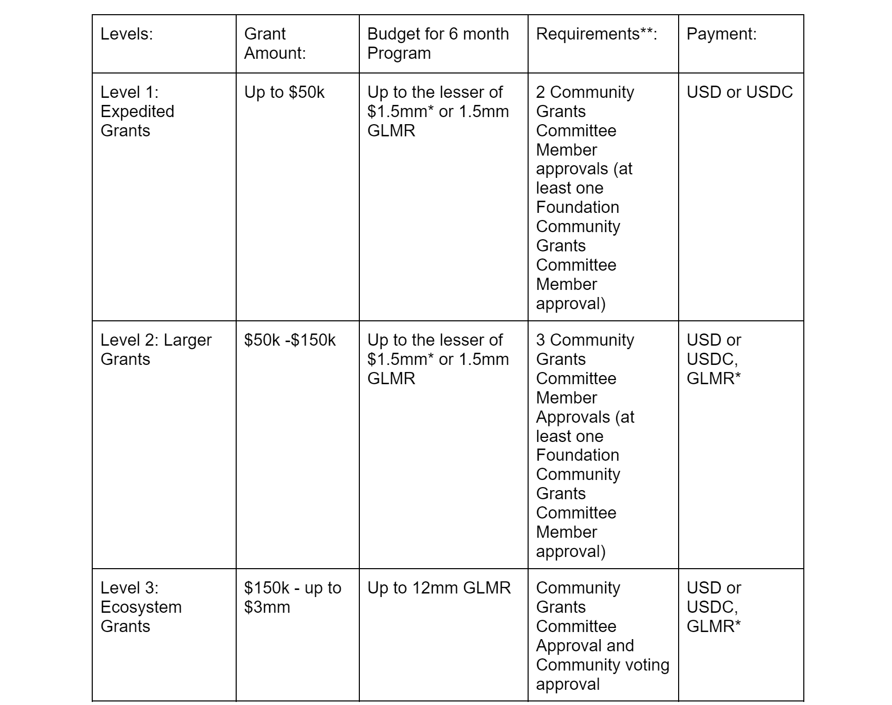

# Interim Grant Program Draft Proposal

## Abstract

The proposed governance measures describe a community driven and transparent process for issuing grants on the Moonbeam Network “Interim Grants Program”. The goal of this Grants Program is to further the adoption, utilization, and development of the Moonbeam Network as a premier destination for cross chain connected smart contracts and applications.

Projects funded through the Interim Grants Program will be broad in scope from funding software development for applications, infrastructure, tooling to education programs and project initiatives that bootstrap activity, adoption and overall growth of Moonbeam.

## Motivation

The Moonbeam community, alongside the Moonbeam Foundation, aims to make the Moonbeam Network a hub of cross chain activity, leading the shift from siloed apps to unified apps that live on multiple chains simultaneously.

A core component of this vision are Connected Contracts. Connected contracts are smart contracts on Moonbeam which use cross chain messages to facilitate the integration of and interaction with functions and data on remote smart contracts and remote blockchains. Using this messaging approach, Connected Contracts can access any user, asset, or function, regardless of which chain they are on. A growing number of messaging transports are available to facilitate cross chain interactions including XCM, Polkadot's native cross chain messaging system that is available to Moonbeam as a parachain on Polkadot.

The Moonbeam community will be able to submit ideas and proposals for grant funding, discuss these proposals, and vote on them to bring them to life.

In its role as a facilitator of grants, the Moonbeam Foundation and Grants Committee will follow these Moonbeam Guiding Principles:

-   **Inclusivity**  - Being inclusive to GLMR token holders to engage in the grants and other governance processes. One GLMR token is the same as any other GLMR token for voting purposes.
    
-   **Engagement**  - Always favoring community engagement, even if there are views contrary to the views of the Moonbeam Foundation. That being said, discussion must always be kept respectful and in keeping with  [Moonbeam’s Code of Conduct](https://github.com/moonbeam-foundation/code-of-conduct).
    
-   **Transparency**  - Striving for transparency in the grants process and seeking community engagement and input commensurate with the size and scope of the grant.
    
-   **Greater Good of the Ecosystem**  - Keeping in mind that the goal of grants is to further the adoption, utilization, and development of the Moonbeam Network as a whole. These goals should always come before any individual’s or project teams benefit.
    

In addition, grants should not be given to projects that actively promote gambling, illicit trade or products, money laundering or criminal activities in general.

## Rationale

The Moonbeam Foundation serves the Moonbeam community in creating the best possible environment for cross-chain connected smart contracts and applications, allowing protocol teams to create web3 dapps that connect and coordinate value-based activities across network participants.

The short-term vision in this proposal is to launch a community led grants process using existing tools and functionality in and around the Moonbeam blockchain. This Interim Grant Program proposal attempts to find the right balance between productivity and community engagement, allowing for increasing levels of engagement as grants under consideration become more economically significant and have a larger expected impact on the direction of the network.

To achieve these goals, it is of the utmost importance that the Moonbeam community, defined as the people who hold GLMR tokens, engage in the proposed process to submit ideas, discuss and refine ideas to turn them into proposals, and to vote on proposals.

Given the principles of Inclusivity, Engagement, Transparency, and Greater Good, all ideas, comments, proposals, and voting results will be public and available for anyone to review.

The Moonbeam Foundation looks to the Moonbeam community and its collective wisdom to drive and empower the grants process and to directly discuss and vote on the most significant grants decisions facing the network. The belief is that this collective wisdom will provide the surest path to meeting the Foundation's goals of increased adoption, utilization, and development of the Moonbeam Network.

## Guidelines

### Interim Grant Program

-   This is a proposal for an interim solution that will last 6 months unless amended prior to the 6 month term.
-   The intention is that the interim solution will be revisited by the community when Polkadot Governance v2 rolls out (and is functional).
-   The Structure outlined in this proposal may be amended by the community at any time with an Idea posted for community feedback for 5 days and then with a Proposal via Moonbeam’s Governance process. Per Moonbeam’s governance rules, the Council may cancel Referenda that are obviously counter to the Moonbeam Principles outlined  [here](https://docs.moonbeam.network/learn/features/governance/).

The intention for this proposed Structure is to gather community feedback for at least 5 days and then to be submitted as a Proposal and go through the Moonbeam Governance Process to be community approved.

Given the time sensitive nature of this proposal, the Council is strongly encouraged to consider fast tracking the voting period to 7 days with the simple majority tallying rule.

### Grant Guidelines

Moonbeam Foundation Grants Program supports open-source projects that add value and help grow the Moonbeam ecosystem.* Projects applying for grants will have greater chance of success if they can demonstrate:

-   **Well-researched and tested project idea**, ideally with examples of prior work.
-   Description of idea and project that ideally can be  **differentiated from competitors or implements technology that does not exist in the ecosystem yet**.
-   **Strong technical background of team and team’s experience**  in the project’s concept and ability to deliver on promised milestones
-   Team demonstrates their  **ability to maintain (and grow) the project**  after the grant deliverables. Applicable factors include team’s prior experience, project’s funding, business wherewithal and marketing knowledge.
-   **High-quality application**  with clearly defined milestones and rich in technical details and attention to security implications**.
-   **Reasonableness of grant amount requested**  relative to outlined milestones.
-   Engagement and Responsiveness throughout the application and diligence process.
-   **Commitment to the Moonbeam ecosystem**, ideally with demonstrated collaboration efforts.
-   Use of a  **Connected Contracts**  implementation approach using one of the integrated messaging systems on the Moonbeam Network.
-   Alignment and respect of Moonbeam Guiding Principles (outlined above), Moonbeam’s Code of Conduct.

_*exceptions to open source requirements can be made by a simple majority vote of the Community Grants Committee on rare occasions._

_**grant disbursements should be tied to the completion and delivery of clearly defined milestones unless there is documented reason for exception_

## Interim Grants Program Structure

_* valued at the time the grant agreement is executed and calculated based on USD equivalent based on 30-day TWAP from the date the grant agreement is executed_

_** note a Grant Application will not be accepted if there are more Nay Community Grants Committee votes than Aye votes._

GLMR grants will be funded from the “Liquidity Programs” allocation specified on the  [Moonbeam Foundation website](https://moonbeam.foundation/glimmer-token/). The remaining amount in the Liquidity Programs allocations should be renamed to “Post-Launch Developer Grants”.

### Community Grants Committee

The Community Grants Committee will consist of individuals from the community who are currently serving a role at the Foundation and community members who are not actively serving in a role at the Foundation who understand the priorities of the ecosystem and who serve to help facilitate growth of the ecosystem.

-   Total Community Grants Committee Members: 5
    -   Foundation Community Grants Committee Members: 2
    -   Non-Foundation Community Grants Committee Members: 3
-   Committee Members are nominated for approval as part of this proposal and will serve for the length of this Interim Grant Structure
-   If at any time there are not two individuals at the Moonbeam Foundation who can serve on the Community Grant Committee then the Foundation may appoint a representative(s) to act on behalf of a Foundation Community Grants Committee Members. Any other change to the Community Grants Committee composition must go through the Moonbeam Governance process.
-   Non-Foundation Community Grants Committee Members will be compensated $3,500 monthly for services provided to the committee

### Foundation Community Grants Committee Member Nominees

-   Foundation Community Grants Committee Members nominee:  **Aaron Evans**
-   Foundation Community Grants Committee Members nominee:  **Sicco Naets**

### Non-Foundation Community Grants Committee Member Nominees

-   Non-Foundation Community Grants Committee Member nominee:  **Thiago Castroneves**

_Thiago joined Moonbeam as an Ambassador in July 2021, making several contributions to the community such as founding and leading the Portuguese Community, hosting several interviews on Moonbeam Universe and leading the Moonbeam Communities YouTube Channel._

-   Non-Foundation Community Grants Committee Member nominee:  **Jim Farley**

_Jim is the founder of CertHum, a Web3 infrastructure and tooling company that runs active collators for Moonbase Alpha, Moonriver, and Moonbeam networks. He has over 20 years professional experience in using technology to help support business objectives. He has been a part of the Moonbeam community since Moonbase Alpha launch and can be frequently found contributing to discussions on the official Discord._

-   Non-Foundation Community Grants Committee Member nominee:  **Natalia Kovtun**

_Natalia has held several positions in the Moonbeam community over the last year and a half, including Ambassador, member of the On-boarding Team, Community Leader, Senior Ambassador and now Head of Ambassadors._

## The Process: Level 1 & Level 2 Grants

### Phase 1: Application is submitted to Community Grants Committee

-   Project team submits a Grant Application through the Moonbeam Foundation website.

### Phase 2: Screening

-   The Community Grant Committee will then reach out to the Grant Applicant to schedule a Screening call(s). Based on the information provided in this phase and the Grant Application, the Community Grant Committee will decide whether the project moves forward based on the community approved Grant Guidelines.

### Phase 3: Admin, Business and Technical Diligence

-   The Community Grant Committee and designated service providers will then conduct further diligence into the project, concept and grant asks to assess whether the Grant Application aligns with the community approved Grant Guidelines and Moonbeam Guiding Principles.

### Phase 4: Community Grants Committee Vote

-   Once Phase 3 is completed, the Community Grant Committee will review the diligence findings and vote on whether the Grant Application should be accepted or rejected. The voting thresholds to accept a Grant Application are for:
    -   **Level 1 Grants**: A Grant Application is approved if at least 2 Community Grants Committee Members vote Aye with at least one of the Foundation Community Grants Committee Members voting “Aye”
    -   **Level 2 Grants**: A Grant Application is approved if at least 3 Community Grants Committee Members vote Aye with at least one of the Foundation Community Grants Committee Members voting “Aye”.
    -   For both Level 1 and Level 2 grants, a Grant Application will not be accepted if there are more Nay Community Grants Committee votes than Aye votes.

### Phase 5: Implementation

1.  For accepted Grant Applications, implementation will begin based on the milestones and timeline in the Grant agreement
2.  The Foundation will make good faith efforts to directly or through the use of contracted parties implement and enact the accepted Grant Application.
3.  Once a quarter, the Foundation will publish a list of grants that have received a transfer as part of their grant.

## The Process: Level 3 Grants

### Phase 1: Submit  **MBGP Idea**  for discussion

1.  The Grant Author, submits MBGP Idea to Designated Discussion Forum(s) for feedback from the community
    
2.  If the Grant Author intends for this Idea to become a Final MBGP, the Author must be the intended recipient of the MBGP and include the address they intend to use to pay for the MBGP Bond so that the Community Grants Committee can track and advance the MBGP Idea to MBGP Draft.
    
3.  The MBGP Idea informally gathers comments for 5 days and then automatically comments are closed.
    
4.  After this 5-day feedback period, only the Community Grants Committee or a Community Grants Committee Member acting on behalf of the Community Grants Committee will be able to comment on the MBGP Idea. This will allow the Community Grants Committee to publicly communicate with the Grant Author and the community updates on the Idea’s progress to a Final MBGP.
    
5.  **MBGP Idea typically includes:**
    
    -   **Abstract**  - two or three sentences that summarize the MBGP.
    -   **Motivation**  - a statement on why the Moonbeam Community should support the MBGP.
    -   **Project Overview and Team Experience**  - description of project and relevant team experience
    -   **Rationale**  - an explanation of how the MBGP would add value to the Moonbeam Ecosystem, including, but not limited to, if the grant is planned to help further Moonbeam Ecosystem’s Connected Contract capabilities
    -   **Vision Of Success**  - description of what success looks like if the team executes on an approved MGP, clearly defines the suitable metrics to measure success, and the grand vision for the protocol / company over a 2 to 5 year period?
    -   **Key Terms (optional)**  - definitions of any terms within the proposal that are unique to the MBGP
    -   **Overall Cost of Grant**  - the total cost of the MBGP and how this cost ties to the Milestones
    -   **Use of Grant**  - detailed explanation of use of grant
    -   **Timeline and Milestones**  - relevant timing details, including, but not limited to, start date, milestones, and completion dates.
    -   **Specifications**  - a detailed breakdown of the platforms and technologies that will be used.
    -   **Steps to Implement**  - the steps to implement the proposal, including associated costs, manpower, and other resources for each step where applicable.

### Phase 2: Submit MBGP Bond for MBGP Proposal

1.  Grant Author sends MBGP Bond Amount to the MBGP Bond Multisig Address. The Grant Author can bond at any time once MBGP Idea is submitted, but must bond within 48hrs of the fifth day after posting MBGP Idea; otherwise, the MBGP Idea will not proceed to the MBGP Draft phase.
    -   MBGP Bond Amount: 5,000 GLMR
    -   MBGP Bond amount is returned (net of transaction fees) within 30 days of the MBGP being Accepted or Rejected.
2.  MBGP Bond Multisig Address will be controlled by the Community Grants Committee with a three out of five threshold.

### Phase 3:  **MBGP Review**

1.  Once the MBGP bond amount is received and MBGP Idea has been posted for the required five days, the Grant Author will then have 15 days to provide an initial MBGP Draft to the Community Grants Committee for business, technical and Administrative Review.
    
2.  The MBGP should:
    
    -   **Incorporate feedback from Community**  - MBGP should incorporate feedback from the community responses to the MBGP Idea that helps better serve the Moonbeam ecosystem and feedback from the Community Grants Committee.
    -   **Link to Previous MBGPs**  - must link to previous MBGP if previous MBGPs did not make it through the respective approval process and indicate what changes have been made
3.  **Community Grants Committee Review and Diligence:**
    
    -   The Community Grants Committee will review the MGP Draft and conduct business and technical diligence (either directly or through an approved party) on the MBGP Draft to ensure it adheres to the Moonbeam Community Approved Grant Guidelines. The Community Grants Committee will then communicate with the Grant Author on any incorrect and missing information or other deficiencies in the MBGP Draft needed for diligence and review.
    -   Grant Author has 15 days to respond to the Grant Committee's request for additional information on the MBGP Draft. If the Grant Author fails to provide an initial draft or fails to respond to the Community Grants Committee with appropriate answers needed per the Moonbeam Community Approved Grant Guidelines within this timeline, the Community Grant Committee may reject the MBGP due to Inaction or Incompleteness in the Drafting and Diligence Process. If the Community Grants Committee agrees to Reject the Proposal due to Inaction or Incompleteness in the Drafting and Diligence Process, the Community Grants Committee must comment on the MBGP Idea in the Designated Discussion Forum(s) stating that the MBGP has been Rejected.
4.  **Community Grants Committee Vote:**
    
    -   The Community Grants Committee will vote on whether the finalized MBGP Draft can be submitted as a Final MBGP for community voting, based on Moonbeam Community Approved Grant Guidelines, no later than 15 days from when the author and Grants Committee both agree the proposal is complete. To prevent inactive or unresponsive Grant Authors from clogging the process, the Community Grants Committee may reject proposals that are open for more than 90 days.
    -   Approval: simple majority of the Grants Committee
    -   The Community Grants Committee’s vote will be recorded as a comment posted to the Designated Discussion Forum(s) MBGP Idea post.

### Phase 4: Live MBGP

1.  The Community Grants Committee will then submit the MBGP Draft that has passed the respective approval processes outlined above for voting by the community. An MBGP Draft that has been submitted in the Designated Voting Channel(s) via the Community Grants Committee Address for the Council to put up for voting by the community is a Live MBGP.
    
    -   The Minimum Preimage Deposit will be covered by the Community Grants Committee and the Minimum Proposal Deposit will be covered by the Council.
    -   If the Community Grants Committee based on conversations with the Author believe this grant proposal is time sensitive then the Grants Committee can suggest in the proposal that the Council consider fast tracking the MBGP.
2.  The Proposal will then follow the typical Governance on Moonbeam process. Voters will vote Aye or Nay (see Key Terms for definition below and Moonbeam Governance docs for more information).
    

### Phase 5: Accepted or Rejected MBGP

1.  There are two subcategories of Final MBGPs: Accepted and Rejected
    -   **Accepted MGP**: moves into the Implementation phase after acceptance by the community at the end of voting period.
    -   **Rejected MGP**: can be resubmitted as a revised MBGP Idea.

### Phase 6: Implementation

1.  For Accepted MBGPs, implementation will begin based on the steps outlined in the MBGP template, including execution of a grant agreement or other documentation dictating the conditions for administering and implementing an Accepted MBGP.
2.  The Foundation will make good faith efforts to directly or through the use of contracted parties implement and enact the Accepted MBGP.

## Specifications

#### All Grant Levels

-   Google doc workspace for Community Grants Committee Members to coordinate and work with each other and with Grant Applicants (Level 1 and Level 2 Grants) and Grant Authors (Level 3 Grants) throughout the relevant processes.
-   Foundation email address for Community Grants Committee.

#### Level 3 Grants

-   **Designated Discussion Forum(s)**  - currently going to use Polkassembly Grants Discussion Forum for the short term, but the Moonbeam Foundation should publish a page that keeps an updated list of the Designated Discussion Forum(s) as the selection of options changes and evolves.
-   **Designated Voting Channel(s)**  - currently going to use Polkadot.JS for voting and require the Grants Committee to also update the proposal in Polkassembly and submit it to Github, but the Moonbeam Foundation should publish a page that keeps an updated list of the Designated Discussion Forum(s) as the selection of options changes and evolves.

## Steps to Implement

-   The Foundation will need to generate and publish the  **Community Grants Committee Address**. This Address will comment on Polkassembly MBGP Ideas and will submit Final MBGP for Level 3 Grants. Note that because the Democracy Precompile does not support smart contract interactions at this time, the proposing address will have to be controlled by only one individual, and not through the  **MBGP Bond Multisig Address**. Therefore, this address will be controlled by a member of the Community Grants Committee who will act on behalf of the Community Grants Committee in submitting the MBGP Draft.
    
-   The Foundation will need to generate and publish the **MBGP Bond Multisig Address. This is the address that Grant Authors will send the MBGP Bond to. It is a Gnosis Safe multisig controlled by the 5 Community Grants Committee Members that Grant Authors send the MBGP Bond to in the Level 3 Grant’s second phase. The Multisig requires ⅗ signatures.
    
-   The Foundation will need to allocate funding for the Community Grants Committee Address that will submit proposals for Level 3 Grants.
    
-   The Foundation will need to publish information on Designated Discussion Forum(s) and Designated Voting Channel(s).
    
-   The Foundation should allocate funds for the Community Grants Committee costs, including compensation for Community Grants Committee Members and costs associated with submitting MGPs (the Minimum Preimage Deposit, Minimum Proposal Deposit and diligence related costs).
    

## Timeline

The Interim Grant Program should go into effect as soon as it is reasonably practical and after it is voted on and accepted per the Moonbeam Governance process. As outlined in the Guidelines section, this Interim Grant Program is intended to run for 6 months or until amended.

## Overall Costs

The majors costs of this program beyond the Budget for the Interim Grant Proposal are the following:

-   Non-Foundation Community Grants Committee Member compensation.
-   Costs of the tech platforms that support the process (Designated Discussion Forum(s), Designated Voting Channel(s), Google workspaces for the Community Grants Committee.
-   Costs associated with the diligence and review processes of Grant Applications and MGPs.
-   Minimum Preimage Deposit and Minimum Proposal Deposit.

## Key Terms

-   **Administrative Review**  - part of the process for a grant to be approved and conducted by the Community Grants Committee or designated service provider(s).
-   **Community Grants Committee Address**  - this is the Address that will comment on Polkassembly MBGP Ideas and that will submit Final MBGP for Level 3 Grants. [This address should be published on Moonbeam Foundation website]
-   **Designated Discussion Forum(s)**  - will use the Polkassembly Grants Discussion Forum for the short term, but the Moonbeam Foundation should publish a page that keeps an updated list of the Designated Discussion Forum(s) as the selection of options changes and evolves.
-   **Designated Voting Channel(s)**  - currently going to use Polkadot.JS for voting and require the Grants Committee to also update the proposal in Polkassembly and submit it to Github, but the Moonbeam Foundation should publish a page that keeps an updated list of the Designated Discussion Forum(s) as the selection of options changes and evolves.
-   **Final MGP**: an MBGP that has completed the voting process. There are two subcategories here: Accepted and Rejected.
-   **Grant Applicant**  - an individual or project team that is applying to a Level 1 or Level 2 grant.
-   **Grant Author**  - any prospective Grant recipient who posts an MBGP Idea.
-   **Grants Template**  - Template for Grant Author to Submit to Community Grants Committee that will be published on the Moonbeam Foundation website.
-   **Community Grants Committee**  - 5-person committee to decide on Level 1 and Level 2 grants and to oversee MBGP drafting process and diligence for Level 3 grants based on the Moonbeam Community Approved Grant Guidelines
-   **Community Grants Committee Email**  - designed email published by the Moonbeam Foundation for official communication from the Community Grants Committee
-   **MBGP Bond Multisig Address**  - a Gnosis Safe multisig controlled by the 5 Community Grants Committee Members that Grant Authors send the MBGP Bond to in the Level 3 Grant’s second phase. The Multisig requires ⅗ signatures.
-   **Live MBGP**  - an MBGP that has passed all required approval stages and is submitted by the Community Grants Committee in the Designated Voting Channel for the Council to fast track for the community to vote on it. The voting options for a Live MBGP are “Aye” and “Nay.” Voting “Aye” means the voter is in favor of implementing the MGP exactly as-is. Voting “Nay” means the vote is against implementing the MBGP exactly as-is.
-   **MBGP (Moonbeam Grant Proposal)**  - a document proposing a new Level 3 grant.
-   **MBGP Bond**  - in the second step for creating an official MBGP, the Grant Author will submit a GLMR Bond to a MBGP Bond Multisig Address.
-   **MBGP Draft**  - the third phase (Level 3 Grants) in the process of creating an official MBGP, which can only be submitted after the original MBGP idea has gathered feedback from the community for five days in the Designated Discussion Forum and the Grant Author has successfully submitted the MBGP Grant Bond. An MBGP Draft must be submitted directly to the Community Grants Committee.
-   **MBGP Idea**  - the first step in the process for creating an official MBGP, which will be submitted to the community for informal feedback in the Proper Discussion Channel for a period of five days.
-   **MBGP Vote Tallying Period**  - in Phase 4, the Council will set the MBGP Vote Tallying Rule to be “Simple Majority”.
-   **MBGP Voting Period**  - in Phase 4, the Council will set the voting period for all Final MBGP for 7 days.
-   **Moonbeam Governance**  -  [https://docs.moonbeam.network/learn/features/governance/](https://docs.moonbeam.network/learn/features/governance/)
-   **Polkadot Governance**  -  [https://wiki.polkadot.network/docs/learn-governance](https://wiki.polkadot.network/docs/learn-governance)
-   **Rejected MGP**  - a Final MBGP that will not be implemented. There are two causes for rejection: (i) due to inaction or incompleteness in the Drafting and Diligence Process; or (ii) because the MGP failed to garner enough support in voting to pass.
-   **Simple Majority**  - defined by Polkadot as “Majority-carries, a simple comparison of votes; if there are more “Aye” votes than “Nay”, then the proposal is carried, no matter how much stake votes on the proposal.”

## Lastly, Thank You

I couldn’t have done this alone. It takes a community to make governance work as intended and this draft proposal is the result of hard work, guidance, and feedback from community members across the Moonbeam ecosystem. I hope this serves as a starting point for increased community involvement in the important decisions made to drive forward the Moonbeam ecosystem. A special thanks to the following individuals who helped along the way:

-   Aaron Evans, Moonbeam Foundation
-   Cassandra, D1 Ventures
-   Derek Yoo, PureStake
-   Dieter Fishbein, Community Member
-   Jose, Ambassador
-   MadCripto, Ambassador
-   Rae Deng, Community Member
-   Natalia, Ambassador
-   Nick, Downtown Moonbeam
-   Sicco Naets, Moonbeam Foundation
-   Thiago, Ambassador
-   Turritz, Ambassador