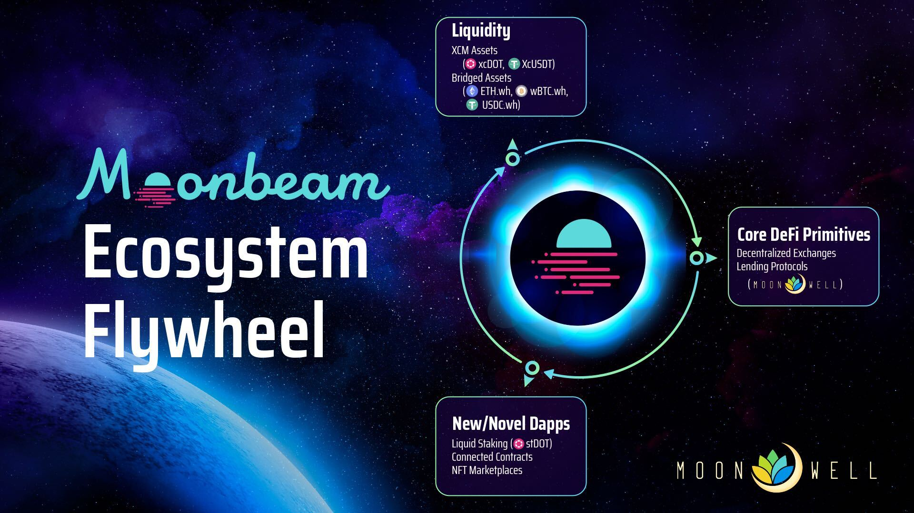
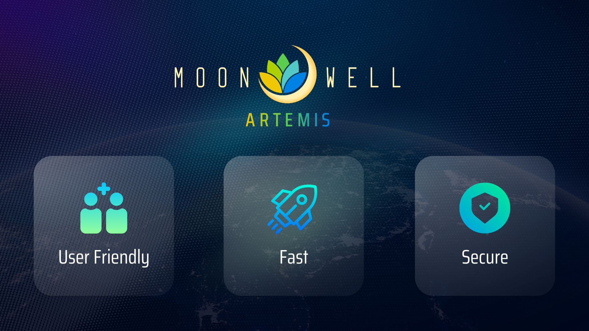
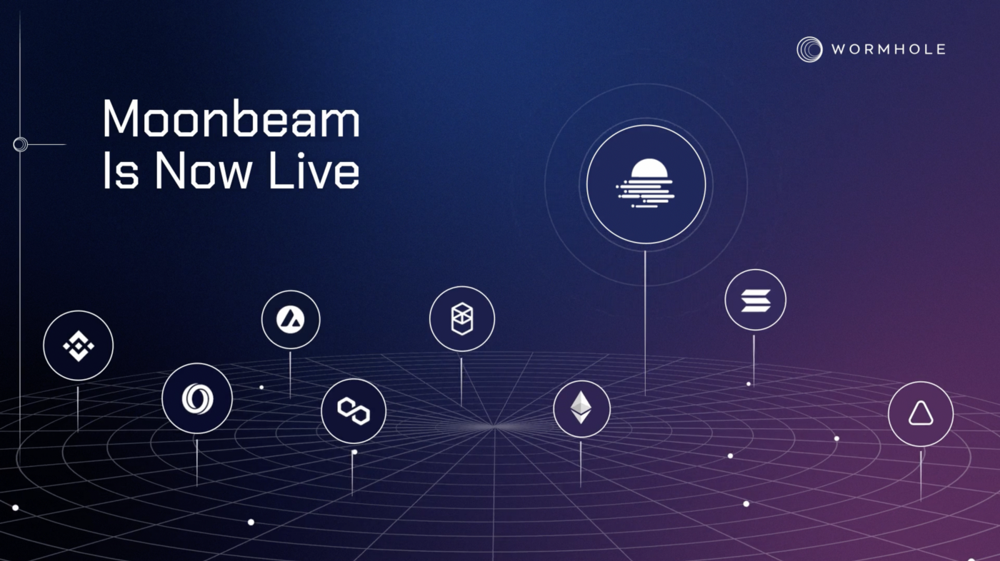
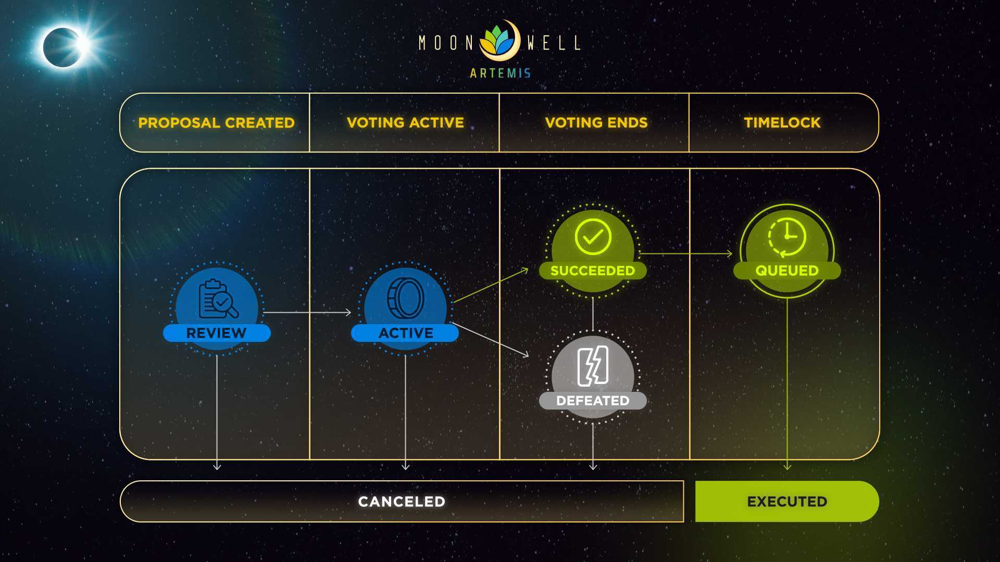
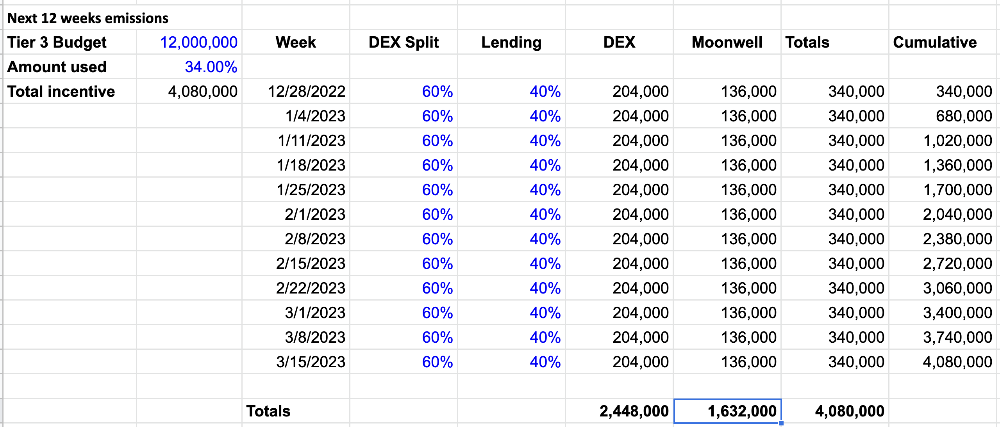

## Abstract

Moonwell is an open lending and DeFi protocol built on Moonbeam and Moonriver, and is the largest DeFi protocol by TVL in the Dotsama ecosystem. In order to foster the development of a robust web3 ecosystem on Moonbeam, core protocols such as decentralized exchanges and lending protocols like Moonwell provide basic DeFi primitives, and create a solid foundation of liquidity that developers can build new Dapps on top of, enabling the connected contracts future that the Moonbeam community envisions.

## Motivation

The Lunar Technology Foundation is responsible for fostering the development of the Moonwell protocol and its ecosystem, similar to the role that the Moonbeam Foundation plays in the broader Moonbeam ecosystem. The Foundation is honored to submit a proposal for a grant that aims to help build useful liquidity in the Moonbeam ecosystem, with the goal of creating this base liquidity that will be broadly useful for other Dapps and developers on Moonbeam.

The success of a new web3 ecosystem like Moonbeam will largely depend on whether the community can successfully bootstrap the flywheel illustrated below. By first building liquidity, next, strong base DeFi primitives such as Decentralized Exchanges and Lending, new and novel applications such as NFT marketplaces and Multichain Dapps using connected contracts can flourish, which in turn should bring more liquidity. As this flywheel builds up momentum in the form of deeper liquidity and more Dapps, this leads the entire ecosystem to more growth and greater success.

## Project Overview

Moonwell Artemis uses battle tested code from the [Moonwell Apollo](https://moonwell.medium.com/moonwell-apollo-has-launched-134f9c87103e) protocol to provide an open, non-custodial lending and borrowing DeFi protocol. Whereas Apollo is the Moonwell protocol’s deployment on Moonriver (Kusama), Artemis is Moonwell’s deployment on Moonbeam (Polkadot). At its peak, Moonwell accumulated over $350M in TVL earlier in 2022. The Moonwell community worked together with key ecosystem partners such as Solarbeam, StellaSwap, and the Moonbeam Foundation to achieve a high degree of success in a short time.

Moonwell’s goal is to be the most user-friendly, fast, and secure liquidity protocol in the ecosystem. With this in mind, an emphasis was placed on having a high standard of security. On-chain governance and multi-signature systems are implemented for all smart contracts that make up the protocol, with the cyber-security team at Halborn Security providing continuous security as a service. There is also a generous bounty program through a partnership with the team at ImmuneFi, which allows security researchers to submit their findings for review and earn a bounty for discovering security vulnerabilities.

## Fundraising and Key Contributors

The Lunar Technology Foundation [successfully raised approximately $26M in March 2022](https://www.coindesk.com/business/2022/03/17/katie-hauns-new-fund-joins-10m-round-for-polkadot-lending-protocol-moonwell/) through a combination of a private funding round and a public sale of the WELL token, and has 4+ years of runway at the current burn rate. Moonwell was also the first project to be funded by Arrington Capital’s [$100M Moonbeam Ecosystem Fund](https://moonbeam.foundation/news/arrington-capital-fund-moonbeam-ecosystem/). The core contributors to the Moonwell ecosystem represent an all-star roster of some of the best minds in technology, web3, DeFi, smart contracts, and staking, including **Luke Youngblood**, who was the tech lead at Coinbase responsible for launching Staking Rewards, a multi-billion TVL product with millions of users globally, and **Lucas Kozinski**, COO at TokenSoft, who helped many of the best parachains, including Moonbeam, Acala, Manta, Zeitgeist, and others raise funds through token sales.

## Other Contributors and Partners

In its role to foster the broader development of the Moonwell ecosystem, the Lunar Technology Foundation has also engaged with many other contributors and partners that have helped Moonwell to achieve its goals of being the most user-friendly, fast, and secure liquidity protocol in the ecosystem. Some key partners contributing to the Moonwell ecosystem are highlighted below.

### Security Audits and Ongoing Security Advisory by Halborn

After working closely with Halborn Security for several months and completing multiple audits of the Moonwell protocol, in May 2022, Moonwell announced the onboarding of Halborn Security through their Security Advisory as a Service ([SAAAS](https://halborn.com/services/security-advisory/)). This ongoing security service aims to provide users with peace of mind and the protocol with efficient scaling of the best security practices in the industry.

### Economic Safety and Health Monitoring

In addition to contract and code security, economic security is also important. One of the contributors to the Moonwell protocol is the team at [Gauntlet Network](https://gauntlet.network/), a firm providing top-notch financial modeling from the algorithmic trading industry to inform on-chain protocol management, in addition to simulations and risk modeling which carefully allow for better protection of the markets and user assets by ensuring there is a more complete and comprehensive idea of potential economic impacts.

Gauntlet recently launched the [Moonwell Apollo Risk Dashboard](https://gov.gauntlet.network/apollo), and is currently completing the data analysis and modeling required to support Moonwell Artemis as well.

### Chainlink Price Feeds

Moonwell has already integrated Chainlink Price Feeds into the Moonwell Apollo deployment on the Moonriver network, and is pleased to announce integration into Moonwell Artemis. Integration with Chainlink’s industry-leading and decentralized oracle network helps ensure the collateralization and liquidation ratios on Moonwell’s platform are backed by accurate–and fair– market rates. Chainlink helps to secure billions of dollars worth of assets for leading protocols by providing a high amount of security, reliability, and data quality.

### Wormhole

Jump Crypto and the team behind Wormhole represent one of the strongest bridges in the crypto industry, and we are excited to welcome them to Moonbeam. As they bring the best wrapped assets from Ethereum and other ecosystems, it is important that we work together as an ecosystem to build liquidity on Wormhole wrapped assets to help bootstrap the broader Moonbeam ecosystem.

## On Chain Governance

One overarching goal of the Moonwell community has been to create financial infrastructure that will stand the test of time and outlive any contributing team or individual. Applications and developers that build on top of Moonwell should have confidence that the protocol will have the resilience to operate indefinitely. By decentralizing governance, removing single points of failure and empowering the community to ratify changes to the protocol, a viable path to this goal has been created.

With the passage of [MIP-1](https://gov.moonwell.fi/proposal/1) (Moonwell Improvement Proposal #1), the Moonwell community’s on chain governance system has now successfully executed an on chain proposal and the community can now govern all aspects of the protocol.

This demonstrates the Moonwell community’s desire to participate in open, democratic self-governance, which will ultimately lead to long term stability of the broader Moonbeam ecosystem.

### Bridge Selection Process

Recently, Moonwell community governance enabled the broader Moonbeam ecosystem, including StellaSwap, to poll users for their bridge preference through a [snapshot vote](https://snapshot.moonwell.fi/#/proposal/0x7c96e4d331db2977a499a87b028a58d0f2a0bd343c68f5ea10e74d4cf6a387f6). This is how the community selected Wormhole as the preferred bridge, and demonstrates the power and capabilities of Moonwell governance.

## Grant Proposal

This grant proposal aims to increase active users, TVL and liquidity in key money markets on Moonwell, which will lead to lower borrowing costs and greater overall ecosystem liquidity that can be used by other Dapps in the ecosystem, including NFT marketplaces, connected contract use cases, and other novel and emerging use cases.

### Current Assets Supported

After the devastating collapse of the Nomad bridge, the Moonwell community removed support for Nomad assets through on-chain governance. This left the following assets currently supported on Moonwell for lending and borrowing:
* GLMR - Moonbeam's native token
* xcDOT - Polkadot from the relay chain
* FRAX - Frax is a stablecoin that is a native asset on Moonbeam and other networks

### Enabling Support for Wormhole and XCM assets

Through this grant proposal funding, the Moonwell community aims to increase liquidity and open new money markets for the following assets:
* USDC.wh - USDC wrapped by the Wormhole bridge
* ETH.wh - Ethereum wrapped by the Wormhole bridge
* wBTC.wh - wBTC wrapped by the Wormhole bridge
* BUSD.wh - BUSD wrapped by the Wormhole bridge
* xcUSDT - Tether transferred from the Statemine parachain

### Cost of the Grant

The Moonwell community has mapped out the incentives required for the next 6 months, and has collaborated with leading DEXes in the ecosystem, including StellaSwap, to come up with a liquidity incentives proposal that will fit into the combined 12M GLMR budget for the next 6 months.

Similar to StellaSwap’s grant proposal, we are dividing the 6 month grant duration into two parts. Given the current market dynamics, the 12M budget is not enough to sustain an equal distribution across the entire duration of 6 months and to support all the assets required.

While this proposal is designed to work in conjunction with StellaSwap’s grant proposal, it is important to note that the Moonwell community is neutral on which DEX the liquidity comes from. As long as sufficient liquidity exists on any reliable DEX in the ecosystem, it will meet the needs of the Moonwell community. It is important that liquidity builds in these new assets on decentralized exchanges like StellaSwap prior to the Moonwell community adding support, so that there is sufficient liquidity to liquidate underwater loans without too much slippage.

### Schedule of Liquidity Incentives

The 6 month duration is broken into two parts, with the corresponding GLMR requirements:
1. First 12 weeks: From October 5th to December 28th:
   - **First 4 weeks**: From October 5th to November 2nd - during this time period, the DEXes will be building liquidity on Wormhole assets, so Moonwell will not yet add incentives to any new markets.
     - GLMR required: **0 additional GLMR** (Moonwell will use previously granted funds)
     - Assets supported: **GLMR**, **xcDOT**, and **FRAX**
   - **Next 8 weeks**: From November 2nd to December 28th - during this time period, it is anticipated that there will be sufficient liquidity of the new assets, so new markets will be launched and incentives will be added.
     - GLMR required: **2,534,400 GLMR**
     - Assets supported: **GLMR**, **xcDOT**, **FRAX**, **xcUSDT**, **USDC.wh**, **ETH.wh**, **wBTC.wh**, **BUSD.wh**
2. Second 12 weeks: From December 28th to March 22nd:
   - GLMR required: **1,632,000 GLMR**
   - Assets supported: **GLMR**, **xcDOT**, **FRAX**, **xcUSDT**, **USDC.wh**, **ETH.wh**, **wBTC.wh**, **BUSD.wh**

### Phases of Liquidity Incentives

#### Phase 1 - 4 weeks

During the first 4 weeks, from October 5th to November 2nd, decentralized exchanges such as StellaSwap will be building TVL and liquidity in the new bridged assets, such as xcUSDT, USDC.wh, ETH.wh, wBTC.wh, BUSD.wh. While the Moonwell community desires to add support for these assets as soon as possible, adding them safely and securely requires sufficient liquidity first, so it is anticipated that during this 4 week timeframe, Moonwell will only support the 3 existing, native assets: GLMR, xcDOT, and FRAX.

#### Phase 2 - 8 weeks

During the next 8 weeks, from November 2nd to December 28th, there should be sufficient liquidity on decentralized exchanges to expand asset support beyond the 3 native assets and adding support for new assets: xcUSDT, USDC.wh, ETH.wh, wBTC.wh, and BUSD.wh. This will require increased liquidity incentives.

The first 12 weeks (encompassing phases 1 and 2) are represented in this spreadsheet below, which represents the Moonwell community’s recommended split of 60% of tier 3 liquidity incentives going to DEX liquidity, while 40% go to Moonwell markets:

#### Phase 3 - 12 weeks

During the next 12 weeks, from December 28th to March 22nd, 2023, the rewards will be reduced across both decentralized exchanges and Moonwell, in order to stay within the tier 3 grants budget of 12M. Rewards will continue to be distributed across all of the markets supported on Moonwell, which should include native assets GLMR, xcDOT, xcUSDT, and FRAX, as well as bridged assets USDC.wh, ETH.wh, wBTC.wh, and BUSD.wh.

The next 12 weeks (encompassing phase 3) is represented in the spreadsheet below, which represents the Moonwell community’s recommended split of 60% of tier 3 liquidity incentives going to DEX liquidity, while 40% go to Moonwell markets:

### Experience and Likelihood of Success

One important factor for the Moonbeam community to consider is the experience of the Moonwell community and the likelihood of successfully achieving the goals to increase ecosystem liquidity. The Moonwell community would like GLMR holders and participants in governance to know that this liquidity plan was developed in collaboration with DeFi experts and advisors that helped to perform slippage analysis and created a very similar liquidity plan to support the initial launch of Moonwell Artemis on June 23rd with Nomad assets.

By following an almost identical liquidity plan, the StellaSwap and Moonwell communities were able to successfully build over $50M TVL on StellaSwap and over $185M TVL on Moonwell Artemis. The Moonwell community has a high degree of confidence in the plan and the ability to achieve the goal of growing ecosystem liquidity, but as is all things in crypto and life in general, it is impossible to say that such goals will be met with certainty.

## Conclusion

The Moonwell community would like to thank the broader Moonbeam community for your incredible support during the last 8 months. Together, we’ve onboarded thousands of new DeFi users to Moonbeam and Polkadot, and shared in success that is unrivaled by any other parachain in the Dotsama ecosystem. We are long term builders and community members,, and believe strongly in the connected contracts and interoperability vision that Moonbeam brings to Polkadot. We hope to spend many years building alongside you all, and hope to launch key connected contract use cases, such as enabling XCM and multichain/multiprotocol governance for our industry-leading governance solution.

Thank you for considering this grant proposal. Let’s build liquidity and connected contracts together!

## Answers to Grants Committee Feedback

The Moonwell community has provided the following answers to the Community Grants Committee's feedback.

### 1. Capture and Respond to community feedback

> We would encourage Moonwell to add a table to the proposal that summarizes the main points of feedback they’ve received from the community.

> In the table detail either the counter argument to the feedback; or how they intend to amend the proposal based on the feedback.

> If the response results in any changes to the proposal, highlight those changes so it’s clear where adjustments have been made based on community feedback.

The primary areas of community feedback are as follows:
1. There are general concerns about the security and safety of the Wormhole bridge.
   - The users impacted by the Wormhole hack were made whole and suffered no losses, due to the strong backing from Jump Crypto. In addition, Wormhole has paid out a $10m bug bounty, proving to the community that they take security very seriously, and has shared a roadmap that includes significant improvements in the areas of security and decentralization with the Moonbeam community.
   - In many cases, projects that have successfully recovered from a security incident return more secure and trustworthy than they were in the past, due to improvements made and bringing security to the forefront of their decision making process.
2. There are general concerns about favoring StellaSwap over other DEXes in the Moonbeam ecosystem.
   - As we mentioned in the grant proposal, the Moonwell community is completely neutral on which DEX the liquidity comes from. If another DEX, such as Zenlink Pro or Beamswap receives the grant, and incentivizes the right market pairs, that liquidity will support healthy liquidations on Moonwell.
   - There are some technical limitations, such as the requirement for flash loan support on the DEXes in order for liquidations to work effectively, but barring those, any DEX liquidity in the new Wormhole and XCM assets (xcUSDT) is welcome to the Moonwell community.
3. There is some community skepticism as to whether GLMR liquidity incentives are even necessary for Moonwell.
   - Ecosystem incentives encourage user activity and TVL growth, which increases liquidity in the ecosystem, bringing new developers, who in turn bring more user activity and TVL growth. Please see the Moonbeam Ecosystem Flywheel infographic above. We're building not only for the success of Moonwell, but for the success of the entire Moonbeam ecosystem. One thing that many of us have learned over the last few years of DeFi is that no single protocol succeeds on its own. Interoperability, which is the key reason why Polkadot and Moonbeam will succeed, require protocols to build on top of each other and integrate with each other. Moonwell can't succeed without the rest of the ecosystem succeeding as well.
   - "Why is there a need to supply Moonwell users with GLMR?" - Answer: To incentivize further ecosystem growth. Please recall that StellaSwap reached over $50M TVL during Harvest Moon, but Moonwell reached over $185M TVL during that same time period. This would not have been possible without ecosystem incentives.
4. There are concerns about the reasonableness of the amount requested, and whether the tier 3 grants budget should be split between more than 2 projects (StellaSwap and Moonwell).
   - The Moonwell community is asking for **4,166,400 GLMR**, which is **34.72%** of the total tier 3 budget.
   - Unfortunately, 12M GLMR over 6 months may not be sufficient, at current GLMR prices, to properly bootstrap the ecosystem with the liquidity necessary to support healthy liquidations across many different assets. When compared to other ecosystems, like NEAR protocol, [who invested $350M ](https://medium.com/nearprotocol/announcing-a-350m-grants-dao-for-near-defi-projects-186668ed427a) in ecosystem grants, the amount invested by the Moonbeam foundation pales in comparison. Even at today's lower valuations, these ecosystem incentives are still worth $147.6M, compared to only ~$5.35M in this tier 3 budget.
   - The reality is that if we don't put sufficient incentives on Moonbeam ecosystem projects, we won't attract meaningful liquidity. The Moonwell community is deeply invested in the ecosystem, and is building for the long term, but there are certain economic realities that liquidity providers have when it comes to providing liquidity in an ecosystem:
     - If the rewards are not sufficient in the form of APRs that justify the risk, LPs will not take the risk of using a new ecosystem, especially if bridges are involved.
     - If LPs choose to bring their liquidity to other ecosystems with higher reward APRs, there may never be enough liquidity for Moonwell to establish healthy collateral ratios for these markets because liquidations cannot be successful.
   - This extremely low budget over 6 months and the brutal reality of competing ecosystems with 20-30x the ecosystem incentives allocated will cause Moonbeam to continue to be a low usage, low activity, low TVL ecosystem.
   - The Moonwell community is already concerned that if we attempt to split this 12M budget between several protocols in the ecosystem, none of them will achieve any meaningful degree of success, and we'll all waste a lot of time and energy attempting to bootstrap an ecosystem with insufficient firepower. Nobody wants to see that happen, so we're asking for the bare minimum to make this successful.

### 2. Include WELL dispersal details into the two emission phases.
> We understand that the emission phases will include WELL as well as GLMR incentives. In order to help the community understand and evaluate the full scope of the incentive program; we believe it would be helpful to include the WELL incentives in the emission tables.

The [WELL Transparency Report](https://lunartechfdn.medium.com/well-transparency-report-8dfeb91f5176) shows that 15%, or 750M WELL tokens are allocated to liquidity incentives. These incentives are distributed equally over a 4 year period of time, and the community can expect to see similar rewards allocated to the new money markets once they are online. The actual amount of WELL distributed to both borrowers and suppliers in each of the markets will vary based on TVL, but for a reference point, here are the rewards as distributed during the last week of July, prior to the Nomad incident:

### 3. Provide TVL targets for the two emission phases
> To help the community evaluate the expected impact of the incentive program; we believe it would be helpful if Moonwell include TVL targets for the two emission phases; and explain how they arrived at those targets.

Based on the success of the Harvest Moon campaign, which led to ~$185M TVL supplied to Moonwell during the 5 weeks leading up to the Nomad incident, we estimate that the TVL will reach similar levels by week 8 or 9 of the first phase. Please keep in mind that these TVL targets were achieved with 335,076 GLMR emitted per week, and the new grant proposal is slightly lower than this at 316,800 per week in phase 1.

Note that it is impossible to predict with certainty what TVL is achievable. The community may have a higher degree of confidence in Wormhole assets than Nomad, so that might increase TVL above these estimates, but general market conditions are more bearish now, so that might decrease TVL below these estimates.

### 4. Set conditions for the second allocation
> We believe that the level of comfort from the community would be enhanced if the last allocation were conditional on meeting specific milestones. In other words; after the first emission period, we would suggest a target should be met before the second allocation is awarded.

What conditions would you have in mind? As mentioned earlier, TVL estimates are just estimates, and if we fail to reach those estimates, it would most likely be due to the liquidity incentives not being high enough to attract the TVL required, or market conditions that are outside of the control of the Moonwell community. In addition, the thing most liquidity providers are looking for when they bridge or provide liquidity is certainty that the rewards will last for some period of time, and won't be taken away on short notice. By placing a condition on these ecosystem incentives that might result in them being eliminated prematurely, this can create a self-fulfilling prophecy as liquidity providers withdraw liquidity early in anticipation of the ecosystem incentives being removed prematurely.

The Moonwell community recommends that the only condition that would result in the second allocation not being delivered would be if the Moonwell protocol ceases operating prematurely, before the end of the second phase.

### 5. Outline the strengths of Wormhole
> A critical piece of the grant proposal is the selection of Wormhole as the main bridge for strategic assets. We would encourage Moonwell to provide further detail around the merits their community saw in Wormhole versus other possible selections.

We'd like to provide some select quotes from the [Moonwell Governance Forum discussion](https://forum.moonwell.fi/t/bridges-path-forward/182/2) on the bridge selection proposal and from [StellaSwap's bridge evaluation framework](https://stellaswap.medium.com/rebuilding-strategy-a-framework-for-evaluating-bridges-on-moonbeam-359701c5c461):
> One important thing to note on the Connectivity side is that the Portal token bridge on Wormhole supports any standard compliant fungible token on any of the connected ecosystems and not just 113 assets. Portal automatically adds support for new tokens when they are transferred via the UI for the first time.

> Unfortunately, this means the underlying mechanism doesn’t matter too much to me, so even though the nerd inside of me gets excited by each of the mechanisms, I think it’s rational to trust first Wormhole (since it was hacked for the most money and survived) and then next Multichain (since it was hacked a bit) and finally Axelar in that order makes the most sense.

> Wormhole uses a Proof-of-Authority Guardian network as an oracle and a permissionless relayer network to transmit messages cross-chain. There are currently 19 Guardians that runs full nodes for each of Wormhole’s supported chains and listens for messages emitted by Wormhole’s core contracts on each chain. These Guardians verify and sign these messages, and thereafter relays them to one another on a P2P network. Once a message is received, signatures from more than 2/3 of the Guardians (or at least 13 Guardians), it’s relayed to the target chain. A byproduct of this design is that it allows for a completely trustless relayer network to land the message on the destination chain. Since these messages are signed by the Guardians, it is not possible to either change the contents of the message or censor it as anyone can run a relayer to submit any message. The security guarantee of Wormhole comes from the reputational authority of the Guardians, which is made up of 19 of the largest staking and infrastructure providers in Web3. 13 Guardians would need to collude to sign a false message, and 7 Guardians would need to collude to censor a message. Moreover, the existing Guardian set has the ability to vote to remove or replace Guardians.

Another large factor that led to Wormhole's selection as the preferred bridge was financial coverage:
> On Feb 2 this year, Wormhole’s bridge was exploited for $320 million (120k ETH). Within 24 hours, the vulnerability was fixed and the bridge resumed operations after Jump Crypto, the backers of Wormhole, backstopped the bridge. As users were made whole, confidence was restored and ecosystem TVL recovered within days.

> Although Wormhole has suffered one of the largest exploits in DeFi, Wormhole exhibited the highest confidence for financial coverage. The $320M shortfall was covered in under 24 hours, as compared to Multichain’s response, in which they confirmed their reimbursement plan approximately a month after their latest hack. Beyond that, the prominence of Jump across the cryptocurrency system is well-known and goes beyond financial coverage, as they have expertise and networks across major financial functions. For instance, Jump’s capital deployment in Solana has been measured to surpass billions of dollars across the functions of market-making, arbitraging and institutional networks. Granted, this does not pertain directly to the function of bridging, but it represents a highly beneficial proposition to assess as it could enrich the entire ecosystem.

Another considerable factor was user experience:
> UI/UX wise, Multichain and Wormhole edges out Axelar incrementally.

### 6. Propose performance metrics and a cadence for sharing them with the community

> We would encourage Moonwell to come up with public performance metrics indicating how the emission phases are performing against their expected targets and suggest a forum and a cadence for sharing those with the community.

Active members of the Moonwell community, who participate in on chain governance, are already posting useful data and metrics, including TVL in each of the money markets, in our governance forums. [Here is an example](https://forum.moonwell.fi/t/re-balancing-of-well-token-liquidity-incentives/240) of one of the first proposals. These governance adjustments to liquidity incentives are necessary to adjust the GLMR and WELL incentives to each of the target markets in order to incentivize healthy liquidity in each. It is proposed that these reward speed updates, which include current TVLs, APRs, and borrow utilization metrics in each of the markets, serve as regular updates that will be shared with the broader Moonbeam ecosystem at least every 4 weeks. Here is an example:

### 7. Consider whether the overall object could be achieved with a smaller grant.

> As previously mentioned, if the grant is approved by the community, it will take up a significant portion of the level 3 budget for the current 6 month period. We would encourage Moonwell to at least explore whether the same overall objective could be achieved with a smaller grant (20% less) and if not; provide detail around why the current grant target is essential.

The Moonwell community does not believe that a similar objective can be achieved with a smaller grant. In fact, the second phase of the grant, weeks 13-24, has only 1/3rd of the liquidity incentives, and it is likely that TVL will decrease, rather than increase during this phase.

### 8. Detail under what conditions emissions should be paused.
> The future is inherently uncertain; and conditions might arise that make an adjustment to the emissions program prudent. These conditions could be either negative or positive - an overall macroeconomic downturn; a rapid increase or decrease in GLMR price; and so on.

> We would encourage Moonwell to detail under what conditions they would suggest emissions should be paused; and these conditions were to arise; how that would be handled. Would the emissions be paused for a period of time and then resumed? Should there be a limit of time after which tokens should be returned to the level 3 program?

The only conditions under which the Moonwell community would be likely to pause emissions and return the GLMR rewards are as follows:
  - A security incident, similar to the Nomad incident, results in losses to the Moonwell community such that supplying and borrowing in markets would need to be paused.
  - The Moonwell Artemis protocol ceases to operate or suspends operation for an extended period of time (outside of unplanned/minimal downtime)

Thank you for the opportunity to address this feedback from the grants committee.