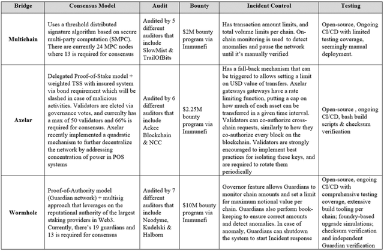
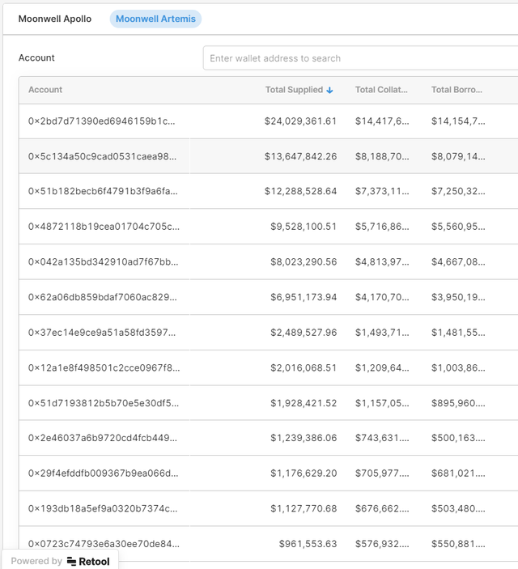
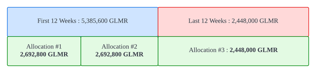

# StellaSwap's Ecosystem Grant Proposal

Thank you to all those that provided critical comments to further enhance our ecosystem proposal. We have reacted to all feedbacks and integrated value-added critiques to our enhanced proposal (V2). In order to effectively track the revisions, we have created the following table as a high-level overview;

**ABSTRACT**

[StellaSwap ](stellaswap.com/)is keen to jumpstart the growth of the Moonbeam ecosystem by attracting a ton of liquidity to foster a conducive and robust trading marketplace. The ecosystem grant will be used to deepen the market depth of strategic assets for widespread utility across the ecosystem. [Wormhole ](https://www.portalbridge.com/)has been selected as the main bridge for strategic assets.

**MOTIVATION**

Through innovation and a collaborative approach, our vision is to be the Schelling point for the wider Polkadot ecosystem. Ecosystem incentives represent a core enabler for attracting capital inflows, which consequently fosters a deep market that optimises price discovery. As the largest DEX on Moonbeam by TVL and trading volume, StellaSwap is fully dedicated towards spearheading growth of the network with the support of all stakeholders and users in the ecosystem. Having sufficient market depth across the ecosystem is required to enable the full-functioning of key protocols such as Moonwell, the leading lending protocol on Moonbeam.

**PROJECT OVERVIEW & TEAM EXPERIENCE** 

StellaSwap is an integrated trading protocol that features a standard AMM, a stable AMM and a concentrated liquidity AMM. We were the first DEX to go live on Moonbeam, and have been the prominent DEX ever since. At its peak, StellaSwap accumulated over $140M in TVL and had an average daily volume of around $3-$5M. StellaSwap has pioneered several novel mechanisms such as our [Initial Liquidity Offering (ILO)](https://stellaswap.medium.com/avax-ilo-recap-a-successful-model-for-cross-chain-liquidity-incentivization-827114df8574) to foster capital inflows towards Moonbeam, [ZAP feature](https://app.stellaswap.com/exchange/zap) to facilitate 1-click staking, and soon we’ll launch the [first concentrated liquidity AMM called Pulsar](https://stellaswap.medium.com/stellaswap-partners-with-algebra-to-bring-concentrated-liquidity-to-polkadot-moonbeam-3425e3abc140), which will be the most capital efficient AMM to date.

Besides Moonwell, StellaSwap was the only native DEX to receive grant incentives to spearhead ecosystem growth. We’ve worked with key protocols such as Moonwell, Lido, Beefy finance to develop a robust trading venue for the ecosystem.

StellaSwap is made up of a tight knit group of technologists and DeFi natives that previously founded one of the first regulated digital assets exchanges in the Middle East. Our founding team also includes a senior research associate from London School of Economics (LSE). Our team brings a wealth of expertise in digital assets trading and security systems, with prior experiences across high growth start-ups. We have been fully KYC-ed by the Moonbeam team.

**StellaSwap's Performance Before Grants**

Even before StellaSwap got any grants, we were the leading DEX across all major metrics, primarily TVL and unique users. Here's our TVL (https://defillama.com/protocol/stellaswap) vs Beamswap, which was the 2nd (https://defillama.com/protocol/beamswap). The rest of the DEXs were trailing behind. 
Here's the stats of daily unique users from web3g0: 

. 

It was clear that StellaSwap was the leading DEX and based on that, the previous grants were given. 

**RATIONALE**

The Moonbeam ecosystem will stand to gain in the following ways;

**1. Foster Market Depth**

With ecosystem grants, StellaSwap can begin incentivizing strategic farms to attract external capital (liquidity) into the Moonbeam ecosystem, which is key to a fully-functioning and robust marketplace. Greater market depth facilitates efficient price discovery, which is required for protocols such as Moonwell - and a host of DeFi applications - to operate. With incentives, there will be an inflow of new users that will be exposed to the various use cases within the ecosystem, including connected contract capabilities. Developers are more inclined towards building their dApps on a network with critical mass. 

An example of a highly successful ecosystem incentive program that happened just recently - in the midst of an under-performing market - was Ethereum’s L2 layer, Optimism. Optimism’s grants kicked off in mid-July 2022, with approximately $25M in unlocked grants that pushed TVL from sub-$300M to over $1B and trading volume increased by over 43% in just 2 weeks.

Another successful incentive program was Avalanche Rush, which was championed by Avalanche Foundation. The leading DEX at that time, Trader Joe, received $10 million in grants, resulting in a boost of TVL from a sub-$100M to a peak of $2.5B within 3 months. The entire AVAX ecosystem got a boost, with TVL topping over $12B within the same period. Fantom deployed the same mechanics, launching a liquidity incentive program in Aug 2021 valued at $320M. This caused Fantom’s TVL to grow 5x, topping at over $5B. However, it should be noted that both Avalanche and Fantom’s incentive program occurred during a bull period where market sentiments were positive, which resulted  in a greater boost. Optimism’s program is more relevant as a benchmark.

**2. Enhanced User Experience**

With greater total value locked (TVL) on Moonbeam, price discovery for token value would be the most optimal and slippage would be mitigated, thereby resulting in a conducive trading environment for users. Ultimately, end users will reap the rewards from a liquid market on Moonbeam from ecosystem incentives, resulting in lower slippages and a more streamlined user experience.

**3. Extending Cross-Chain Connected Capabilities**

Beyond ecosystem incentives for StellaSwap farms to drive TVL, we’re also excited to prepare for the launch of Squid, a liquidity routing module that enables cross-chain swaps and payments on [Axelar](https://axelar.network/), in early October. This partnership has been in the works for several months, and will unlock the power of cross-chain swaps across other L1 blockchain networks. The integration with Squid will enable significant trading volumes to flow through the Moonbeam ecosystem, in the most capital efficient way. In order to facilitate cross-chain swaps, StellaSwap will launch an incentivized USDC.axl metapool. Swaps will be routed via our stable AMM and concentrated liquidity AMM, ensuring optimal trading routes with low slippage. USDC.axl will be the primary route for cross-chain swaps from [Squid](https://0xsquid.com/).

On top of that, it is important to highlight the effectiveness of [Moonbeam’s HarvestMoon program](https://moonbeam.network/blog/harvest-moon/) that launched in June 2022 where 15M GLMR was allocated from the total supply. This pushed ecosystem TVL from $40M to $187M, a staggering 4.5X increase. As the leading DEX, StellaSwap was at the core of the incentive program and we had to work closely with Moonwell to coordinate liquidity parameters for the ecosystem. We had to ensure that grants were disbursed optimally in lieu of TVL targets and prevent unnecessary wastage of rewards. At that time, StellaSwap was the largest AMM not only on Moonbeam, but across Polkadot as well.

# Bridge Selection
This section details the spectrum of bridge-related information that is relevant to the selection of Wormhole as the main bridge.
## Selection Process & Prioritization of Factors
The main reason why StellaSwap refrained from recreating strategic farms immediately after Nomad was due to ecosystem considerations; setting up those farms entails the selection of the bridge, and as the leading DEX, bridge selection would set the direction for the ecosystem, which was sensitive and required a more thoughtful approach beyond just us. Therefore, we rolled up our sleeves across several weeks to perform our own due diligence, interact with the community, other protocols, internal stakeholders and gathered information directly from each bridge to create a bridging framework for the ecosystem. The manifestation of our work can be seen [here](https://stellaswap.medium.com/rebuilding-strategy-a-framework-for-evaluating-bridges-on-moonbeam-359701c5c461).
The selection of Wormhole was based on two major considerations;
1)	**Moonwell Governance Vote**: Moonwell community governance enabled the broader Moonbeam ecosystem, including StellaSwap, to poll users for their bridge preference through a [snapshot vote]( https://snapshot.moonwell.fi/#/proposal/0x7c96e4d331db2977a499a87b028a58d0f2a0bd343c68f5ea10e74d4cf6a387f6) on the preferred bridge. Wormhole was the overwhelming favourite, amassing 66% of the total votes.

2)	**Security & Financial Coverage as the Over-Arching Factors**: The second major consideration was our own internal evaluation of the most optimal bridge choice based on our analysis, which pointed to Wormhole based on two main factors; security and financial coverage. As StellaSwap was at ground 0 for Nomad’s exploit, we fully understood the need for a robust security framework and the importance of financial coverage in making users whole in the event of an exploit. 

Security must be discussed from a larger spectrum of elements that is beyond architectural logic but also, and equally, emphasised on various other vectors that included operational processes, safeguard mechanisms, audit coverage (full audit, continual audit & bounty), incident control and testing SOPs (for deployments). The comprehensiveness of “security” must be explored in detail for each component to ensure a proper evaluation of security prowess, and Wormhole edges out in aggregate. This will be discussed in the security section below.

There was also a concession that was highlighted in the framework that exploits/hacks may be undeniable in the world of DeFi, and therefore another core pillar discussed was financial coverage. This exact point was presumably a major factor by participants in the Moonwell governance process, as in the case of Nomad, there was no ‘lender of last resorts’ to backstop user losses. This insurance coverage – besides a robust security framework – played a strong part in why Wormhole was regarded as a credible and strong bridge option.

## Bridge Security Comparative Analysis
This is perhaps the most vital factor for evaluation of bridges, covering trust mechanism and security assurances. The former covers the spectrum of trust assumptions embedded within their logic and (operational) verifiers instituted in the system, while the latter covers the depth of audits, code deployment process and external bounties. The Nomad exploit underlined the need for a comprehensive and fully robust security framework; it is simply not enough to have a secure architectural logic without a corresponding emphasis on secure operational measures.
It is therefore vital to analyze the full-suite of security elements that not only include the architectural logic, but also — with equal emphasis — the respective operational security measures and safety measures determining the protocol’s code quality. Here is the comparative analysis for security across the bridges;

Across all security vectors, Wormhole stood out. The security guarantee of Wormhole comes from the reputational authority of the Guardians, which is made up of 19 of the largest staking and infrastructure providers in Web3. Beyond that, their dedication towards continual audits, offering the highest bounties as well as extensive incident control + robust on-chain monitoring played a huge role in edging the rest of the bridges. We have spoken to the Wormhole’s Chief Security Officer (CSO) to understand their security infrastructure and processes at a greater depth, which gave us more conviction on their dedication towards security.

## Risk Mitigation 
There are two main ways to mitigate against bridge risks that StellaSwap has established
1.	Focus on native assets
2.	Create metapools on our stable AMM for potentially higher-risk stablecoins that may be relatively young and untested both from a bridge operator POV and the actual risk profile of the stablecoin itself
On Point 1), we began sourcing for native stables for our basepool composition. One positive thing was the arrival of Tether on Polkadot, which StellaSwap, along with the likes of Moonwell pressured the Parity team constantly to have ready. Native Tether eliminates the risk of bridged USDT. That is why native USDT will be part of the core basepool. Additionally, once native USDC becomes available we would seek to introduce it to our farms and deprecate bridges USDC. 

We also launched the aUSD farm in partnership with Acala as this was something seen as the native stablecoin of Polkadot that our users were interested in. Unfortunately, an exploit resulted in the depegging of aUSD, which is still depegged as of now. That is why we cannot include it in the basepool for now, and would continually monitor the development of Acala. Even if Acala recovers, StellaSwap has conceived a risk-mitigated approach for stables onboarding. This is in the form of metapools. Beyond native USDT and aUSD, there was no other bluechip stables that had the traction/adoption to facilitate strong capital inflows, and even if we did incentivize the pool, the cost of TVL acquisition for these pools would be far higher than that of a bridged stablecoin like USDC. 

On Point 2), creation of metapools is a good way to isolate idiosyncratic risks of the stablecoin, and that is what we’ve done with USDC.axl (and potentially aUSD down the line once they recover). In the event that USDC.axl is compromised, it will not affect the basepool configuration.

**VISION OF SUCCESS** 

On a high level, our vision is to be the *Schelling* point for trading on Polkadot. With Polkadot’s [Cross-Consensus Message Format (XCM)](https://docs.moonbeam.network/builders/xcm/overview/), secure asset transfers between parachains allows us to attract inter-parachain liquidity and unlock connected contract utilities. Examples of this include working with [Acala to bring incentivized aUSD](https://stellaswap.medium.com/stellaswap-partners-with-acala-to-bring-ausd-into-moonbeam-80a1893d52fc), as well as [Interlay in launching the first iBTC farm](https://stellaswap.medium.com/first-trustless-bitcoin-ibtc-launches-on-polkadot-moonbeam-c3638055a24a). Beyond inter-parachain use cases, StellaSwap is keen to unlock cross-chain applications across other L1s, such as our partnership with Squid.

In order to actualize our vision, the core of our foundation as a DEX is predicated on the efficacy of our trading infrastructure. That is why we have constantly upgraded our infrastructure to enhance trading efficiency for all stakeholders, including our upcoming launch of Pulsar. Tying the success of StellaSwap and with ecosystem objectives, here’s the list of suitable metrics that will be fervently tracked;

**1. Total Value Locked (TVL)**

TVL is one of the strongest indicators of popularity and health of any ecosystem. The higher the TVL, the stronger the ecosystem as it is more trusted and reliable. When MoonbeamHarvest campaign started in July and incentives went live, StellaSwap’s TVL went from $18M to over $56M, even in an under-performing market. We believe that it is going to be easier to attract liquidity with Wormhole as compared to Nomad, as the former is one of the most reputable and oldest bridges around. Therefore, our target TVL would be around $25M - $45M throughout the duration of the established grant duration.

TVL would be the main metric in evaluating the success of the grants program, as seen across other L1 programs where the main methodology to spearhead ecosystem growth is to actually spearhead growth of liquidity first. This has been a constant across many L1s including Avalanche, Fantom, Optimism, Near protocol etc. Ecosystem incentives encourage user activity and TVL growth, which increases liquidity in the ecosystem, bringing new developers, who in turn bring more user activity and TVL growth. Please see the Moonbeam Ecosystem Flywheel infographic above. We're building not only for the success of StellaSwap, but for the success of the entire Moonbeam ecosystem. One thing that many of us have learned over the last few years of DeFi is that no single protocol succeeds on its own. Interoperability, which is the key reason why Polkadot and Moonbeam will succeed, require protocols to build on top of each other and integrate with each other. 

By following an almost identical liquidity plan, the StellaSwap and Moonwell communities were able to successfully build over $50M TVL on StellaSwap and over $185M TVL on Moonwell Artemis. We have a high degree of confidence in the plan and the ability to achieve the goal of growing ecosystem liquidity, but as is all things in crypto and life in general, it is impossible to say that such goals will be met with certainty.

**2. Trading Volume**

Greater volume indicates greater user activity on the chain, and is perhaps the most important metric to optimize for a DEX. Pre-Nomad, our daily trading volume was in the range of $2M - $5M. Our target is to reach these levels once rewards go live. With the inclusion of more markets such as stDOT and BUSD and the unlocking of their utilities in partnership with Moonwell, Lido and other stakeholders, we expect trading activity to increase beyond the base target levels. Once Pulsar is out, we expect trading volume to ramp up given more favourable trading conditions attributed to concentrated liquidity.

**3. Slippage**

One of the key factors that contribute to increased trade volume is the reduction of price impact or slippage. Having more liquidity (via an increase in TVL) would be the main avenue for reducing price impact. With incentivized pools targeted to attract more than $5M each on average, price impact would be reduced to less than 0.09% for trade values of $1,000. Pushing down slippage is one the key design factors for Pulsar; with concentrated liquidity, price impact would be significantly reduced, almost similar to the slippage seen in centralised exchanges.

**4. Unique Users**

User acquisition is a core metric for growth of any protocol; a growing protocol is attributed - in part -  to an increase in the number of users. It is imperative to track and optimize for user acquisition, especially when ecosystem incentives are used. The objective is to attract and onboard as many users as we can onto the Moonbeam network.

## LAUNCH STRATEGY

After comprehensive stakeholder discussions, we have decided that the most optimal way is to rebuild our strategic farms on our standard AMM and our correlated-asset farms (basepool + metapool). The equal liquidity distribution model of our standard AMM presents a safe foundation for ecosystem liquidity. This way, liquidations from Moonwell will operate optimally and reliably in any scenarios such as a black swan event. 

Therefore, ecosystem incentives would be directed to our strategic farms to kick start rebuilding. In the near future, we’ll be launching Pulsar, the first concentrated liquidity AMM on Moonbeam. Pulsar will drastically ramp up capital efficiency for liquidity providers and drive more effective price discovery for assets on Moonbeam, thereby leading to a conducive trading environment similar to that of a centralized exchange. As Pulsar optimizes for liquidity depth, this will benefit the ecosystem as only a fraction of TVL is required for similar market depths on current standard AMMs. This will induce greater efficiency for GLMR emissions as Pulsar will attract productive liquidity. The transition plan would be thoroughly discussed with all stakeholders in the network.

## Conservation Strategy

As GLMR (incentive) represents a finite resource that must be effectively deployed, StellaSwap must be ready to deploy a contingency plan in the event of a black swan. The main concerns around pausing or stopping emissions due to adverse market conditions is as follows;

1)	If LP’s know there’s a possibility of disruption in rewards they won’t bring it to being with and the campaign won’t be successful
2)	We have seen that it is more expensive to attract liquidity back thus offsetting any “savings” in pausing

With that in mind, we believe that any stoppage to the emissions should only occur in a scenario similar of that to what we experienced;
-	In the event of a security incident that resulted in the de-pegging of an asset, StellaSwap will cease emissions into the farm until there is clarity on next steps, whether it be post-resolution or deprecation.

## KEY TERMS

**DEX**: Decentralized Exchange refers to a peer-to-peer marketplace where users can trade cryptocurrencies in a non-custodial manner.

**TVL**: Represents the sum of all assets deposited in decentralized finance (DeFi) protocols

**AMM**: An automated market maker (AMM) is the underlying protocol that powers a decentralized exchange (DEX) by enabling assets to be traded by using crypto liquidity pools as counterparties, instead of a traditional market of buyers and sellers.

**L1**: Layer 1 blockchains are the base-layer blockchains that process and record transactions for their respective ecosystems, featuring a native cryptocurrency typically used to pay fees and provide broader utility.

**APR**: Also called simple interest, APR is the annual rate of return, expressed in percentage.

# Grants Overview

## Importance of Concentrated Baseline Liquidity

The main purpose of ecosystem grants is to kickstart growth of baseline liquidity for the ecosystem. To be clear, StellaSwap is not and will never be against depriving access for grants by protocols. That will be counter intuitive as all of us are aligned in making Moonbeam a success. However, it is important to understand the high-level objective of the ecosystem grants where we are right now; there is no baseline liquidity since all strategic farms have been destroyed in Nomad's exploit. 
Here's 2 scenarios;

- Scenario #1: $30M liquidity is concentrated in a DEX that has been granted $4M (which is small relative to incentives programs in other L1s to kickstart ecosystem) to establish a baseline market depth for the full function of the ecosystem. It will foster conducive trading environment, facilitate vital functions such as liquidations and lead to greater capital inflows.

- Scenario #2: 4 DEXes with $7.5M TVL, with $1M in grants. Slippage & trading costs is high, vital functions like liquidations cannot occur due to the lack of market depth. And to top it off, APRs is tiny as it is divided 4-way, thereby reducing the potential for attracting capital inflows due to insufficient rewards to cover impermanent loss risk.

This juxtaposition highlights the pitfall of fragmented liquidity, which would dent the success of establishing the requisite market depth for the full-function of the ecosystem.

It is true that it would be more fair to award GLMR to multiple DEXes, however, this strategy is likely to fail to attract meaningful growth in terms of users, TVL, and adoption, for the following reasons:

- Liquidity providers in DeFi generally chase higher yield and lower risk

- They evaluate opportunities based on the potential income (APR/APY) and the risks (qualified team behind the project, quality bridge, strong/secure L1) 

DeFi liquidity providers have target APR/APYs they are generally trying to achieve:

- For stablecoin pools with low risk of impermanent loss, approximately 8-10% APR is a good rate of return

- For crypto pools with a higher risk of impermanent loss, approximately 20-30% APR is a good rate of return

To put it simply, Moonbeam might have a couple different options with the current budget:

- Allocate 8% APR rewards to a single DEX in the stableswap pool

- Allocate 2% APR rewards each to four different DEXes stableswap pools

At 8% APR, Moonbeam can be somewhat competitive and attract stablecoin liquidity, but at 2% APR, they have no chance, especially when you look at the Ethereum mainnet yields for stablecoin pools on Uniswap, which carry no bridge risk:

## OVERALL COST OF GRANTS

We’ve mapped out the incentives requirement for the next 6 months, with vital inputs from Moonwell such as their slippage analysis to establish the minimum liquidity threshold for each strategic asset. 

We will divide the 6 months grant duration into two parts, as there is a 12M GLMR cap. Given the current low of GLMR prices in this market conditions, it is not sufficient to maintain equal distribution across the entire duration for the TVL targets that is required for sufficient market depth, which is mainly predicated on Moonwel’s slippage analysis for their markets to allow for robust liquidations.

The 6 months duration is broken into two parts, and the corresponding GLMR requirements;
1. First 12 weeks: Week of 5th October - Week of 21st December, 2022
      - GLMR Required: **5,385,600 GLMR**

2. Last 12 weeks: Week of 28th December, 2022 -  Week of 15th March, 2023
      - GLMR Required: **2,448,000 GLMR**

The breakdown of the GLMR requirements will be explained in the next section.

## USE OF GRANT

*It must be emphasized that the totality of the grants will be used to incentivize farms to build baseline liquidity. Under no circumstances would any of the grants be used for development or any other purposes beyond incentivizing the farms, which goes to LP stakers.*

The grants will be used to incentivize strategic farms as part of our rebuilding process. Strategic farms are made up of assets of strategic importance, which are in the form of blue-chips. Sufficient market depth is vital to ensure the full-functioning of several native protocols such as the biggest lending protocol, Moonwell. There must be an adequate threshold of liquidity for supported assets on Moonwell, which have coordinated with them on. 

It is important to note that the TVL targets are predicated on APR baselines that have been empirically observed previously on StellaSwap. We have also factored in the reduction in reputational risks for Wormhole assets, which we’ve seen in Nomad previously where the cost of emissions is higher for new bridges vs older and more credible bridges such as Wormhole. 

Here is the emissions breakdown on a week-by-week basis:

**First 12 Weeks: Week of 5th October - Week of 21st December, 2022**

For the first half of the grant duration we have further broken down the emissions based on when Moonwell will start incentivizing their markets. For the first four weeks in October, StellaSwap will begin the incentive program to start building liquidity for the ecosystem. Once liquidity has been built and Moonwell starts opening and incentivizing their markets, StellaSwap will bump up emissions to ensure deeper market depths when Moonwell is operational. This ensures that we are prudent with ecosystem grants before Moonwell is operational, allowing a base liquidity for the ecosystem first.

The first four weeks for kickstarting initial ecosystem liquidity, as well as before Moonwell starts reopening the rest of their markets, is as such:

Once there is a base level of market depth for the ecosystem to rebuild, we will start to increase GLMR allocations for strategic assets in order for sufficient liquidity for Moonwell’s liquidations. We have coordinated with Moonwell on the minimum liquidity threshold for liquidations to occur, which is dependant on slippage analysis on their end. The emissions and the required TVL thereafter for the next eight weeks will be as such;

All in all, the total GLMR required for the first 12 weeks is **5,385,600 GLMR**.
 
 
***Last 12 weeks: Week of 28th December, 2022 - Week of 15th March, 2023***

In the last 12 weeks of the proposed timeline, GLMR emissions will be reduced given the max ecosystem cap. Instead of a linear distribution across 24 weeks, it will be more prudent to concentrate 70% of liquidity in the first 12 weeks to meet the minimum liquidity threshold for liquidation on Moonwell to occur, which is a vital pillar of the lending and borrowing markets and that which cannot be met across 24-weeks with equal distribution. Once the market has matured with greater TVL depths, we can reduce the emissions.

Here are the GLMR requirements for the last 12 weeks:

The total GLMR requirements for the last 12 weeks amount to: **2,448,000 GLMR**.
The extension *.wh* refer to Wormhole assets. StellaSwap will partner with Wormhole as our strategic bridge, after a unanimous community decision via [Moonwell’s governance](https://snapshot.moonwell.fi/#/proposal/0x7c96e4d331db2977a499a87b028a58d0f2a0bd343c68f5ea10e74d4cf6a387f6).

### Context of STELLA Emissions
*The total STELLA requirements for the entirety of the 24 weeks amount to 4,685,341.49 STELLA, which is a 7% increase as compared to the first proposal.* 

As a DEX, StellaSeap's native token - STELLA - would be the primary medium used to bootstrap liquidity and hence there's naturally strong selling pressures due to the constant inflation. One of the main functions is emissions handling, ensuring that the inflation rate takes into account various factors such as the expected APR goal, liquidity stickiness threshold, as well as productivity of each farms. The key is having an optimal rate in lieu of all factors. Without that, STELLA token will constantly depreciate in value, and creates a vicious cycle of GLMR dependency down the line as more inflation is needed to keep up with APR targets, which will dilute the price even more. That is why the STELLA proposal factors in the maximum allowable inflation.

However, after all things considered, we have decided to increase the STELLA emissions beyond the allocation that were first established based on pre-Nomad times in order to signal our commitment in making this a success.

## Asset Justification

The breakdown of the target TVL and rewards is predicated on our past experience in optimizing for TVL and volume. Here is the justification for each strategic assets;

**USDC.wh / wBTC.wh / ETH.wh / xcDOT / 4Pool (USDC.wh+NativeUSDT+FRAX+ BUSD.wh)**

These coins represent strategic assets across the Moonbeam ecosystem, with lending/borrowing markets established on Moonwell. Therefore, it is no surprise that 99.2% of all GLMR incentives are distributed across these strategic assets. 

USDC.wh - GLMR farm is by far the most strategic pair across Moonbeam, as it is the most widely traded pair by a mile. On average, this pair accounts for 30%-50% of total trading volume. Its popularity rests on having a stable medium for GLMR-side, as well as the role of USDC.wh being a dominant stable that will route stable swap liquidity for GLMR acquisition. That is why this requires the greatest incentive coverage, relative to its productivity (which is the highest). Having a deep market depth facilitates a low-slippage environment, allowing institutional users and liquidators to trade efficiently.

wBTC, ETH and xcDOT are bluechips across the DeFi ecosystem and as previous track record shows, represents the most active and popular coins on Moonbeam. They are also primary assets on Moonwell.
StellaSwap will relaunch our 4Pool basepool as it represents an efficient pooling of the top stablecoins, one that enhances trade routing and mitigates against emissions dilution. This enables emissions to be focused on a pool of correlated assets, all of which are bluechips. We are excited to include native USDT in the mix, which is close to launching on Substrate. USDC and BUSD assets will utilize Wormhole bridge.

**USDC.axl Metapool**

In the pursuit of extending cross-chain connected capabilities, UDSC.axl’s metapool is a core component in enabling cross-chain swaps. We have partnered with an upcoming cross-chain DEX: Squid. Squid is the liquidity routing module on Axelar that will facilitate cross-chain swaps with other L1s, allowing users to simplify their trading experience and access tokens natively on their origin chain. The USDC.axl pool serves as the medium for trade execution, allowing trades to be routed, aggregated and executed across the participating L1 chains.

**stDOT Pool**

stDOT is an upcoming asset that is widely accepted in Moonbeam and would be a strategic asset down the line when more GLMR emissions open up. stDOT is currently the largest pool on Moonbeam without any GLMR incentives, as it is primarily fueled by Lido’s incentives. We have been working with Lido to open up greater utility for stDOT, and this initial allocation would serve to kickstart initial liquidity on StellaSwap. stDOT listing on StellaSwap would radically enhance trade routing of stDOT across other assets within Moonbeam; currently a great deal of stDOT is siloed in Curve without any automated/efficient routing to any other assets except DOT. Examples of future utility would be listed as a primary asset on Moonwell, accepted as collateral for [MAI minting](https://app.stellaswap.com/mai) as well cross-chain swap exposure.

## Trackable Metrics & Conditional Requirements for Continual Grants

# TVL Targets Reference
StellaSwap’s baseline TVL requirement is worked on in conjunction with lending protocols like Moonwell, which requires a requisite market depth in order to liquidate underwater loans without too much slippage. Moonwells liquidity plan was developed in collaboration with DeFi experts and advisors that helped to perform slippage analysis and created a very similar liquidity plan to support the initial launch of Moonwell Artemis on June 23rd with Nomad assets. StellaSwap has also discussed with experts on the baseline TVL required for sufficient liquidations to occur. 

As an example, a farm with $5M TVL has a 2.2% slippage when an amount of $50,000 is traded. That is a high slippage factor that results in a high cost of liquidations, especially in times of duress (where liquidation occurs most).

 Here are additional inputs that put things into perspective;
- Liquidation fee (Gross rev. for liquidators): 7%
- Historical TVL of Moonwell (pre-Nomad): $185M
- Pre-Nomad Metrics (Total Supplied, Total Collaterals, Total Borrowed) 

Even though it is clear that the possibility of liquidating the top users on Moonwell seems like a jarring proposition, a baseline of $3-$5M provides a bare minimum to support small-mid liquidations. The slippage analysis on a $50k trade value on a $5M farm that resulted in a massive 2.2% slippage is sufficient proof of the relatively thin liquidity that we're aiming for.

# TVL Milestones & Conditional Requirements

The primary TVL milestone that the success of the grants program would be the aggregate TVL of all farms on StellaSwap, measured by the quantity of assets and not dollar value of the assets. One major limitation of tracking TVL based on the dollar value is that it is highly dependant on the volatility of asset prices. The main methodology of analyzing capital inflows is the quantity of assets that is flowing into Moonbeam, which does not take into consideration the fluctuating value of the asset. That being said, it is difficult to track asset quantity and TVL is the most appropriate aggregate metric for now.

Based on that, our target TVL would be around $25M - $45M throughout the duration of the established grant duration. It must be highlighted that $45M is based on the tapering of the APRs. The failure for StellaSwap to reach a base TVL of $25M would require us to increase STELLA emissions in order to reach the $25M base. This is a sign of our commitment in ensuring that there is sufficient base liquidity to power the ecosystem.

In the opposite scenario where market conditions tend to be positive and GLMR prices pick back up, we will maintain status quo and facilitate the reflection of the increased APRs that will seek to deepen ecosystem liquidity. This will be highly beneficial to the ecosystem where the flywheel effects could be enhanced, given the limitations of a relatively small ecosystem grant cap (Level 3).

12M GLMR over 6 months is not sufficient, at current GLMR prices, to properly bootstrap the ecosystem with the liquidity necessary to support healthy liquidations across many different assets. When compared to other ecosystems, like NEAR protocol, who invested $350M in ecosystem grants, the amount invested by the Moonbeam foundation pales in comparison. Even at today's lower valuations, these ecosystem incentives are still worth $147.6M, compared to only ~$5.2M in this tier 3 budget.

The reality is that if we don't put sufficient incentives on Moonbeam ecosystem projects, we won't attract meaningful liquidity and will continue to be a "ghost chain". Both StellaSwap and Moonwell is deeply invested in the ecosystem, and is building for the long term, but there are certain economic realities that liquidity providers have when it comes to providing liquidity in an ecosystem:

- If the rewards are not sufficient in the form of APRs that justify the risk, LPs will not take the risk of using a new ecosystem, especially if bridges are involved.

- If LPs choose to bring their liquidity to other ecosystems with higher reward APRs, there may never be enough liquidity for Moonwell to establish healthy collateral ratios for these markets because liquidations cannot be successful.

This extremely low budget over 6 months and the brutal reality of competing ecosystems with 20-30x the ecosystem incentives allocated will cause Moonbeam to continue to be a low usage, low activity, low TVL ecosystem.

# Secondary Metrics Tracking
It is important for StellaSwap to also ensure the tracking of secondary metrics in a transparent manner so that we can analyze the effecitiveness of the grants program. Here is the following secondary metrics that will be tracked, which is similar to prior metrics that were furnished to the Foundation during pre-Nomad times;
-	Avg Trading Volume (Daily)
-	Avg No. of Txns (Daily)
-	No. of Unique Users
-	Trade Fee APRs
-	Farms APR

# Grants Release Cadence
We would be happy to accede to the committee’s request of breaking down the grants distribution cadence into 3 separate parts instead of the initial 2 in the original proposal. This will ensure similar dollar-value parity in distribution across all three allocations, since the bulk of the emissions are established to be within the first 12 weeks. On top of that, it will establish greater accountability for StellaSwap in receiving the next allocation of grants only when the TVL milestones (which has been established in prior sections) has been achieved.

Here is the conditional cadence of grant distribution;

**TIMELINE**

We hope to begin incentivizing the proposed farms starting on the week of 5th October for a period of 6 months, ending on the week of 15th March, 2023.
