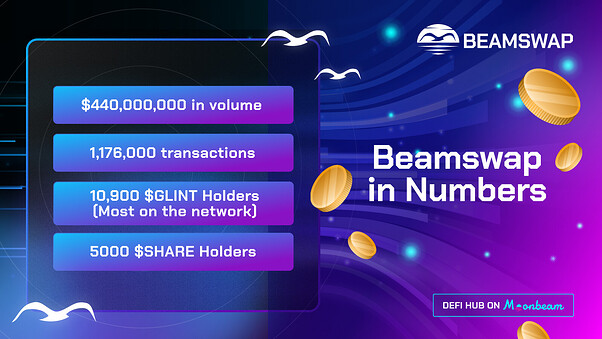
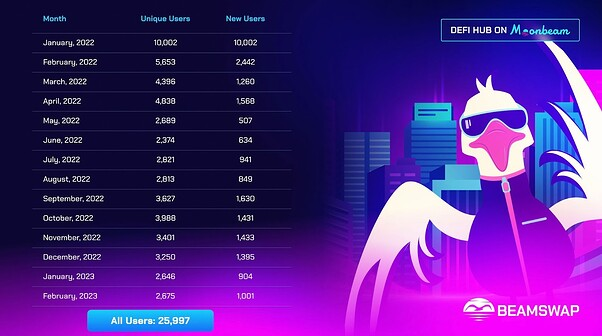
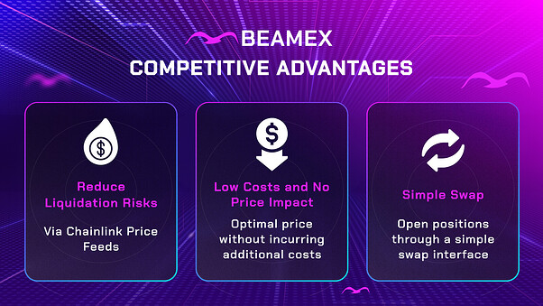
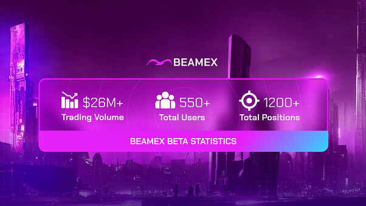
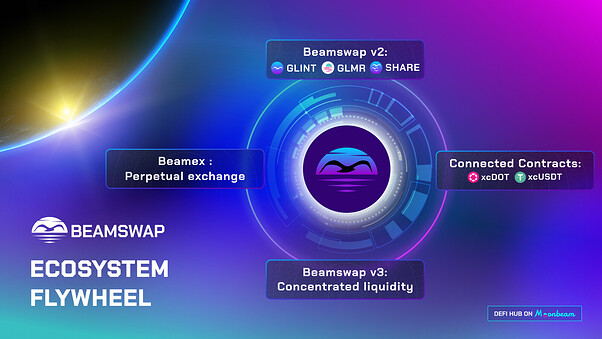
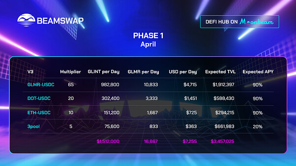
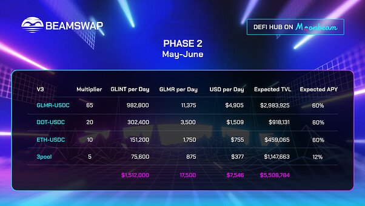
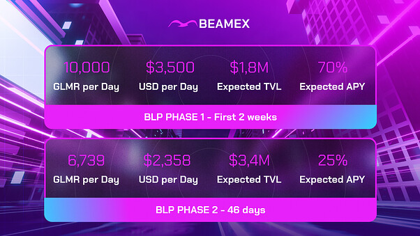
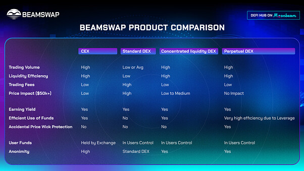
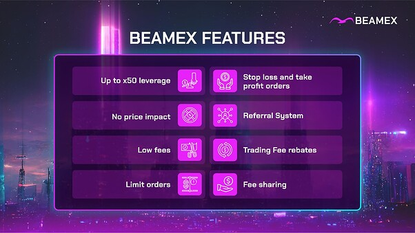

# Title: Beamswap: Ecosystem Grant Draft Proposal
## Author: Beamswap Team

## 1 Primary goal

The present Moonbeam Grant Proposal is submitted with the intent to achieve two goals - initially, to increase market liquidity for Beamswap's newest products, namely Beamex, a decentralized perpetual exchange (perpetual DEX), and concentrated liquidity AMM (CLMM), and consequently, to bring more active users to the Moonbeam Network and retain them long-term.

An expanded and loyal community would increase Beamswap's self-sufficiency as a user-powered DEX. It would also reduce its reliance on external funding support, ensuring long-term sustainability and continuous contribution to the growth of both the Moonbeam Network and Polkadot ecosystems.

To support Moonbeam's vision of connected contracts adoption, Beamswap will include xcDOT, xcUSDT, and axlUSDC among supported assets and seamlessly integrate XCM transfers into the DEX's front end, as it did with the Multichain bridge.

## 2 Project Description

Beamswap is a leading Moonbeam-based DEX and an ample DeFi hub powered by both standard and stable AMM, providing liquidity for peer-to-peer transactions.

## 3 Requested GLMR Amount

The amount requested to support the project initiatives is 2,000,000 GLMR.

## 4 Use of Grant

The funds acquired through the Grant would increase market liquidity for Beamswap’s newest products, Beamex, a decentralized perpetual exchange, and concentrated liquidity AMM, leading to a stronger influx of active users to the Moonbeam network and their long-term retention.

## 5 Motivation

Since its inception just over a year ago, Beamswap has built and released cutting-edge DeFi solutions on the Moonbeam Network and fortified its position among the top three dapps in the space. The platform has successfully implemented most of the available technologies and established strong relationships with partners within the Moonbeam space to constantly improve the service and deliver ever-new reasons for users to adopt Moonbeam as the network of choice in their DeFi journey.

While the team is proud to say it was all accomplished with simply hard work, commitment, own funding, and zero GLMR incentives, the platform also deserves mutual support and backing from the Moonbeam Network’s side.

Every GLMR acquired would be poured directly into development, pursuing the goal to deliver more, serve better, and achieve greater goals for every DeFi user in the space while utilizing Moonbeam’s technology, specifically connected contracts and cross-parachain communication.

Following the vision of becoming a fully user-powered DEX, the funding of Beamswap would, therefore, beneficially impact the acquisition of new users on the Moonbeam Network, further increasing its relevance compared to other networks.

### 6 Reserved for Updates

*Expanded Primary Goal:*

Our intention was for the community to gain a comprehensive understanding of Beamswap’s objectives by reviewing our grant proposal. In brief, our current objective is to expand Moonbeam’s user base and increase transaction volume, total value locked (TVL), and overall activity by leveraging Connected Contracts technology. Since our suite of products supports multiple goals, it is not practical to focus on just one.

*Expanded Vision of Success:*

Below are several quantifiable metrics that are consistent with the specific objectives of the grant. Our projections are based on current market conditions and are dependent on obtaining the entire grant funding.

Expected growth in Phase 1 of Beamswap Concentrated Liquidity (April 2023) :

* Unique User Growth from 1100 to 1300 per month
* Increase average monthly transactions from 40000 to 50000
* Hit $1.5M TVL within 1st week of Concentrated Liquidity launch

Expected growth in Phase 2 of Beamswap Concentrated Liquidity (May - June 2023):

* Increase Unique User Growth by 15% compared to Phase 1 results
* Increase average monthly transactions by 15% compared to Phase 1 results
* Hit $3M TVL within 1st week of Phase 2 launch

Besides using GLINT and GLMR as reward tokens we also plan to attract users with internal and external marketing powered by Airlyft and Crew 3. We will also implement a referral program and a strategic content strategy that emphasizes inbound marketing funnels to focus on user acquisition and total value locked (TVL) growth.

*Grant Allocation and Fundamentals:*

`Are there any protections or contingencies for BLP in the event of a de-peg of stablecoin (whether it’s USDC or USDT) after launch?:`

In case another UST or USDC depeg occurs we can protect the BLP with setting the stablecoin Index weight to 0.

`How does BLP token work?`

When a user acquires BLP, they contribute liquidity to the pool. An equivalent dollar value of BLP is minted and credited to the user based on the asset’s value at the time of deposit. Upon withdrawal, the user selects an asset to receive from the liquidity pool, and they obtain the same dollar value of that asset as the BLP tokens they return, which are then burned. The only way to obtain BLP is by providing liquidity, making BLP holders the liquidity providers.

Profits earned by leverage traders reduce the BLP value, as these profits are paid from the liquidity pool. Conversely, funds lost by traders are deposited into BLP, increasing the value of BLP tokens. Numerous statistics and broker reports indicate that 80-90% of traders lose money, which ultimately benefits BLP holders. When traders have open positions, they must pay a borrow fee at set intervals. This fee is paid into the BLP Index.

`How do GLMR rewards work in BLP Phase?`

Users will stake BLP tokens to receive rewards in GLMR. Additionally, 70% of the platform’s fees will be converted to GLMR and distributed among liquidity providers.

*Community and Ecosystem Engagement (most asked)*

`Please provide more information on how you are collaborating with other teams in the Moonbeam ecosystem.`

Our team is always actively exploring new ways and trends to work together with other teams in the ecosystem. We look only to continue to work hard towards this important initiative.

Regarding recent collaborations we have the Airlyft campaign, we hosted in co-op with Moonfit or the Take Flight Alpha sponsored promotion we did at Eth Denver where we also networked and had the opportunity to present and release Beamex open Beta to the world at the Moonbeam booth. This was done with other great builders in the ecosystem all networking and driving education together showing the value of Moonbeam. Other partners include: Subsquid, Axelar, Multichain, Braindex, DAM Finance and GLMR Apes.

*Community and Committe questions:*

We will conduct audits for both platforms before their release, and we are currently discussing this with auditors suggested by the Moonbeam Foundation. Additionally, for Beamex, we have an open beta phase with a Discord channel dedicated to reporting any bugs. Thorough testing before going live is critical to us, and we prefer all projects to adhere to this practice instead of conducting testing during production.

BeamexBETA: https://beta.beamex.exchange/

`Is there a scenario where you would consider transitioning to .wh assets, or are you strongly committed to .multi ?`

> Depending on the outcome of the grants, we’re open to incorporating Wormhole assets if needed. If we are selected we are prepared to use Wormhole assets, due to community concerns and to prevent liquidity fragmentation.

` Is there any protection against asset manipulation on Beamex?`

Beamex retrieves asset prices from three centralized exchanges and employs a Chainlink oracle to relay the data on-chain. The efficiency of Beamex prevents price slippage, so any manipulation of asset prices would have to occur directly on the centralized exchanges themselves. To counter this, Beamex restricts open interest for cryptocurrencies with lower liquidity, making the cost of manipulation on centralized exchanges higher than any potential gains on Beamex, given the limited position size. Furthermore, Beamex is currently operating a beta version for bug testing and will conduct an audit to verify that no oversights have been made.

`How would your development plan be affected if there were no incentives for your project?`

To date, we have not received any incentives from Moonbeam. Despite this, we continue to deliver new products and add functionalities, even providing over $9 million in incentives ourselves to attract liquidity and users to the Moonbeam network. If the network’s support remains insufficient, we may need to consider other parachains and EVM networks as potential new homes for our project and community, where we can collaborate effectively with the network teams.

```
Can you provide more details on the use cases for connected contracts?
```

Regarding connected contracts, we plan to incentivize liquidity for the xc-tokens specified in the proposal (DOT, USDT) and integrate Squid’s Axelar-powered router, which facilitates cross-chain swaps and routing. Additionally, we will incorporate Multichain’s recently released v7 router that supports cross-chain swaps. As Multichain is the bridge with the highest Total Value Locked (TVL), it will offer an excellent user experience and reduced slippage. You can find more information here: https://docs.multichain.org/developer-guide/bridge-funds-and-anycall-router-v7.

Furthermore, we are exploring other networks such as Base and Optimism, in line with Moonwell’s approach.

`In case the situation with USDC and Circle deteriorates, the USDC stablecoin would be replaced with USDT (Tether) prior to product launch.`

## 7 Project Overview and Relevant KPIs - brief description of project including historical KPIs on protocol traction and success to date on Moonbeam.

The Beamswap DeFi Hub is among the five leading players in the Moonbeam DeFi arena, according to:

* [Web3Go Moonbeam Analytics](http://app.web3go.xyz/#/MoonbeamPublicDashboard)
* [DappRadar](https://dappradar.com/rankings/protocol/moonbeam)
* [Moonbeam Subscan](https://moonbeam.subscan.io/erc20_token)

Beamswap has continuously hit the charts and was listed among/as:

* Top 3 dapps by dapp transactions
* Top 5 dapps by dapp active addresses
* Top 3 dapps by number of unique active wallets
* No. 1 held community token on the chain ($GLINT)
* No. 1 held secondary token on the chain ($SHARE)

In just over a year since launch, the Beamswap DeFi Hub has accumulated a lifetime volume of USD 450 million, with a peak TVL of USD 100 million, a daily average volume of USD 1 million, and registered over 1.15 million transactions to date.

The Beamswap-native $GLINT token is the most held asset on the Moonbeam Network with 10,900 holders, while the $SHARE token is the most held secondary asset on Moonbeam with 5,000 holders.



Beamswap DeFi Hub supports an array of versatile and technologically sophisticated features. Advancing from the one-click peer-to-peer asset swap, users can benefit from Standard and Stable AMM, stake their tokens in Beamshare, earn passive income in Yield Farms, Zap In and Out to acquire LP tokens in a click, use elaborate trading tools in Advanced Trading, track their transactions in Portfolio Tracker, stay updated with $GLINT burn trajectory on the Burn Dashboard, put their skills to test in Trading Competitions, participate in BLO - Beamswap Liquidity Offering, and support promising projects on Beamswap Launchpad.

Since the previous Moonbeam Grant application, Beamswap further developed and introduced the Trading Competition capability, advanced Referral system to boost user acquisition, and Gas Pump for a faster swap of bridged assets.

In one of the most radical updates, the platform has recently developed and launched a Beta version of a Perpetual DEX and is about to complete the Concentrated Liquidity solution.

The rich array of opportunities has attracted a strong, and growing, user base. On average, Beamswap has 3,940 unique monthly users and onboards 1,855 new users per month. To date, 25,977 unique users in total have interacted with the Beamswap dapp in one way or another on the Moonbeam Network.

## 

## Beamex Beta

Beamex is the newest perpetual DEX that evolved from Beamswap DeFi Hub and delivers opportunities for trading derivative crypto contracts.

As a decentralized spot and perpetual exchange, Beamex delivers advanced crypto trading to the Moonbeam network, both market order swaps and leverage trading of crypto futures, at low fees and zero price impact.



An in-depth article about Beamex and its core features can be read [here](https://medium.com/beamswap/announcing-beamex-a-decentralized-perpetual-exchange-f8a81b0447cf).

### Beamex Beta first week statistics



The Beamex Beta is delivered on the BSC Testnet, where users test the exchange features using imaginary tokens. The trade results achieved on Beamex Beta cannot be translated to the production-level Beamex due to factors such as using real money, low risk-taking, and lower TVL. For the Beamswap team, the Beamex Beta represents a test version, and the community should approach it as merely a way to familiarize itself with product features.

## 8 Team Experience

The Beamswap team represents a tight-knit international group of 15+ members, crypto veterans with a strong background and years of experience in Web3 development, DeFi and TradFi, and strategic marketing, working tirelessly to deliver outstanding service, scout new partnership opportunities, and contribute to the evolution of the ecosystem.

Most team members have public names on their social profiles and wish not to be named in the present grant. The Moonbeam Foundation is acquainted with all the key team members and has met several of them at past crypto conferences and events.

The Beamswap team has participated in various roundtable talks, attended many Web3 and crypto events, and held smooth discussions with the Moonbeam ecosystem representatives. Just recently, Beamswap was present at ETHDenver, where Beamex was introduced to the world at the Moonbeam booth.

## 9 Timeline and Milestones for Use of Grant

With upcoming launches of Beamex, the first perpetual exchange on Moonbeam, and Beamswap’s concentrated liquidity v3, both platforms will be in need of boosted liquidity to perform simultaneously and optimally.

The Beamswap Flywheel will leverage all the Beamswap products and consist of the following:

Connected contracts <> Beamswap v2 <> Beamswap v3 <> Beamex



100% of the GLMR incentives acquired from the present grant would be channeled back to network users, mainly to provide extra rewards for liquidity providers on Beamswap and perpetual traders on Beamex.

## Two-phase development plan

We have divided our grant application and development plan into two phases.

### Phase 1: Beamswap v3 liquidity building

* Start: first week of April 2023
* End: April 30, 2023
* GLMR requested: 500,000
* GLMR use: concentrated liquidity incentives

### Phase 2: Beamex launch

* Start: first week of May 2023
* End: June 30, 2023
* GLMR requested: 1,500,000
* GLMR use: exchange incentives
  * 1,050,000 GLMR for Beamswap v3 exchange incentives
  * 450,000 GLMR for Beamex perpetual DEX incentives
    * 140,000 GLMR for Launch phase
     * 310,000 GLMR for Retail phase


Onboarding new users from different corners of the Web3 space and beyond proves to be a challenging but not impossible task. To deliver the latest DeFi services and features to different communities on various networks, the Beamswap DEX integrates Multichain, the bridge with [the highest TVL](https://defillama.com/protocols/Bridge) across all EVM networks.

For users to have more authority and sovereignty, they should be able to choose their preferred stablecoin among all the supported coins on the Moonbeam Network. As a Moonbeam-native DEX and perpetual exchange protocol harnessing the power of Moonbeam’s connected contracts, Beamswap and Beamex aim to provide direct access to Multichain stablecoins together with Polkadot-native stablecoins.

### TVL and APY estimates

Token prices used for calculations: (10th March 2023)
* GLMR = USD 0.35
* GLINT = USD 0.00092

Beamswap reserves the right to discontinue or pause GLMR emissions in case of extreme events on the Moonbeam Networks, such as, but not limited to:

* Moonbeam Foundation’s request to stop/pause the program
* Significant price manipulation on one of the assets (>70% price change)
* Bridge exploit (Nomad, aUSD scenario)
* Smart contract risk (unverified contracts that might affect the Beamswap platform)
* Auto-compounder exploit (LP migration)
* Network downtime (upgrades, pauses, etc.)

In case of other detrimental events, Beamswap would also halt rewards and return the remaining grant amount to the Moonbeam Treasury.

Expected TVL is an estimate based on the current token prices and network activities.

### Phase 1

In the first four weeks, a liquidity-sufficient order book would be developed for assets included in the Beamex Perpetual Index token, BLP. With the launch of Beamswap v3 concentrated liquidity AMM and proposed TVL, ~95% of all Moonbeam-based transactions to date can be covered.

Through the use of XCM transfer and connected contracts, a stable pool (3pool) consisting of USDTxc, USDCaxl, and USDCmulti would be deployed.



Achieving the forecasted TVL would lead to more daily volume on the Beamswap DEX while increasing the Moonbeam Network key metrics in active users, transactions, and total value locked.

Expected APY and TVL should be met within the first week of the Beamswap v3 launch.

The success of Phase 1 and Beamswap’s capacity to proceed with Phase 2 would be measured by unique user growth, transaction size growth, TVL, interactions with the exchange’s smart contracts, and more.

### Phase 2

Following the successful Phase 1 of building sufficient liquidity, the Beamex perpetual DEX, the first perpetual exchange on Polkadot Network, is planned to launch.

Using Beamswap Flywheel, users will be able to benefit from Moonbeam and Polkadot capabilities to open long or short positions on Beamex-supported assets.



Expected APY and TVL should be met within the second week of the Beamex launch. The adoption of Beamex will be supported through a set of guides, dedicated community managers, and daily marketing activity to ease user onboarding to a completely new product. The use of Beamex Beta is strongly encouraged.

## Roll out of BLP token powering Beamex liquidity

### BLP token

BLP, Beamex Liquidity Provider Index Token, is Beamex’s native liquidity provider asset.

It represents an index of assets used to support swaps and leverage trading on Beamex, and replaces the liquidity token pairs used to provide liquidity on Beamswap.

BLP is composed of:

* ETH (30%)
* BTC (12%)
* DOT (5%)
* GLMR (3%)
* USDC (50%)

BLP can be minted using any index asset or burned to redeem any index asset. In case the situation with USDC and Circle deteriorates, the stablecoin would be replaced with USDT (Tether) prior to product launch.

Leverage traders source liquidity by borrowing from exchange, or, more accurately, liquidity providers or BLP token holders. When such traders suffer a loss, BLP holders earn a profit and vice versa.

### Phase 1

The initial phase is the Launch phase with 140,000 GLMR community rewards.

### Phase 2

The following phase is a Retail phase with 310,000 GLMR community rewards.



# 10 Vision of Success

This proposal aims not to simply funnel granted funds to increase the platform’s volume and liquidity. Instead, it seeks to spread them more thoroughly and thoughtfully to primarily cater to user expectations and demands to enjoy an excellent DeFi experience.

While the number of users is easy to count, it is much more challenging to predict the user base growth rate. User adoption depends not only on the success and functionalities of the platform but also on factors beyond the team’s control, such as network stability, market sentiment, competition, media presence, and word of mouth.

At the beginning of 2023, Beamswap had an average of 2,661 unique users per month and added 953 new users per month. These figures will be used as a baseline for determining the Incentive Program’s success along with TVL, volume, and transaction count.

As Beamswap progresses with platform development, continuously steady QOQ user growth is anticipated, especially with incentives powering the user onboarding initiatives and campaigns.



Ultimately, the long-term goal for Beamswap is to become a fee-powered DEX, reliant only on ongoing user activity bringing in sufficient volume and liquidity.

# 11 Rationale

Beamswap is about to introduce two new products - concentrated liquidity AMM and perpetual DEX. Compared to a standard AMM, these will enhance transactional efficiency while lowering operating costs. However, their operation requires a higher percentage of liquidity, as seen with concentrated liquidity and perpetual solutions on other networks.

By bringing new users to the Beamswap platform and familiarizing them with the network’s benefits, the Moonbeam ecosystem would get a significant boost in daily volume and liquidity, further solidifying its relevance as the go-to network for builders, users, and service providers.

As more XC-20 assets are supported, Beamswap continues reinforcing the implementation of Moonbeam’s connected contract capabilities. Better asset choices and cross-chain connectivity would provide users with greater DeFi options, boosting market depth. Simultaneously, the optimized rates and mitigated slippage would improve user experience and safeguard their portfolio.

In the case of grant application approval, the Beamswap team plans to roll out advanced features and platform upgrades to pursue the expansion and loyalty of the DeFi community. On the one hand, these would reward users for their activities, either trading crypto assets or promoting the platform. On the other hand, they would optimize the platform offering and expand its reach with both Beamswap-launched cutting-edge solutions like concentrated liquidity AMM and perpetual DEX, as well as those supplied by partners, such as the cross-chain liquidity routing module by Axelar and Squid.



# 12 Steps to Implement

To date, no major hurdles in implementing or developing the contents of this grant proposal have been detected. Both Beamex and Beamswap v3 have already been developed, and currently, the only outstanding costs are audits of both platforms.

To solve the issues and improve features for both platforms, dedicated partners have been identified and have their share of work underway. Both platforms need to be actively managed, and all relevant parties to do so have already been contacted and confirmed their involvement.

Partners supporting the platforms include:

* Chainlink supplying on-chain price oracles
* Base enabling connected contracts and perpetuals use case
* Subsquid providing API endpoints for Beamswap and Beamex Trading Competitions
* Axelar and Squid enabling cross-chain messaging and asset swaps
* Multichain supporting advanced and multi-chain asset bridging to Beamswap and Beamex
* AirLyft delivering on-chain trading competitions, task gamification, and platform education to enhance user engagement and retention
* Braindex providing smart routing through all Beamswap products