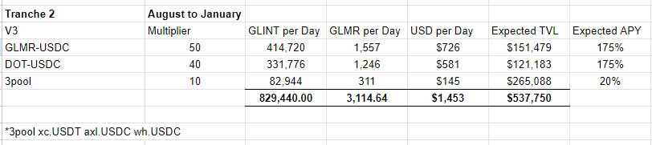
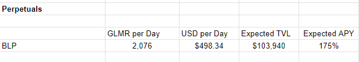

-   **Title**  - Beamswap: Ecosystem Grant Proposal
    
-   **Author**  - Beamswap Team
    
-   **TLDR**  -
    
    -   **Primary Goal**-
        
        -   Maintain and Grow Activity (active users, transactions, TVL)
    -   **Project Description**  - Beamswap is Moonbeam-based DeFi hub powered by standard, stable & CL AMM , providing liquidity for peer-to-peer transactions, as well as the only active perpetual exchange on Polkadot.
        
-   **Revised Requested GLMR Grant Amount** - 622,927 GLMR
    
-   **Use of Grant**  - 249,171 GLMR will be used to increase market liquidity for Beamex, a decentralized perpetual exchange, and 373,756 GLMR for Beamswap v3 concentrated liquidity AMM, leading to a stronger influx of active users to the Moonbeam network and their long-term retention.
    
-   **Motivation for Grant Amount**- Following the vision of becoming a fully user-powered DEX, the funding of Beamswap and Beamex would, therefore, beneficially impact the acquisition of new users on the Moonbeam Network, further increasing its relevance compared to other networks.

-   **Project Overview and Relevant KPIs**  - The Beamswap DeFi Hub is among the five leading players in the Moonbeam DeFi arena, according to:

[Web3Go Moonbeam Analytics](http://app.web3go.xyz/#/MoonbeamPublicDashboard)  
[DappRadar](https://dappradar.com/rankings/protocol/moonbeam)  
[Moonbeam Subscan](https://moonbeam.subscan.io/erc20_token)

Beamswap has continuously hit the charts and was listed among/as:

-   Top 3 dapps by dapp transactions
-   Top 5 dapps by dapp active addresses
-   Top 3 dapps by number of unique active wallets
-   11,700 holders of the native $GLINT Token on the Moonbeam network.
-   1st Perpetual exchange on Polkadot

In a year and a half since its launch, the Beamswap team has delivered numerous new products and solutions. Most recently, we have launched  [Beamswap V3 Concentrated Liquidity](https://medium.com/beamswap/breaking-beamswap-upgrades-to-v3-boosts-capital-efficiency-for-moonbeam-based-defi-374260b8e14a)  and  [Beamex](https://medium.com/beamswap/announcing-beamex-a-decentralized-perpetual-exchange-f8a81b0447cf), the first Perpetual Exchange on Polkadot Network.

Beamswap’s concentrated liquidity AMM currently has a TVL of $510,000, complimented by Beamex’s $640,000.

-   **Team Experience**  -The Beamswap team represents a tight-knit international group of 15+ members, crypto veterans with a strong background and years of experience in Web3 development, DeFi and TradFi, and strategic marketing, working tirelessly to deliver outstanding service, scout new partnership opportunities, and contribute to the evolution of the ecosystem.  
    Most team members have public names on their social profiles and wish not to be named in the present grant. The Moonbeam Foundation is acquainted with all the key team members and has met several of them at past crypto conferences, the most recent being Consensus.
    
-   **Timeline and Milestones for Use of Grant**  - With the successful launch of Beamex, the first perpetual exchange on Moonbeam, and Beamswap’s concentrated liquidity v3, the team has generated a solid amount of base liquidity on both platforms.
    

100% of the GLMR incentives acquired from the present grant would be channeled back to network users, mainly to provide extra rewards for liquidity providers on Beamswap and perpetual traders on Beamex.

## TVL and APY estimates

Token prices used for calculations:

-   GLMR = USD 0.24
-   GLINT = USD 0.00085

Data for prices taken on 9th of August 2023.

**Beamswap V3 Concentrated liquidity: 373,756 GLMR**  

**Beamex Perpetuals: 249,171 GLMR**  

We plan to track 4 key metrics:

-   Beamswap v3 TVL
-   Beamswap Monthly volume
-   Beamswap 30d transactions
-   Beamex BLP TVL

With rewards being flat and people already familiar with both products, we propose a 3.5% monthly increase for all the goals. The source for data is publicly available here:

Source of Beamswap TVL and Volume Data:  [Dashboard | Beamswap Analytics](https://analytics.beamswap.io/all)

Source of Beamex TVL:  [Beamex](https://beamex.exchange/#/dashboard)

Source of Transaction Data:  [Analytix](https://analytix.web3go.xyz/layout/dashboardDetail/c99f7e10-de9c-4d9f-992b-279b6e0ae2e2?date_filter=past90days&text=Beamswap&text_is_not=)

-  **Vision Of Success**  - Beamswap’s vision is to establish a base amount of liquidity on the Moonbeam network, enabling institutional and retail users to execute their strategies with lower fees & slippage and higher efficiency.
    
-  **Rationale**  - Beamswap has launched 2 new products - concentrated liquidity AMM and perpetual DEX. Compared to a standard AMM, these enhance transactional efficiency while lowering operating costs. However, their operation requires a higher percentage of liquidity, as seen with concentrated liquidity and perpetual solutions on other networks.  
    By bringing new users to the Beamswap platform and familiarizing them with the network’s benefits, the Moonbeam ecosystem would get a significant boost in daily volume and liquidity, further solidifying its relevance as the go-to network for builders, users, and service providers.
    
-  **Steps to Implement**  - If the proposal successfully passes, Beamswap will deploy liquidity incentives based on the timeline outlined above.