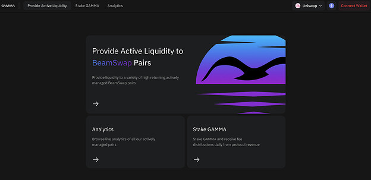
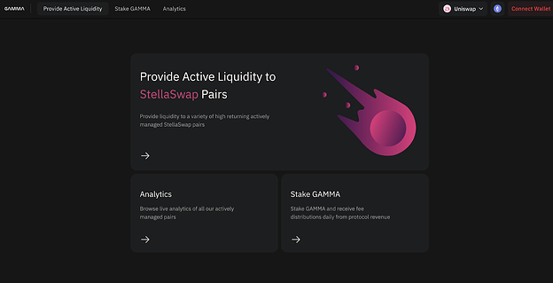
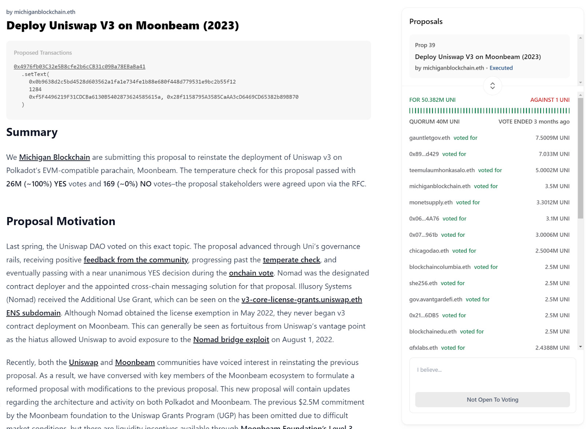

# Gamma Strategies: Ecosystem Grant Draft Proposal

## Author

strategicreserve / BP

## Primary Goal

Maintain and grow activity on Moonbeam (active users, transactions, TVL)

## Project Description

Gamma is a protocol designed for non-custodial, automated, and active management of concentrated liquidity.

[gamma.xyz](https://www.gamma.xyz/)

Access active liquidity management on Uniswap v3. Gamma has developed a protocol, management infrastructure and strategies used by managers and market makers.

## Revised Requested GLMR Grant Amount

890,254.15 GLMR (490,254.15 Incentives, 400,000 development)

Based on Snapshot:  
[https://snapshot.org/#/moonbeam-foundation.eth/proposal/0x5aa4dd72f8323f13a10b6238c5e64c1f969a0f9742f405f8440c97799c5e1178](https://snapshot.org/#/moonbeam-foundation.eth/proposal/0x5aa4dd72f8323f13a10b6238c5e64c1f969a0f9742f405f8440c97799c5e1178)

## Use of Grant

490.254.15 GLMR will be used as direct liquidity incentives over five months to liquidity providers via Gamma’s managed vaults. 400,000 GLMR will fund Gamma’s development and deployment on Moonbeam, including new AMM support and infrastructure.

## Motivation for Grant Amount

Liquidity incentives are critical to bootstrapping and building healthy decentralized liquidity pools on a growing blockchain. Correctly allocated and managed concentrated liquidity pools allow low slippage trading, which is vital to a healthy network. This grant amount creates long-term ideal liquidity conditions for liquidity providers and provides Gamma with the necessary funds to deploy them.

## Team Experience

Gamma is a global team that has been developing concentrated liquidity solutions for over two years. Gamma is deployed on most major EVM-supported blockchains and has collaborated with AMMs to supply backend liquidity management services and support. The team comprises business development, strategy, frontend, backend, data analytics, marketing, social media, documentation, and community management.

## Project Overview and Relevant KPIs

Gamma is a protocol for non-custodial, automated, active management of concentrated liquidity. Gamma’s vaults are deployed on eight blockchains and nine decentralized exchanges.
[A list of our currently supported integrations and partnerships](https://docs.gamma.xyz/gamma/features/supported-platforms)

Currently, we are managing $90M in TVLand over 300 vaults. We have recently deployed with Beamswap and accrued $475K in TVL.

[DefiLlama](https://defillama.com/protocol/gamma)

We have our own incentive staking contracts (Gammachef) that can be deployed on any Moonbeam-compatible AMM. We currently run a variety of incentive programs for different blockchains and protocols.

## OpenBlock Labs and Pool Selection

We will partner with OpenBlock Labs, which is currently working with the Moonbeam Foundation and Gamma to give recommendations regarding pair selection, the length of the rewards program, and how much to incentivize each pair.  
[https://www.openblocklabs.com/](https://www.openblocklabs.com/)

OpenBlock Labs is a blockchain consulting company that is currently helping Lido Finance with pair selection recommendations and amounts to reward.We are also working with OpenBlock Labs with the Uniswap Foundation in distributing their $ARB rewards. They aim to select pairs based on the sustainability of the liquidity and value to the ecosystem.

OpenBlock Labs will take into account pairs that are already being incentivized and will choose pairs and DEXs that are currently being under-incentivized based on their analyses, which would be inclusive of pairs and DEXs that Beamswap and Stellaswap are not yet incentivizing or under-incentivizing.

## Current Moonbeam Support

Gamma supports the AMM Bemswap on Moonbeam with over $475,000 in TVL. Our front end for Beamswap is pending deployment.

  
Critical infrastructure has been set up for Stellaswap as well.

  
Gamma is waiting for Uniswap V3 support before deploying on Uniswap.

[Uniswap Governance – 13 May 23](https://gov.uniswap.org/t/deploy-uniswap-v3-on-moonbeam-2023/21042/11 "02:30PM - 13 May 2023")

[Deploy Uniswap v3 on Moonbeam (2023)  1](https://gov.uniswap.org/t/deploy-uniswap-v3-on-moonbeam-2023/21042/11)

## Timelines and Milestones for Use of the Grant

**Development Funds**

400,000 GLMR

September 1, 2023 - until expended

Deployment on BeamSwap, StellaSwap, and Uniswap

-Backend - 2 weeks 2 person - $30,000  
-Frontend - 2 weeks 2 person - $25,000  
-Analytics - 2 weeks 2 person - $25,000  
-Infrastructure - RPC, subgraph, backend server, frontend server, oracle) - $20.000

**Liquidity Mining**

490,400 GLMR

Pool Exploration and Deployment Phase: September 1, 2023 - October 31, 2023  
LM Phase: Q4 2023 to Q1 2024

Phase I: 1 Month (98,050.83 GLMR)  
Update I: 1 Month + 15 days  
Phase II: 2 Month (98,050.83 GLMR)  
Update II: 2 Month + 15 days  
Phase III: 3 Month (98,050.83 GLMR)  
Update III: 3 Month + 15 days  
Phase IV: 4 Month (98,050.83 GLMR)  
Update IV (final): 4 Month + 15 days  
Phase V: 5 Month (98,050.83 GLMR)  
Update V (final): 5 Month + 30 days

## Vision Of Success

Gamma’s vision is to work with OpenBlock Labs to facilitate a functionally proper amount of liquidity on Moonbeam. Properly facilitated liquidity is critical to attracting volumes from whales and retail users and thus should lead to more usage, lower slippage trades, and project integrations.

## Rationale

This proposal adds value to Moonbeam by increasing TVL, increasing volume, decreasing slippage, and increasing project integrations.

## Steps to Implement

1.  Gamma will enter the pool exploration and deployment phase. Gamma will finish deployments on Stellaswap, Beamswap, and Uniswap. This includes backends, frontends, and the required infrastructure.
2.  Gamma will work with OpenBlock Labs to identify the best pools to incentivize Moonbeam.
3.  Gamma will deploy liquidity incentives to support liquidity to strategically important pools that create growth or need liquidity support. The liquidity incentives will then run for five months. Gamma will report monthly on the status of the grant and the program results, including a final report going over the whole program.