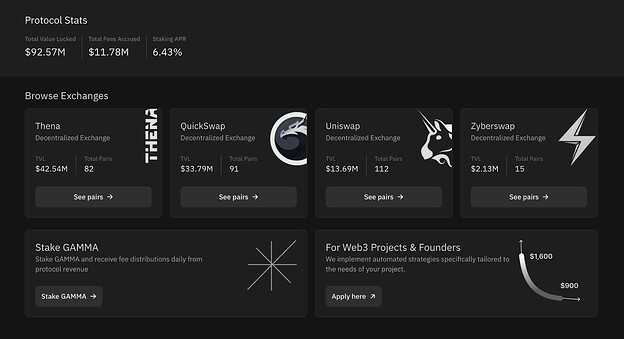
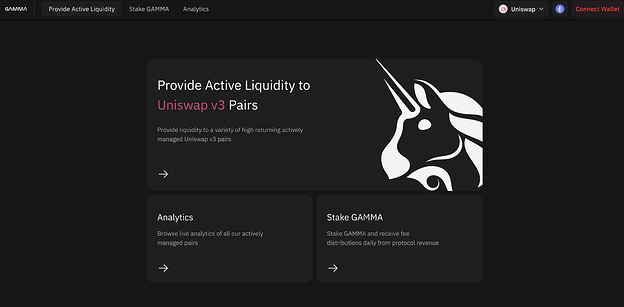

# Gamma Strategies: Ecosystem Grant Draft Proposal

## Author

strategicreserve / BP

## Primary Goal

Maintain and Grow Activity (active users, transactions, TVL)

## Project Description

Gamma is a protocol designed for non-custodial, automated, and active management of concentrated liquidity on Moonbeam

## Requested GLMR Grant Amount

2,000,000 GLMR (1,600,000 Incentives, 400,000 development)

## Use of Grant

1,600,000 GLMR will be used to direct liquidity incentives over six months to liquidity providers via Gamma’s managed vaults, and 400,000 GLMR will fund Gamma’s development and deployment on Moonbeam, including new AMM support and infrastructure.

## Motivation for Grant Amount

Liquidity incentives are critical to bootstrapping and building healthy decentralized liquidity pools on a new blockchain. Correctly allocated and managed concentrated liquidity pools allow low slippage trading vital in attracting volumes to projects and the network overall. This grant amount creates long-term ideal liquidity conditions for liquidity providers and provides Gamma with the necessary funds to deploy them.

## Updates

**Breakdown of Development Fund request:**

1.  Backend Development - 2 weeks 2 person - $30k USD
2.  Infrastructure (enterprise RPC, subgraph, backend server, frontend server, oracle costs) - $20k USD
3.  Frontend Development - 2 weeks 2 person - $25k USD
4.  Analytics Development - 2 weeks 2 person - $25k USD

**Details on relationship with Openblock Labs**  
We will be partnering with OpenBlock who is currently working with the Moonbeam Foundation to give recommendations regarding pair selection, length of rewards program, and how much to incentivize each pair.

They will provide to Gamma which pairs to incentivize with how many rewards, and we will implement that within our rewarder system where we can adjust reward rates and introduce new pairs for incentives relatively quickly.

## Project Overview and Relevant KPIs

Gamma is a protocol for non-custodial, automated, active management of concentrated liquidity. Gamma’s vaults are deployed on eight networks and six decentralized exchanges. Gamma’s vaults are deployed on the Uniswap Foundation, OP Labs, Polygon, and more.

Currently, we are managing $90M in TVL ([https://defillama.com/protocol/gamma](https://defillama.com/protocol/gamma)) and over 300 pairs. We have recently partnered with Beamswap and accrued $425K in TVL within the first few weeks. We will be supporting Stellaswap as well upon their launch.

## Current Moonbeam Support

Gamma supports the AMM Beamswap on Moonbeam with over $400,000 in TVL. Gamma is looking to deploy with StellaSwap and Uniswap pending integration. In addition to providing the liquidity management backend to these protocols, we are additionally providing our own dedicated frontend pages for all our partners on Moonbeam. These are currently in development, but we have mocked up designs for our partners on Moonbeam thus far:

## Team Experience

Gamma is a global team that has been developing concentrated liquidity solutions since the inception of Uniswap v3. Gamma is deployed on 5+ other networks and has worked collaboratively with DEXs and networks to supply backend liquidity management services and support. The team comprises business development, strategy, frontend, backend, data analytics, marketing, social media, documentation, and community management.

## Timeline and Milestones for the Use of Grant

Start Date: August 4th, 2023  
Phase I: August 5, 2023 - August 31, 2023 (333,333 GLMR)  
Update I: September 15, 2023  
Phase II: September 1, 2023 - September 30, 2023 (333,333 GLMR)  
Update II: October 15, 2023  
Phase III: October 1, 2023 - October 31, 2023 (333,333 GLMR)  
Update III: November 15, 2023  
Phase IV: November 1st, 2023 - November 30, 2023 (333,333 GLMR)  
Update IV: December 15, 2023  
Phase V: December 1, 2023 - December 31, 2023 (333,333 GLMR)  
Update V: January 15, 2023  
Phase VI: January 1, 2024 - January 31, 2024 (333,334 GLMR)  
Update VI: February 15, 2023  
Program Conclusion: February 15, 2023

## Vision Of Success

Gamma’s vision is to facilitate a functionally proper amount of liquidity on Moonbeam for six months. Having properly facilitated liquidity is key to attracting volumes from both whales and retail users and thus should lead to more usage, lower slippage trades, and project integrations. We will work together with partners like OpenBlock Labs to offer users key KPI metrics.

## Rationale

This proposal adds value to Moonbeam by increasing TVL, increasing volume, decreasing slippage, and increasing project integrations.

## Steps to Implement

After the proposal approval and implementation, Gamma will deploy liquidity incentives to support liquidity to strategically important pools that create growth or need liquidity support. The liquidity incentives will then run for six months, reporting every month on the status of the grant and the program results.