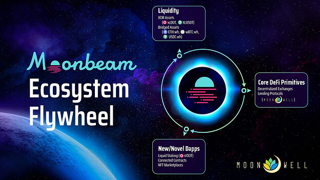
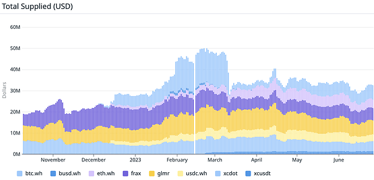
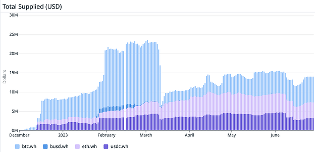
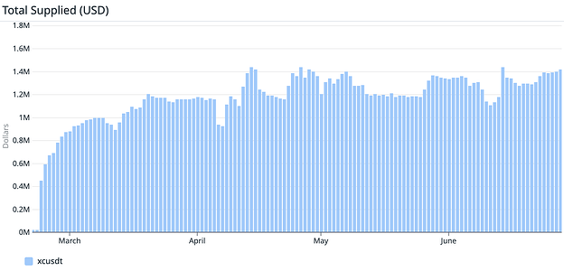
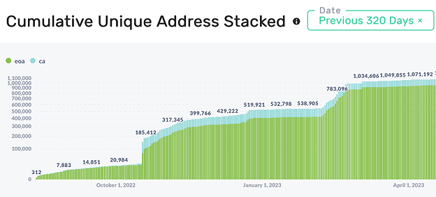

# Moonwell: Ecosystem Grant Draft Proposal

### Author

coolhorsegirl, submitting in my capacity as a Moonwell DAO delegate

## TLDR

The Moonwell community presents this Moonbeam Grant Proposal driven by the primary goal of Maintaining and Growing Activity. Our motivations center around fostering useful liquidity for the wider ecosystem and expanding our influence as a DeFi ambassador for Moonbeam in the Ethereum/L2 space. With Moonwell’s strong roster of contributors, featuring industry-leading teams and experts such as Gauntlet, Halborn, Lunar Labs, Warden Finance, and VectorDAO, and our position as the largest DeFi protocol by TVL in the Dotsama ecosystem, we stand uniquely poised to promote ecosystem liquidity and help accelerate the DeFi flywheel effect by increasing network activity and liquidity.

By leveraging Moonbeam grant funding, we aim to attract new users and grow our community. Grant funds, which will be completely channeled to our liquidity providers on Moonwell’s Moonbeam deployment, will play a vital role in increasing TVL, bolstering onchain activity, and empowering core DeFi primitives. These strategic moves affirm our belief in the vitality of liquidity and the importance of lending and borrowing protocols within our ecosystem. Adding to this, the integration of Moonwell’s mTokens, which are yield bearing versions of GLMR, xcDOT, xcUSDT, Frax, and other tokens, by Moonbeam projects such as  [ZooDAO](https://twitter.com/ZooDAO/status/1658880238950940679?s=20)  and  [Qoda](https://twitter.com/QodaFinance/status/1657089114041352192?s=20)  is a testament to our protocol’s potential to spur ecosystem growth. Their choice to build on top of Moonwell not only brings additional utility and opportunities for the Moonbeam community, but also further validates the effectiveness of our protocol. This cross-project collaboration is paving the way for a more interconnected and robust ecosystem.

Moonwell strongly aligns with Moonbeam’s vision of connected smart contracts with EVM as the base layer (as outlined in  [MIP-39: Activate Moonwell on Base Mainnet](https://forum.moonwell.fi/t/mip-39-activate-moonwell-on-base-mainnet/414)). Our plans to leverage the Wormhole message passing protocol for temporal governance emphasizes our commitment to connected contract use cases, fostering efficient governance mechanisms in managing Moonwell’s deployment on Base from Moonbeam. Simultaneously, the Moonwell community has a strong desire to integrate additional XCM powered XC-20s from across Polkadot, including the likes of Bifrost’s liquid staked  [xcvDOT and xcvGLMR](https://bifrost-finance.medium.com/how-bifrost-supports-vmovr-vglmr-based-on-xcm-cef597b9a02c), and Interlay’s  [xcIBTC](https://forum.moonwell.fi/t/ibtc-x-moonwell-a-path-to-truly-decentralized-bitcoin-lending/221). While the grant funds will be used entirely for the purpose of incentivizing liquidity, we wanted the community to know that contributors to Moonwell are building a connected contracts use case as well, which will not be funded by the grant.

As our community expands, we are steadfast in our commitment to making DeFi more accessible to all. We believe in lowering the barriers to entry that have traditionally made DeFi daunting. With this grant proposal, Moonwell demonstrates its dedication not only to innovation but also to creating a more inclusive and approachable DeFi environment. We are eager to simplify and democratize access to these financial tools. Moonwell is leading the charge towards a more dynamic, inclusive, and connected DeFi ecosystem, opening up new possibilities for all users, regardless of their prior blockchain experience.

## Project Description

Moonwell is an open lending and DeFi protocol built on Moonbeam and Moonriver, and is the largest DeFi protocol by TVL in the Dotsama ecosystem.

-   App:  [https://moonwell.fi](https://moonwell.fi/)
-   Docs:  [https://docs.moonwell.fi](https://docs.moonwell.fi/)
-   Governance Forum:  [https://forum.moonwell.fi](https://forum.moonwell.fi/)
-   Governance Portal:  [https://gov.moonwell.fi](https://gov.moonwell.fi/)
-   Github:  [GitHub - moonwell-fi/contracts-open-source: Open Source Moonwell Contracts](https://github.com/moonwell-fi/contracts-open-source)
-   Audits:  [Audits - Moonwell Artemis](https://docs.moonwell.fi/moonwell-finance/protocol-info/audits)

## Requested GLMR Grant Amount

The amount requested to support the project initiatives is 2,000,000 GLMR.

## Use of Grant

The entirety of the grant funds (GLMR) will be distributed to liquidity providers on Moonwell’s Moonbeam deployment, in an effort to increase both TVL and onchain activity. Engaging with other grant recipients, the Moonwell community will collaboratively promote these incentives, mirroring the successful strategies employed in the recent  [Moonbeam Ignite](https://twitter.com/MoonwellDeFi/status/1621211000967155712?s=20)  campaign. This unified effort will not only spark increased participation, but also foster a sense of unity and shared purpose within our expanding ecosystem.

## Motivation for Grant Amount

The proposed Ecosystem Grant Amount of 2,000,000 GLMR will enable Moonwell to continue to bolster liquidity for both bridged and native assets in the ecosystem. Increased liquidity in lending protocols like Moonwell enables borrowers to receive lower interest rates, which makes borrowing for use in other applications and protocols on Moonbeam more attractive, and helps grow TVL and adoption more broadly across the ecosystem. By endorsing this grant, the Moonbeam community is not only backing a proven model of success, but also reaffirming their trust in a project that has demonstrated its transparent and responsible use of prior grant allocations.

Previous ecosystem grant funding was a crucial component in various recent successes:

-   It allowed Moonwell to bootstrap initial liquidity for Wormhole-wrapped assets like WBTC, ETH, and USDC, helping the ecosystem to recover post-Nomad and establishing Wormhole as a major player in the Moonbeam ecosystem.
-   It enabled the Moonwell community to activate and support a new xcUSDT market which brought activity and value from the wider Polkadot ecosystem into Moonbeam.
-   It helped Moonwell in maintaining its position as the top DeFi protocol on Polkadot, in terms of total value locked
-   Moonwell’s leadership in the Moonbeam Ignite incentives campaign brought ecosystem-wide benefits in terms of new users, TVL, and activity between projects. We didn’t see a similar campaign for Tranche 1, largely due to Moonwell not being a grant recipient and other projects not utilizing grant funds.
    -   In April 2023, during the Moonbeam Ignite GALXE NFT campaign which the Moonwell community spearheaded, we saw significant growth in Moonwell usage metrics:
    -   Unique address count nearly tripled, rising from 4,899 in March to 12,131 in April.
    -   Total transaction count rose significantly month-over-month, increasing from 27,127 transactions in March to 44,706 in April.
-   Grant-incentivized liquidity enabled new Moonwell integrations like ZooDAO and Qoda, providing new DeFi opportunities in the Moonbeam ecosystem.

## Project Overview and Relevant KPIs

The Moonwell community was honored to  [receive one of the first grants](https://moonbeam.foundation/news/level-3-grant-recipients/)  available to ecosystem projects in the Fall of 2022. This grant funding enabled the Moonwell community to launch and build liquidity in new money markets for Wormhole wrapped assets, as well as native Dotsama assets such as xcUSDT (cross-chain Tether).

It was challenging for the Moonbeam ecosystem to rebuild liquidity on a new bridge, but  [the community decision](https://snapshot.moonwell.fi/#/proposal/0x7c96e4d331db2977a499a87b028a58d0f2a0bd343c68f5ea10e74d4cf6a387f6)  to select Wormhole as the preferred bridge provider has born fruit as Wormhole has swiftly evolved into an integral component of the Moonbeam ecosystem, evident in their support for the recently unveiled  [MRL](https://moonbeam.network/education/moonbeam-routed-liquidity/)  (Moonbeam Routed Liquidity). Also, other top DeFi protocols, such as Uniswap,  [have selected Wormhole](https://snapshot.org/#/uniswap/proposal/0x6b8df360fdf73085b21fdf5eef9f85916fbde95621a3d454cb20fbe545ffc852)  as their cross chain message passing protocol of choice for multichain governance, and the security of that solution has improved remarkably in the last year.

The Moonbeam grant last fall enabled the Moonwell community to launch the following new markets:

-   Wormhole wrapped ETH, WBTC, USDC, and BUSD
-   Polkadot native xcUSDT (cross-chain Tether)

On December 4, 2022,  [MIP-11](https://gov.moonwell.fi/artemis/proposal/8)  was executed, adding grant GLMR incentives to these new markets on Moonwell Artemis. TVL at that time was $23.72m. By February 21, TVL had reached an annual high of $48.61m (Source:  [DefiLlama](https://defillama.com/protocol/moonwell-artemis?denomination=USD)).

The liquidity growth in these markets would not have been possible without the previous round of grant funding and support from the Moonbeam community. We hope to continue this positive trend through this current round of funding.

-   TVL growth of Wormhole wrapped assets on Moonwell

-   TVL growth of xcUSDT on Moonwell

## Team Experience

In March 2022, the Lunar Technology Foundation successfully secured approximately $26M via a combination of a private fundraising round and a public sale of the WELL token, giving it a financial runway of more than four years at the current rate of expenditure. Furthermore, Moonwell holds the distinction of being the inaugural project funded by Arrington Capital’s $100M Moonbeam Ecosystem Fund. The founding contributors to the Moonwell ecosystem are a distinguished ensemble comprising industry leaders in technology, web3, DeFi, smart contracts, and staking.

Moonwell is supported by a diverse set of contributing teams including:

-   Lunar Labs - Founding contributors consisting of Luke Youngblood (former Coinbase Sr. Staff Engineer & AWS Principal Engineer, built Coinbase staking rewards infrastructure), Eli Clendenin (“Majin”, community and communications lead), Octavius (fullstack developer), x0s0l (fullstack developer and Solarbeam co-founder), DevPupo and KidLiberty (frontend developers)
-   [Gauntlet Network](https://gauntlet.network/)  - Onchain risk modeling, risk management, and protocol optimization
-   [Halborn](https://www.halborn.com/)  - End-to-end auditing and real-time monitoring services
-   [Warden Finance](https://www.warden.finance/)  - Risk modeling and risk management
-   [Rome Blockchain Labs](https://romeblockchain.com/home)  - Technical implementation assistance
-   [VectorDAO](https://vectordao.com/)  - Collective of application designers and developers

Advisors such as 0xMaki, Brandon Kase, Justin Lee, and Mason Borda provide guidance.

Additionally, Moonwell has a global and decentralized community of engaged builders, liquidity providers, developers, writers, designers, delegates, and community members who actively shape and power the protocol. The Moonwell DAO also possesses a robust  [grants program](https://forum.moonwell.fi/t/moonwell-grants-program-framework/507)  that offers support for projects looking to grow the Moonwell ecosystem.

This diverse composition of dedicated teams, advisors, and community members collaborating through decentralized governance allows Moonwell to continuously evolve with the ecosystem’s needs.

## Timeline and Milestones for Use of Grant

The Moonwell community will have successfully deployed 100% of the original 4.166M GLMR grant funding received last Fall, by August 2023. As a community, we are proud of the fact that 100% of the grant funds went to liquidity providers in the Moonwell protocol, and no grant funding was used for other expenses. To ensure utmost transparency, a  [grant transparency report  1](https://lunartechfdn.medium.com/moonbeam-grants-transparency-report-ff6f7adb8650)  was published, which communicated the updated rate of incentive distribution. A grant transparency dashboard is  [available here](https://github.com/orgs/moonwell-fi/projects/2), which the community can follow to understand how the grants are distributed on a month by moth basis. All grants are distributed through community governance, as the contributing teams have no direct access to grant funds.  [Here is an example  1](https://gov.moonwell.fi/artemis/proposal/34)of a successful governance proposal that distributes grant funding. You can see that Moonwell contributors have worked hard to ensure that the community is informed and all changes to distribution are visible and easily accessible.

The Moonwell community will also commit to providing monthly updates regarding emissions and grant usage on the Moonbeam Forum, as recommended in the  [Trance 2 Update post](https://forum.moonbeam.network/t/ecosystem-grants-program-tranche-2-update/873): “Teams that receive the grant should update the community via the forums on progress on a regular basis; a minimum of 1 update per month is required.

It is anticipated that the grant funds from Tranche 2 would be distributed from early August 2023, to February 2024, at a rate of approximately 400K GLMR per 4 week reward interval. In total, a grant of 2M GLMR has been requested. Should the final allocation fall short of this request, our utilization blueprint will remain unchanged. However, please note that a reduction in the granted amount would proportionally diminish both the distribution rates and the potency of these incentives, impacting their ability to achieve the intended objectives outlined above.

### Collaborations

After receiving last year’s Level 3 Ecosystem Grant, the Moonwell community helped to create and lead the  [Moonbeam Ignite](https://twitter.com/MoonwellDeFi/status/1582493233023590401)  liquidity campaign. These efforts included holding multiple  [AMAs](https://twitter.com/MoonwellDeFi/status/1623462897946091521?s=20), detailed  [Twitter thread updates](https://twitter.com/MoonwellDeFi/status/1621211000967155712?s=20), an [A.I. art contest](https://twitter.com/MoonwellDeFi/status/1583488504570314752), and culminated in a  [GALXE NFT campaign](https://twitter.com/MoonbeamNetwork/status/1636043953832091648?s=20). This  [NFT campaign](https://galxe.com/DowntownMoonbeam/campaign/GCttSU4EdN)  saw ~10,000 participants perform onchain actions across the Moonbeam ecosystem in order to mint ~50,000 NFTs. The Moonwell community spearheaded many of these events and utilized non-grants resources to commission all NFTs and campaign graphics. The Moonwell community will once again team up with grant recipients to collaboratively promote these incentives.

The Moonwell community plans to engage with other grant recipients to both create and promote a liquidity incentive campaign, similar to Moonbeam Ignite. While we don’t have specific collaborations confirmed yet (as we don’t know who the grant recipients will ultimately be), we are excited to partner with other projects to co-promote liquidity incentives, similar to the collaborative success seen with previous campaigns.

Potential promotions could include:

-   Co-hosting AMAs and educational sessions to increase awareness
-   Creating joint social media campaigns and campaign update threads to spread awareness
-   Weekly meetings with participating projects to ensure alignment
-   Organizing collaborative NFT campaigns that require onchain ecosystem activity
-   Cross-community Discord events such as game nights, raffles, trivia, and giveaways
-   Contests for creating and incentivizing the creation of art, videos, infographics, and other promotional materials that showcase the incentives

Like with Moonbeam Ignite, the Moonwell community is committed to spearheading creative and engaging promotions alongside other grant recipients with the collective goal of growing awareness, activity, and liquidity for Moonbeam. We are confident this community-driven, collaborative approach can successfully increase adoption of and usage in the ecosystem.

To be completely clear, none of the requested grant funds would be used for promotional purposes or special incentives to partners. 100% of any received grant will go directly to liquidity providers on Moonwell as outlined in our proposal. This has been the case with all ecosystem grant funds Moonwell has received to date.

As part of a collaborative incentives campaign with other projects, the Moonwell community is prepared to separately fund promotional activities as was the case during Moonbeam Ignite. This could potentially include:

-   Commissioning artists and designers to create campaign graphics, videos, logos, and NFT artwork
-   Funding giveaways like swag, token prizes, gift cards
-   Compensating Moonwell contributors and community members to create and share content like articles, threads, and videos highlighting the incentive program

All of these activities would be resourced independently by the Moonwell community without utilizing any of the Moonbeam ecosystem grant. The grant itself will solely be distributed to Moonwell liquidity providers to increase TVL and activity. We are committed to full transparency on grant use.

### Milestones by Grant Amount

_Please note: While liquidity incentives can serve as an important growth catalyst, we want to be transparent that we cannot guarantee specific outcomes or achievement of particular KPI targets solely as a result of this grant. There are numerous external variables beyond our control that play an outsized role in determining metrics like TVL, user growth, and interest rates._

_We will track results transparently and adjust strategies as needed based on evolving conditions. But no amount of incentives can ensure success if winds shift. The community’s support provides means, not guarantees. We are committed to driving adoption, but cannot promise specific outcomes relying on variables outside our control._

If Moonwell receives 500k GLMR, we have estimated results of:

-   Increase TVL by 10%
-   Grow 30 day EOA (unique addresses) by 10%
-   Maintain current average interest rates

If Moonwell receives 1M GLMR, we have estimated results of:

-   Increase TVL by 20%
-   Grow unique addresses by 20%
-   Decrease average interest rates by 0.5%

If Moonwell receives 1.5M GLMR, we have estimated results of:

-   Increase TVL by 30%
-   Grow unique addresses by 30%
-   Decrease average interest rates by 1%

If Moonwell receives 2M GLMR (requested), we have estimated results of:

-   Increase TVL by 40-50%
-   Grow unique addresses by 40-50%
-   Decrease average interest rates by 1-2%

## Vision Of Success

The Moonwell community’s vision of success extends beyond simply deploying the ecosystem grant funds in hopes of boosting protocol volume and liquidity. We aspire to distribute the funds strategically to cater to user expectations and needs, fostering an exceptional DeFi experience.

As a point of reference, we will consider our current user base and rate of new user acquisition, alongside TVL, interest rates, and transaction count, to gauge the effectiveness of our strategies. Steady quarter-over-quarter growth is anticipated as we distribute the GLMR grants and progress with protocol development and expansion. That said, from past experience we’ve learned that grant funding and liquidity incentives are not sufficient to guarantee success or achieve specific KPIs or milestones. Market forces outside of our control often have more to do with the growth in TVL, liquidity, and new users in our community than the grant itself.

The grand vision for Moonwell over the next 2 to 5 years is rooted in the sustainability and growth of the protocol beyond the grant period. Our aim is to build a self-sustaining DeFi hub on Moonbeam that thrives on the constant activity of its users, driving robust volume and liquidity. The path to achieving self-sufficiency will rely not just on the efforts of the Moonwell and Moonbeam communities, but also Parity and Polkadot must invest in infrastructure that brings new users into the Dotsama ecosystem. Currently, the exchange, custodian, and wallet support for Dotsama are not ideal, and we believe that Parity must invest in marketing and communications as well in order to achieve more broad success as an ecosystem. As one of the largest projects and communities in the Dotsama ecosystem, we are well equipped to help.

We strive to be a key player in the Dotsama ecosystem and beyond (demonstrated by our upcoming integration with Base), simplifying the lending and borrowing experience for all, irrespective of ones familiarity with blockchain technology. By focusing on continuous innovation and user-centric development, we aim to evolve into a resilient and intuitive DeFi protocol that helps shape the future of finance.

## Rationale

This Ecosystem Grant holds tremendous potential for adding value to the Moonbeam Ecosystem, advancing the stated goal of “Maintaining and Growing Activity”.

The Moonwell community’s strategy to distribute the grant to liquidity providers on its Moonbeam deployment aims to catalyze user activity and also directly contribute to growing TVL, an essential metric of success in the DeFi space. Robust lending liquidity strengthens a key DeFi primitive (borrowing/lending) that facilitates greater DOT and ecosystem liquidity, more cross-parachain activity, compounds network effects, attracts new users, lowers interest rates, and enables future innovation through composability. It essentially “oils the gears” of a blossoming DeFi ecosystem like Moonbeam. We believe this multiplier effect is the most efficient way to provide value relative to other uses of the grant.

This proposed liquidity plan will function similarly to the one made possible by Moonwell’s previous Level 3 Ecosystem grant, which powered the Moonbeam Ignite campaign. During Moonbeam Ignite, the Moonbeam ecosystem saw a substantial increase in not only  [ecosystem TVL](https://twitter.com/MoonwellDeFi/status/1621211019153666048?s=20), but also the creation of  [unique ecosystem addresses](https://app.web3go.xyz/#/MoonbeamPublicDashboard).

Moonwell also seeks to leverage interconnected use cases through the Wormhole message passing protocol. This will advance the objective of building connected contracts use cases, facilitating the governance of Moonwell’s deployment on Base from Moonbeam. The Moonwell community also has a strong desire to integrate additional XCM powered XC-20s from across Polkadot, including the likes of Bifrost’s liquid staked  [vDOT and vGLMR](https://bifrost-finance.medium.com/how-bifrost-supports-vmovr-vglmr-based-on-xcm-cef597b9a02c), and Interlay’s  [xcIBTC](https://forum.moonwell.fi/t/ibtc-x-moonwell-a-path-to-truly-decentralized-bitcoin-lending/221). Grant funds could be used to incentivize these new markets, attracting new users from across the Polkadot ecosystem.

By bolstering Moonwell’s capability to be a DeFi hub for Polkadot, this grant aids in increasing ecosystem liquidity and activity, as well as advancing Moonbeam’s vision of interconnected smart contracts, both of which are integral to the evolution of the ecosystem. Consequently, supporting this Ecosystem Grant provides a direct pathway to realizing Moonbeam’s broader goals and fostering a more connected, dynamic, and active DeFi landscape.

## Steps to Implement

Estimated Dates: August 2023 - February 2024

-   Grant Request: 2,000,000 GLMR
-   Rate of Distribution: Approx. 100K GLMR/week
-   Incentivized Markets: xcUSDT, xcDOT, GLMR, FRAX, BTC.wh, ETH.wh, USDC.wh

Grant funds will be transferred to the Moonwell Artemis  [Comptroller](https://moonscan.io/address/0x8e00d5e02e65a19337cdba98bba9f84d4186a180)  contract, afterwhich they will be distributed as rewards to those supplying on Moonwell. To which markets these rewards are directed to, and the rate at which they are distributed, is ultimately decided by the Moonwell community through the governance process. Every four weeks, governance proposals are submitted that have the ability to alter reward speeds (emissions) on Moonwell money markets. Moonwell contributors have created  [open source tooling](https://github.com/moonwell-fi/market-reward-adjustments)  that enables the community to dynamically adjust the grant emissions to the various markets supported on the Moonwell protocol based on TVL. This enables the Moonwell protocol to adapt to changing liquidity and TVL in a dynamic manner, and ensures that as liquidity grows over time, the liquidity incentives can adjust to keep lending rates attractive for liquidity providers.

Community governance also enables the Moonwell community to express their opinion about which assets should be incentivized more than others, for example, the community may choose to support native Moonbeam and XCM assets more than bridged assets, to further grow adoption of projects that have chosen the Dotsama ecosystem as their home.

## Security and Risk Management

Moonwell has a rigorous process to minimize risk and ensure the highest level of security:

-   Much of Moonwell’s codebase is derived from Compound v2, allowing the protocol to benefit from its time-tested and battle-hardened architecture that has defended billions in value.
-   Every deployed contract or change is meticulously audited by Halborn before being pushed to production. Halborn also provides ongoing monitoring of contracts through their SaaS service.
-   We run an Immunefi bug bounty program with significant rewards for researchers who responsibly disclose issues. This provides an additional layer of defense.
-   Chainlink price feeds give reliable market data to reduce oracle manipulation risks.
-   Contributors like Gauntlet and Warden conduct extensive simulations and risk modeling tailored to Moonwell.
-   We utilize staged testnet deployments to allow comprehensive testing and review before going live.
-   Emergency pause functionality (Moonwell Pause Gaurdians) can quickly pause markets if and when issues are detected, minimizing damage.
-   The protocol is upgraded through a decentralized governance process to ensure community alignment.

With diligent smart contract auditing, staged deployments, vigilant monitoring, and emergency controls, we aim to uphold the highest standards of security and reliability. Our practices are designed to maximize protection against exploits while empowering the community to guide upgrades safely.

## A Primer on Moonwell Governance

Moonwell Governance is designed to be fully open and decentralized, with the community in control of the protocol’s future. Some key points:

-   Voting power is proportional to held, staked, or delegated WELL. 1 WELL = 1 vote.
-   All governance proposals and votes happen transparently onchain via the Moonwell Governance Portal or Snapshot Portal. There is full visibility into governance activity.
-   To date, over 60 onchain Moonwell Improvement Proposals have been successfully passed through governance, demonstrating one of the most active and productive governance processes in the Dotsama ecosystem.
-   Quorum and approval thresholds ensure every proposal has broad community alignment before passing.
-   Moonwell Governance sees wide, diverse participation, with ~200-300 unique voters per proposal on average, along with engaged delegates and contributors.
-   Anyone can get involved in governance and share ideas by creating posts on the Moonwell Governance Forum, regardless of WELL holdings.

#### To learn more about Moonwell Governance, please consult our  [Documentation](https://docs.moonwell.fi/moonwell-finance/governance/governance)  along with these blog posts:

-   [Introducing Moonwell Governance](https://medium.com/lunartechfdn/introducing-moonwell-artemis-governance-2befa9545f16)
-   [Moonwell Governance 101](https://medium.com/lunartechfdn/moonwell-governance-101-getting-started-ecf5cc4d88fd)

## Conclusion

We at Moonwell would like to express our deepest gratitude to the Moonbeam community for the invaluable support and grant funding we have received in the past year. Your continued belief in our vision and your commitment to fostering innovation have truly made a difference. We are extremely proud to be part of this vibrant community and the groundbreaking work it encourages. We look forward to many more years ahead.

## Updates

Based on community feedback since original posting, we have updated the following:

-   Inclusion of milestones dependent on GLMR amount received
-   Clarified primary goal: Maintaining and Growing Activity
-   Expanded upon intended collaborations in “Use of Grant” section
-   Expanded “Team Experience” section
-   Added a Security and Risk Management section
-   Added a Primer on Moonwell Governance