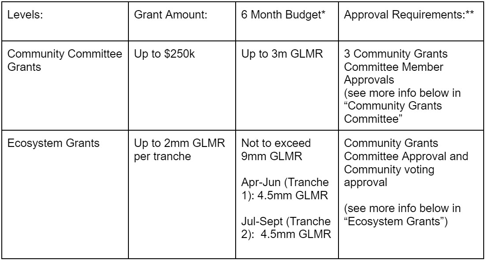

# TLDR

Timing: Plan to put this Proposal in for Vote 2/27/2023

The Interim Grants Program ([Proposal](https://moonbeam.polkassembly.network/referendum/51),  [Proposal Description)](https://moonbeam.polkassembly.network/post/131)  expires Mar 12, 2023. I am proposing an extension of the grants program because as a community member and a member of the Community Grants Committee I believe grants remain a critical component of Moonbeam’s growth and support for developers who are building cutting-edge technology.

## Ecosystem Grants (formerly known as “Level 3 Grants”)

-   Ecosystem Grants replace the “Level 3 Grants” of the previous Interim Grants Program
    
    -   Ecosystem Grants will be the largest grants (>$250k) and will be approved directly by the Community (opposed to approval through the Community Grants Committee)
-   Ecosystem Grant Budget is up to 9mm GLMR:
    
    -   Apr-Jun (Tranche 1): up to 4.5mm GLMR
    -   Jul-Sept (Tranche 2): up to 4.5mm GLMR
        -   The maximum grant size for individual grants per tranche is [2mm GLMR] (“Ecosystem Grant Maximum”).
-   Unlike the process for Level 3 Grants, Ecosystem Grants will not be distributed on a first come, first serve basis. Instead, there will be an application deadline, followed by a community vote via snapshot where the community will be able to submit a weighted vote on how the budget for the first tranche of the Ecosystem Grants should be distributed between the eligible applicants. ([example of weighted vote on snapshot](https://snapshot.org/#/pistachiodao.eth/proposal/0xf93f1ac80e22cc930b1eef1d20bd34671ccc33b88b04695479c9de364451d77f)).
    

Please note that there are important requirements for snapshot voting which are explained in greater detail below.

-   The process for Tranche 1 will start shortly after this Grants Program Proposal is enacted. The process for Tranche 2 would start close to the end of Tranche 1 (estimated end of June)

_Since the process for distributing ecosystem grants will likely take a couple weeks,  **THE INITIAL DEADLINE FOR ECOSYSTEM GRANT DRAFT PROPOSALS IN THE FORUM WILL NEED TO BE SOON AFTER THIS GRANT PROGRAM PROPOSAL IS ENACTED**_

#### Proposed Process for Ecosystem Grants for each Tranche:

_Note: all dates are just illustrative. Actual dates will depend on the approval and date of enactment for this Grant Program Proposal_

1.  Set a deadline for teams that want to be considered for Ecosystem Grant to submit a draft of their Proposal to the Moonbeam Forum
    
    ```
    a. Draft Proposals will need to indicate one of the two overall goals for the use of their grant:
    
       i. Maintain and Grow Activity (active users, transactions, TVL)
       ii. Connected Contracts Use Cases (using XCM and other message passing protocols)
    
    b. Other criteria for Draft Proposal will be similar to the criteria in the Interim Grants Proposal for Level 3 Grants
    c. Draft Date: Mar 13, 2023
    
    ```
    
2.  Gather community feedback (including from Community Grants Committee) on Draft Proposals
    
    ```
    a. Deadline for Feedback from Community Grants Committee: Mar 17, 2023
    
    ```
    
3.  Give teams a couple days to revise their Draft Proposals and incorporate feedback from the community (including Community Grants Committee). Once the deadline for revising Draft Proposals has passed, the Community Grants Committee will review the Draft Proposals and determine which Draft Proposal satisfy the Criteria (“Eligible Draft Proposals”)
    
    ```
    a. Deadline for incorporating feedback and finalizing Draft Proposal: Mar 19, 2023
    
    ```
    
4.  Community Grants Committee to set up a weighted vote on Snapshot with the Eligible Draft Proposals as options and the community will vote on how the first tranche of the Ecosystem Grants budget should be distributed between the Eligible Draft Proposals.
    
    ```
    a. Start of Community Snapshot Vote: Mar 20, 2023
    b. End of Community Snapshot Vote: Mar 25, 2023
    
    ```
    
5.  The Community Grants Committee will then submit the Ecosystem Grant Proposals with the revised GLMR ask based on the Community Snapshot Vote outcome for on-chain governance vote.
    
    ```
    a. Start of vote: Mar 27, 2023
    b. End of vote: Apr 3, 2023 (will recommend to the Moonbeam Council to fast-track this vote for a 7 day voting period with simple majority voting rule)
    
    ```
    
6.  Implementation & Disbursement of Grants
    

#### Other Big Differences from this Proposal and the old Interim Grants Program

-   Combine Level 1 and Level 2 Grants, now called “Community Committee Grants”
-   Community Committee Member Changes
    -   Aaron Evans to step down from Community Grants Committee and Thiago Castroneves will be nominated to replace him
        -   Thiago previously served as a non-Foundation Committee Member but accepted a full-time position at the Foundation and if approved by the community will serve as a Foundation Community Committee Member
    -   There will be a new nominee for Thiago’s Non-Foundation Community Grants Committee spot
-   Length of Committee Member term: 6 months
-   Budget will be for 6 months

# Motivation

Same as  [Interim Grants Program](https://github.com/moonbeam-foundation/grants/blob/main/interim/interim_grant_proposal.md)  Motivation

# Rationale

Same as  [Interim Grants Program](https://github.com/moonbeam-foundation/grants/blob/main/interim/interim_grant_proposal.md)  Rationale

# Overview of Program

[](assets/v2ProgramTable.jpg "v2ProgramTable")

*Budget: Community Committee Grants may be paid in USD or USDC at the Community Grants Committee Discretion. The intention is for Grants to be funded from the “Liquidity Programs” allocation specified on the Moonbeam Foundation website. However, Moonbeam Foundation has full discretion for the funding sources of the Grants Program. The budget for the Grants Program Structure is not inclusive of previously committed grants by the Moonbeam Foundation. The Community Committee Grant Budget may also be increased by the Leftover funds from Adjustment to the Ecosystem Snapshot Votes as described below.

** In addition, applications and proposals will not be considered/put up for a vote if they fail to comply with Moonbeam’s code of conduct or are at odds with the mission, values, or principles of the Moonbeam Foundation.

# Ecosystem Grants

This Proposals proposes a new process for the community to determine Ecosystem Grant recipients by using Snapshot voting as well on-chain voting.

## Use of Snapshot Vote

The Community will use the voting system of weighted voting on Snapshot to determine how to distribute the first tranche (Tranche 1) of the Ecosystem Grants budget to the Eligible teams (Eligible teams are teams that submitted a Draft Proposal to the Forum by the set deadline and that satisfied the community-approved Criteria (also outlined in this Proposal).

With weighted voting, “Each user can spread their voting power across any number of choices, from one to all. Their voting power will be divided between their chosen options according to how much weight they attribute to each option by increasing or decreasing the voting power fraction.”([example of weighted vote on snapshot](https://snapshot.org/#/pistachiodao.eth/proposal/0xf93f1ac80e22cc930b1eef1d20bd34671ccc33b88b04695479c9de364451d77f))

## Important Considerations about Snapshot Voting

-   Staked GLMR or GLMR locked in Democracy cannot be used in Snapshot voting (remember it takes approx 7 days to unstake GLMR). Only free balance GLMR is considered.
-   In weighted voting,  **the entire free balance of your wallet  _at the exact block the snapshot vote was created_**  will be used across the options you distribute to - funds moved in or out after this block will not affect your voting power.

## Adjustments to Snapshot Vote

This proposal places the maximum of 2mm worth of GLMR per Ecosystem Grant per Tranche (“Ecosystem Grant Maximum”). In the event that at the end of the Snapshot Voting period:

-   Any Eligible Draft Proposal receives fewer than the equivalent of $250k worth of GLMR (calculated with a 7-day TWAP from the date this proposal is enacted) will be not proceed to an on-chain vote and the funds allocated to that Eligible Draft Proposal in the Snapshot Vote will be deemed  **“Leftover”**
    -   **If the “Leftover” funds exceed 1.75mm GLMR then the Community Grants Committee may hold another snapshot vote with the Eligible Draft Proposal from the first Snapshot vote that did not receive the minimum votes otherwise Leftover funds are allocated to the Community Committee Grants Bucket.**
-   Any Eligible Draft Proposal receives a percent of the vote that would correspond with a grant over the Ecosystem Grant Maximum, the Community Grants Committee will then distribute the funds allocated in excess of Ecosystem Grant Maximum to the other Eligible Draft Proposals (that received the minimum number of vote in the initial vote) on a pro rata basis.

In addition, when implementing new processes with new third party platforms, especially as it pertains to governance, there is always some uncertainty and associated concern that this process could potentially be manipulated or misused to misrepresent community desires. Therefore, it is prudent for THE COMMUNITY GRANTS COMMITTEE TO RESERVE THE RIGHT TO CANCEL THE SNAPSHOT VOTE IN THE EVENT OF EXTRAORDINARY CIRCUMSTANCES WHERE THE OUTCOME OF THE VOTE VIOLATES THE PRINCIPLES OF MOONBEAM AND DOES NOT REFLECT THE INTENT OF THE COMMUNITY.

## Ecosystem Grant Criteria

### Draft Proposal Template

-   **Title**  - [PROJECT NAME]: Ecosystem Grant Draft Proposal
-   **Author**  - Team Name or individual if applicable
-   **TLDR**  -
    -   **Primary Goal**-  _Draft Proposals will need to indicate one of the two overall goals for the use of their grant:_
        -   _(i) Maintain and Grow Activity (active users, transactions, TVL) OR_
        -   _(ii) Building Connected Contracts Use Cases (using XCM and other message passing protocols)_
    -   **Project Description**  - One sentence describing what the project does
    -   **Requested GLMR Grant Amount**  - [##]
    -   Use of Grant - One or two sentence outlining the Use of Grant
    -   **Motivation for Grant Amount**- one or two sentences on why the Moonbeam Community should support this Ecosystem Grant Amount.
    -   **Updates**  - TLDR should be updated with any revisions made to the initial Draft Proposal
-   **Project Overview and Relevant KPIs**  - brief description of project including historical KPIs on protocol traction and success to date on Moonbeam.
-   **Team Experience**  - include names of team members and relevant experience
-   **Timeline and Milestones for Use of Grant**  - relevant timing details, including, but not limited to, start date, milestones and goals, and completion dates.
-   **Vision Of Success**  - description of what success looks like if the team receives and executes on the Ecosystem Grant Proposal, clearly defines the suitable metrics to measure success, addresses the sustainability and growth of the protocol after the grant expires, and describes grand vision for the protocol / company over a 2 to 5 year period
-   **Rationale**  - an explanation of how this Ecosystem Grant would add value to the Moonbeam Ecosystem, including description of how this Ecosystem Grant will advance its primary goal of either (i) Maintain and Grow Activity (active users, transactions, TVL) OR building (ii) Building Connected Contracts Use Cases (using XCM and other message passing protocols)
-   **Steps to Implement**  - the steps to implement the proposal, including associated costs, manpower, and other resources for each step where applicable.

The proposal must also be in line with the grant guidelines and will be reviewed by the Community Grants Committee from a business, technical, and administrative perspective. The Community Grants Committee may request additional information. Lack of response or cooperation during this process may result in the Draft Proposal failing to proceed through the process and be included in the snapshot vote.

## Community Grants Committee

The Community Grants Committee will consist of individuals from the community who are currently serving a role at the Foundation and community members who are not actively serving in a role at the Foundation who understand the priorities of the ecosystem and who serve to help facilitate growth of the ecosystem. If at any time there are not two individuals at the Moonbeam Foundation who can serve on the Community Grant Committee then the Foundation may appoint a representative(s) to act on behalf of a Foundation Community Grants Committee Members.

-   **Member Composition:**
    
    -   Total Community Grants Committee Members:  **five (5)**
    -   Foundation Community Grants Committee Members:  **two (2)**
        -   Foundation Community Grants Committee Members nominee:  **[Sicco Naets](https://forum.moonbeam.foundation/t/my-role-on-the-grant-committee/421)**
        -   Foundation Community Grants Committee Members nominee:  **[Thiago Castroneves](https://forum.moonbeam.foundation/t/my-experience-as-a-grant-committee-member/423)**
-   Non-Foundation Community Grants Committee Members:  **three (3)**
    
    -   Non-Foundation Community Grants Committee Member nominee:  **[Natalia Kovtun](https://forum.moonbeam.foundation/t/my-experience-as-a-committee-member-on-the-interim-grants-program/413/3)**
    -   Non-Foundation Community Grants Committee Member nominee:  **[Jim Certhum](https://forum.moonbeam.foundation/t/reflections-from-the-interim-grants-program/404/3)**
    -   Non-Foundation Community Grants Committee Member nominee:  **[Ismael Bautista](https://forum.moonbeam.foundation/t/my-application-for-the-vacant-spot-in-the-interim-grants-program/420/1)**
-   **Term:**  Committee Members will serve for the length of 6 months starting the day this proposal is enacted
    
-   **Compensation:**  Non-Foundation Community Grants Committee Members will be compensated $3500.00 monthly for services provided to the committee and the intention is that this compensation will be funded from the treasury.
    
-   **Community Committee Grants Approval Requirements:**  A Grant Application is approved if at least three (3) Community Grants Committee Members vote “Aye” with at least one of the Foundation Community Grants Committee Members voting “Aye”. A Grant Application will not be accepted if there are more Nay Community Grants Committee votes than Aye votes.
    

# Grant Guidelines

Moonbeam Foundation Grants Program exclusively supports open-source projects that add value and help grow the Moonbeam ecosystem by increasing users and/or transaction volume.* Projects applying for grants will have greater success if they can demonstrate:

-   **Well-researched and tested project idea**  ideally with examples of prior work
-   Description of idea and project that ideally can be  **differentiated from competitors or implements technology that doesn’t exist in the ecosystem yet.**
-   **Strong technical background of team and team’s experience**  in the project’s concept and ability to deliver on promised milestones
-   Team demonstrates their  **ability to maintain (and grow) the project**  after the grant deliverables. Applicable factors include team’s prior experience, project’s funding, business wherewithal and marketing knowledge.
-   **High-quality application**  with clearly defined milestones and rich in technical detail
-   **Reasonableness of amount requested**  relative to outlined milestones
-   **Engagement and Responsiveness**  throughout the application and diligence process
-   **Commitment to the Moonbeam ecosystem**, ideally, with demonstrated collaboration efforts
-   Use of a  **Connected Contracts**  implementation approach using one of the integrated messaging systems on the Moonbeam Network and which  **materially impacts adoption**  of the Moonbeam network (i.e. increasing users and/or transaction volume).
-   Alignment and respect with Moonbeam Guiding Principles (outlined above), Moonbeam’s Code of Conduct

*_exceptions to open source requirements can be made by a simple majority vote of the Community Grants Committee on rare occasions._

# The Process: Community Committee Grants

## Phase 1: Application is submitted to Community Grants Committee

-   Project team submits a Grant Application through the Moonbeam Foundation website.

## Phase 2: Screening

-   The Community Grant Committee or designated service provider will then reach out to the Grant Applicant to schedule a Screening call(s). Based on the information provided in this phase and the Grant Application, the reviewer will decide whether the project moves forward based on the community approved Grant Guidelines.

## Phase 3: Admin, Business and Technical Diligence

-   The Community Grant Committee will then conduct further diligence into the project, concept and grant asks to assess whether the Grant Application aligns with the community approved Grant Guidelines and Moonbeam Guiding Principles and this will likely involve a second, more in depth call.

## Phase 4: Community Grants Committee Vote

-   Once Phase 3 is completed, the Community Grant Committee will review the diligence findings and vote on whether the Grant Application should be accepted or rejected. A Grant Application is approved if at least 3 Community Grants Committee Members vote “yes” with at least one of the Foundation Community Grants Committee Member voting “yes”

# The Process: Ecosystem Grants

## Phase 1: Submit Draft Proposal to Forum for Community and Community Grants Committee Feedback

-   Application deadline will be set by the Community Grants Committee for teams who want to be considered for Ecosystem Grant to submit a draft of their Proposal to the Moonbeam Forum
    -   Draft Proposals will need to indicate one of the two overall goals for the use of their grant:
        -   Maintain and Grow Activity (active users, transactions, TVL)
        -   Connected Contracts Use Cases (using XCM and other message passing protocols)
    -   Criteria for Draft Proposal will be similar to the criteria in the Interim Grants Proposal for Level 3 Grants and the intention is to pin the Criteria for the Draft Proposals in the Forum
    -   Draft Proposal should be submitted to the Governance > Grant Proposals Category
-   The Community Grants Committee will provide feedback by a specified deadline on these proposals and evaluate whether the Draft Proposal satisfies the community approved Criteria. In addition, the Community Grants Committee may invite the Draft Proposal teams to complete any necessary legal and admin review by the Moonbeam Foundation and service providers.

## Phase 2: Revise Draft Proposal

-   Teams will have a set amount of time after the deadline for feedback from the Community Grants Committee to incorporate feedback and finalize their Draft Proposal
-   Once the deadline for revising Draft Proposals has passed, the Community Grants Committee will review the Draft Proposals and determine which Draft Proposal satisfy the Criteria (“Eligible Draft Proposals”)

## Phase 3: Snapshot Voting for Allocation of Funds

-   The Community Grants Committee will then set up a weighted vote on Snapshot for the community (“Snapshot Vote”).
    -   The Snapshot Vote will have each Eligible Draft Proposal as an option as well as an option to not use a portion of the Tranche 1 funds.
    -   Community members will then vote with their GLMR on how to allocate Tranche 1 funds across the Eligible Draft Proposals by indicating the weight of the GLMR in their wallet that they would like to place on each option.
        -   When voting, community members should be mindful that this proposal places the maximum of $1mm worth of GLMR per Ecosystem Grant per Tranche so community members should not to over allocate their vote to any one Eligible Draft Proposal otherwise the Community Grants Committee will apply Adjustments (as described below).
    -   The snapshot should be open for 5 days

## Phase 4: Allocation of Tranche 1 Funds and on-chain Ecosystem Grant Proposals

-   The Community Grants Committee will then publish the finalized GLMR grant requests for each Eligible Draft Proposal (subject to any necessary adjustments as outlined in this proposal)
-   The Community Grants Committee will update the Eligible Draft Proposals with the GLMR grant size ask based on the outcome of the Snapshot Vote
-   The Community Grants Committee will then be submitted for on-chain vote as a single batch and the Council is strongly encouraged to consider fast tracking the voting period to 7 days with the simple majority tallying rule and provide any necessary deposit amount.
    -   The Minimum Preimage Deposit will be covered by the Community Grants Committee and the Minimum Proposal Deposit will be covered by the Council.

## Phase 5: Ecosystem Grant Referenda

-   Once on-chain for vote, an Ecosystem Grant Proposal is referred to as Ecosystem Grant Referenda
-   The Ecosystem Grant Referenda will then follow the typical Governance on Moonbeam process. Voters will vote Aye or Nay (see  [Governance | Moonbeam Docs](https://docs.moonbeam.network/learn/features/governance/)  for more information).
-   There are two subcategories of Ecosystem Grant Referenda: Passed or Failed. Only Passed Ecosystem Grant Referenda will move into the Implementation phase Phase 6: Implementation of Passed Ecosystem Grant Referenda
-   For Passed Ecosystem Grant Referenda: implementation will begin based on the steps outlined in the Ecosystem Grant Referenda including execution of a grant agreement or other documentation dictating the conditions for administering and implementing a Passed Ecosystem Grant Proposal.
-   The Foundation will make good faith efforts to directly or through the use of contracted parties to implement and enact the Passed Ecosystem Grant Referenda

# Timeline

The Interim Grant Program should go into effect as soon as it is reasonably practical and after it is voted on and accepted per the Moonbeam Governance process.

Given the time sensitive nature of this proposal, the Council is strongly encouraged to consider fast tracking the voting period to 7 days.

The Grant Program Budget and general composition of the Foundation to non-Foundation Community Grant Committee members is fixed for 6 months and may not be amended.

