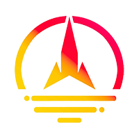
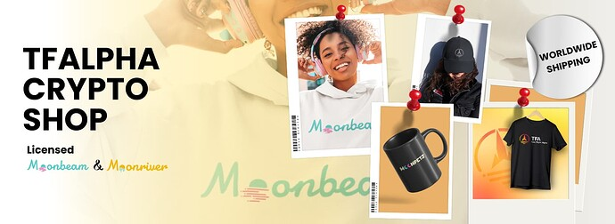

# TFA DAO: Ecosystem Grant Proposal
##  Author - Lord Glimmer, Co-Founder TFA DAO & Community

TLDR - Updated Timeline & milestones, Vision of success, Rationale, Steps to implement, Grant amount and general review.

## 1 Primary Goal

-   The primary goals of the TFA DAO are to engage the Moonbeam community, increase transactions, and TVL (Total Value Locked) to promote Moonbeam technology, and attract users from other blockchains. The DAO plans to achieve these goals through community events, giveaways, and outreach efforts, fostering active participation, raising awareness about governance, and driving comprehensive adoption of Moonbeam to strengthen the ecosystem, and the Moonpets game will be leveraged to retain them and encourage network usage. This will bring mutual benefits to both the users and the network.
-   The TFA community has transformed into a DAO with a clear mission: to promote the adoption of Moonbeam. We actively encourage every community and DAO member to actively support Moonbeam. Since 2021, we have been steadfastly dedicated to this cause, fostering awareness, engagement, and widespread adoption of Moonbeam’s innovative technology. Through strategic initiatives, partnerships, and giveaway campaigns, we aim to further amplify Moonbeam’s presence and establish it as a leading Layer 1 EVM blockchain.

Our website: www.tfalpha.xyz

With a strong and growing community, including over 1,200 active members in our Telegram group and 2,800 followers on Twitter, we have been actively engaging with enthusiasts since 2021. Additionally, we have successfully onboarded more than 600 active delegators with our UTOPIA & TF Alpha Moonbeam node.

## 2 PROJECT DESCRIPTION

TFA DAO aligns with Moonbeam’s Guiding Principles and adheres to the Moonbeam Code of Conduct. Our members understand the importance of fostering an open and welcoming environment and treating all community participants with respect and dignity. We promote the use of welcoming and inclusive language, respect differing viewpoints, and the acceptance of constructive criticism. We emphasise empathy and strive to create a positive and collaborative atmosphere for all individuals involved in our DAO activities.

As a decentralised organisation, TFA DAO embraces diverse viewpoints and encourages open discussions while maintaining the principles of respect, inclusivity, and professionalism. We recognize the significance of upholding the community’s values and ensuring alignment with Moonbeam’s goals and objectives.

Moreover, we fully endorse and uphold Moonbeam’s Guiding Principles, including inclusivity, engagement, transparency, and the greater good of the ecosystem. These principles guide our decision-making processes and drive our commitment to advancing the adoption, utilisation, and development of the Moonbeam Network.

TFA DAO operates with a strong ethical compass, and we are committed to abiding by the principles and values set forth by Moonbeam. We recognize the importance of maintaining a cohesive and respectful community environment that fosters collaboration, innovation, and growth for the benefit of the entire ecosystem.

## 3 PROJECT OVERVIEW  

TFA originated as a community for Moonbeam presale participants, driven by a strong belief in the project’s potential. In 2022, we evolved into a decentralised autonomous organisation (DAO) and established ourselves also as Moonbeam & Moonriver node operators. In collaboration with the foundation, we launched a licensed Moonbeam swag store. Simultaneously, we have been diligently developing an exciting RPG game set for release in 2024. Our Moonpets NFT collection achieved remarkable success, selling out all 5,000 NFTs within 9 minutes. The introduction of the $TFA token via a fair launch led to an exceptional 1,100% increase in value and listing on major DEXs like StellaSwap.

To enhance the Moonbeam ecosystem, TFA has demonstrated an unwavering commitment to supporting various projects. Over the past several months, we have rewarded our delegators with extra $GLMR rewards for staking, more than 16,000 $GLMR tokens in total. Additionally, we have extended our support to numerous projects aiming to launch on Moonbeam, including EXR, GLMRApes, Exosama, Moonfit, Subwallet, Beamswap, and more. Recently, we have actively assisted new projects such as Orbiter One and DAM. Our dedication to help other projects on Moonbeam has resulted in a growing list of partners.

## 4 ECOSYSTEM GRANT

-   Requested grant amount: 1M GLMR Tokens
-   Use of Grant/overall Goals
-   Maintain and grow activity on Moonbeam on a daily basis through Twitter and Telegram, as well as organising bi-weekly events featuring Moonbeam swags sourced from our TFA  [swag store](https://store.tfalpha.xyz/). The aim is to consistently engage with the community, raise awareness, and drive adoption of Moonbeam by leveraging exciting giveaways and events.
-   Development of a fully on-chain game on the Moonbeam network. Our vision is to create a seamless gaming experience where the underlying blockchain technology is abstracted to the extent that the user remains unaware of its presence.

## 5 MOTIVATION

-   Building a Thriving and United Community

We have a proven track record of supporting Moonbeam for several years without any incentives, demonstrating our dedication to its adoption. During this time, we have invested a significant amount in fostering Moonbeam’s growth. To further accelerate our efforts, we seek the requested grant… With this funding, we can amplify and accelerate our impact by dedicating more time and resources to creating compelling content, engaging users positively on multiple platforms, and conducting

extensive research to devise innovative strategies for attracting and retaining users. By securing this grant, we can maximise our commitment to promoting Moonbeam, driving adoption, and cultivating a thriving community around the DAO’s projects.

-   Fostering Camaraderie and Unity

We, at TFA, believe in the power of a united community. Through our efforts, we have cultivated a sense of camaraderie and unity among our members. In the midst of the bear market, we stood together, supporting and uplifting each other. We created a safe space where ideas, debates, and discussions are celebrated, allowing for the confluence of diverse perspectives. Our community is more than just a group of individuals; we are a family, bound by a shared vision and passion for Moonbeam.

-   Immersive Rewards for Community Loyalty

To express our gratitude and appreciation for the unwavering support of our community, we have gone above and beyond. We have shadow worked tirelessly to give “NFT SOLD OUTS” to numerous projects operating on Moonbeam, including previous grant recipients. Additionally, we have pushed social metrics, highlighting the achievements of various project communities, especially those that have excelled. Through these efforts, we have created a positive and encouraging environment, where community members feel valued and celebrated.

-   Fueling Transaction Volume and Engagement

One of our primary goals is to drive transaction volume and increase user engagement within Moonbeam. By incentivizing our holders, who are the largest in terms of delegator numbers staking across our Moonriver and Moonbeam nodes, with valuable rewards such as &GLMRs and $TFA tokens, merchandise, quizzes, birthday gifts, NFTs, we encourage active participation and foster a thriving ecosystem. Additionally, we organise random giveaways, spreading joy and excitement while attracting new users to join our community and, we have contributed more than 12,000 USD in 2 years from our own coffers.

No other community by far and large have distributed a similar amount of free perks without support from any sort of grants or whatsoever.

-   Moonpets Game: Welcoming new Users

The MOONPETS GAME represents more than just a gaming experience; it is a gateway to our community. Through this immersive game, we aim to welcome and onboard new users into the world of Moonbeam. By offering an engaging and enjoyable gameplay, we hope to capture their hearts and minds, establishing a

strong connection with our ecosystem. The game will not only provide entertainment but also a P2E mode.

-   Proactive Security Measures for Peace of Mind

We understand the concerns and risks associated with the crypto space. That is why we have implemented weekly LIVE discourse in our telegram channel and educate users on stringent security protocols and measures to safeguard our ecosystem. Our security team actively reports and addresses any security bugs discovered during other project minting phases, ensuring the integrity of the Moonbeam network. Through educational initiatives, we empower our community with the knowledge and understanding of effective security diligences, fostering a culture of proactive protection.

-   Cultivating Trust and Reliability

Trust is the foundation of any successful community. At TFA, we strive to cultivate trust and reliability among our users. By being transparent, dependable, and accountable in our actions, we have established ourselves as a trustworthy and respected entity. We believe that trust is earned through consistent and ethical behaviour, and we are committed to upholding these values in all our interactions. Our community members can rest assured that their trust in us is well-placed.

## 6 PROJECT OVERVIEW AND RELEVANT KPIs

TFA Token: We launched our token on December 15th, and since then, it has not reached the initial launching price of 10 cents. However, we have experienced a 1100 percent increase in dollar value and even more in GLMR. Currently, 1 TFA is equivalent to 4.5 GLMR. The TFA token is regularly repurchased as part of our tokenomics, which makes it very attractive. We currently have 397 holders, and our token is listed on major DEXs such as Stella Swap and Beam Swap, with 50k GLMR in the liquidity pool. Additionally, our token is listed on platforms like CoinGecko and CoinMarketCap.

TFA Store: Our team has built a merchandise online shop where users can buy items using GLMR. Additionally, we have obtained the Moonbeam and Moonriver licences from the foundation. We have collaborated with more than 20 projects, including Moonbeam Ignite event, and supported BeamSwap with custom merchandise for ETH Denver. These collaborations and custom merch items can be viewed on our website. Our store provides worldwide shipping and 24/7 customer support. Since the launch, we have generated sufficient revenue to cover our expenses, development costs, and store maintenance.

The Moonpets project has achieved several key milestones and demonstrated its ability to drive engagement and foster collaboration within the Moonbeam ecosystem. Through the TFA raffle, the project attracted over 500 registered users, with a total stake of 2 million GLMR, showcasing the community’s participation and interest.

Additionally, the project has facilitated collaborations with various projects and contributed to their growth and exposure. This includes showcasing products on the Telegram channel with over 1,200 members, such as Beamswap, DAM, Subwallet, ZooDAO, Orbiter one, CIK, Moonfit, Cult DAO, FIDI, EXR, EXO, and Airlyft. These collaborations have helped these projects reach a wider audience and engage with the Moonbeam community.

The project has also conducted giveaways of various NFTs, including Gromlins and Whitelists for Exosama, further incentivizing participation and community involvement. Furthermore, the Moonpets team actively supported the Moonfit project in community growth and NFT sales, resulting in the successful sale of Moonfit’s NFTs and onboarding over 800 new users from other chains.

The team’s efforts extended to supporting the EXR project in boosting sales and community engagement, with TFA members purchasing over 500 EXR Pilot NFTs and providing ongoing support and community management. Additionally, the Moonbeam GLMR Apes and Jungle project received assistance from the Moonpets team in NFT sales, showcasing the collaborative nature of the project.

These collaborations and community initiatives have contributed to the project’s success and traction on Moonbeam, fostering a strong and engaged community. The Moonpets project continues to prioritise community involvement, driving adoption, and contributing to the growth and success of the Moonbeam ecosystem.

Moonpets game Initiative:

Specific: We aim to secure 80% daily active users among holders

Measurable: We will track active users daily, with weekly & monthly reviews to monitor growth and assess the effectiveness of our user acquisition strategies

Achievable: We are aiming to achieve transactions equal to (NFT supply x daily sessions x number of tasks x DAU%) transactions a day which based on nearly accurate values is around 32,000 transactions considering values (5000 x 2 x 4 x 0.8)

Relevant: This aligns with our goal of establishing a significant presence on the Moonbeam by attracting and retaining community

Time-Bound: Our target is to reach (80% of holders) active users by the end of 8 weeks post-launch

## 7 TEAM EXPERIENCE

The team members of TFA DAO have a diverse range of experiences and expertise in building and delivering with Web3 technologies in general. The team consists of developers, designers, artists, and community managers who have been actively involved in the blockchain and gaming space.

Some team members have prior experience auditing Web3 games successfully, experience with smart contracts, NFT integration, and blockchain-based gameplay mechanics. They have a profound understanding of the technical aspects of Web3 gaming and are well-versed in the challenges and opportunities that arise in this space.

In addition to the core team’s expertise, TFA DAO may collaborate with 3rd parties to deliver certain components of the project. These collaborations can include partnering with experienced game developers, blockchain infrastructure providers, or other industry experts who can contribute their specialised knowledge to enhance the game’s development and delivery.

The decision to involve 3rd parties will be based on the specific requirements of the project and the expertise needed to achieve the desired outcomes. The team will carefully evaluate potential partners and ensure that they align with the project’s vision and goals. Collaboration with external parties will be done in a transparent and accountable manner, with clear communication and coordination to ensure the successful delivery of the game.

Overall, the team is committed to leveraging their own expertise as well as the knowledge and skills of external partners, if needed, to deliver a high-quality Web3 game experience to the Moonbeam ecosystem.

-   Mr. P is a seasoned software developer with over six years of experience. He is an accomplished ethical hacker, using his skills to identify and fortify system vulnerabilities. As a backend developer, he has honed his abilities in a large multinational corporation, handling complex technical challenges and delivering robust solutions. Moreover, he is experienced in blockchain development, leveraging this knowledge to create innovative digital solutions. Overall, Mr. P’s diverse skill set in software development, ethical hacking, backend development, and blockchain technology makes him a valuable asset in the tech industry.
    
-   AG is an engineer and academic having excelled as a Project Manager at Aramco, Change Management Specialist for Volvo, and Equity and Research Analyst for a blockchain project in the Indian subcontinent impacting more than 3 millions lives, He bring a diverse skill set and unwavering drive especially in conflict remediation, diaspora management and cross-project synergies. He is also an on-field Strategic Advisor to crypto start-ups in MENA, Germany and has acted as a Growth Advisor to several in-limelight Moonbeam projects from behind the scenes.
    
-   Lord Glimmer “LG” is a crypto enthusiast, community manager, and project manager with over 5 years of experience in the energy sector across Italy and the UK. He has been working for a renowned multinational company since 2017 and has extensive knowledge of blockchain technology and DeFi. His strength is his customer obsession.
    
-   Harry is a highly skilled and experienced Full Stack Developer with a focus on front-end UX/UI development and back-end PHP and WordPress development. With a solid educational background in information and communication technology, Harry brings expertise in HTML, CSS, JavaScript, ReactJS, PHP, WordPress, and API integration.
    
-   TS is a software engineer and leads a team of senior data scientists for the national airlines department of predictive maintenance. He is proficient in Python, JavaScript, and has exhaustive experience with backend solutions and logic.
    
-   Nick is a crypto and Web3 gaming enthusiast. He has over 20 years experience with multinational energy companies and experience in Six Sigma methodology. Currently he is running Peakon which surveys over 26,000 staff each quarter and produces data & insight to the senior leadership team and CEO. Previously he ran the social media for a large UK political party during the Brexit campaign on Twitter & Instagram.
    
-   Neo is co-founder of the [Krypto Dudes Podcast ](https://wavve.link/kryptodudes/episodes), where he provides valuable crypto insights to the German community. He is also a translator, proofreader, and contributor to WagMedia’s German unit. In addition, Neo serves as the Director of the Russian unit at WagMedia, where he moderated the channel and distributed rewards. Currently, Neo is working for a crypto startup, utilising his marketing skills and industry knowledge to drive growth and success. He is passionate about leveraging cryptocurrencies to transform the financial landscape. Neo has even written his thesis on the topic of Bitcoin as an alternative form of money. With his extensive experience and passion for the crypto space, Neo is a dedicated advocate for the adoption and understanding of cryptocurrencies. He is actively shaping the future of the industry and is committed to driving innovation and progress.
    

## 8 TIMELINE AND MILESTONES FOR USE OF GRANTS

Community Events Initiative:

Start Date: August 1st, 2023

Community Events: 26 bi-weekly events: August 1st, 2023 - August 31st, 2024

(350,000 GLMR)

-   Month 1/3: Launch and Promotion
    
    1.  Start organising and promoting the community events.
    2.  Begin marketing efforts to attract participants and increase awareness.
-   Month 3/6: Event Execution and Engagement
    
    1.  Host community events, such as giveaways and more.
    2.  Engage with participants and foster a strong community spirit.
    3.  Collect feedback and evaluate the success of the events.
-   Month 6/9: Expansion and Scaling
    
    1.  Scale up the community events based on the feedback and response from participants.
    2.  Introduce new types of events and engagement activities.
    3.  Collaborate with partners to reach a wider audience and increase participation.
-   Month 9/12: Final Events and Evaluation
    
    1.  Host the final round of community events with a grand finale.
    2.  Evaluate the overall success of the community events initiative.
    3.  Gather feedback and insights from participants and the community.

Games Initiative:

Start Date: September 1st, 2023

Proof Of Play Game “MoonPets”: Sept 1st, 2023 - June 31st, 2024

(650,000 GLMR)

-   Month 1-3: Game Development and Testing Sep - Nov
    
    1.  Initiate the development of the Moonpets game.
    2.  Development of User Interface (UI): To create an intuitive and engaging user interface that enhances the gaming experience.
    3.  Implementation of Indexers: To ensure the efficient operation of the game, the implementation of indexers is crucial.
    4.  Implementation of gasless Transactions: To enhance the user experience by minimising transaction costs and improving transaction speed.
    5.  Smart Contract Development: To build secure and efficient smart contracts that will form the backbone of the game’s blockchain infrastructure.
    6.  Conduct internal testing and iterations to ensure a smooth gaming experience.
-   Month 3-4: Alpha Testing and Feedback Dec - Jan
    
    1.  Launch the alpha version of the Moonpets game for selected testers and community members.
    2.  Gather feedback and insights on gameplay, mechanics, and user experience.
    3.  Make necessary improvements and refinements based on the feedback received.
-   Month 5-6: Beta Testing and Iterations Feb - Mar
    
    1.  Open up the game for beta testing to a wider audience.
    2.  Collect feedback and data on game performance, balancing, and user engagement.
    3.  Implement iterations and updates based on the feedback to enhance the gaming experience.
-   Month 7-8: Game Launch Preparation Apr - May
    
    1.  Finalise game mechanics, features, and content.
    2.  Conduct extensive testing and quality assurance to ensure a polished product.
    3.  Prepare marketing and promotional strategies for the game launch.
-   Month 9: Game Launch and Post-Launch Support June
    
    1.  Release the Moonpets game to the public.
    2.  Monitor user feedback and engagement post-launch. Provide ongoing support, updates, and expansions to maintain a thriving gaming community.

## 9 VISION OF SUCCESS

If the team receives and executes the Ecosystem Grant Proposal, the vision of success for the TFA DAO includes the following:

Success will be measured by key performance indicators (KPIs) such as growth in the number of onboarded new users, increased active users, and expanded adoption of the Moonbeam blockchain. Additionally, the success of the TFA DAO will be reflected in the number of successful community events and increased transaction volume on the Moonbeam network.

The TFA DAO aims to ensure the sustainability and growth of the Moonbeam protocol beyond the grant expiration. This will be achieved by establishing stronger partnerships, fostering collaboration with existing projects and influencers, and providing ongoing support to new projects on Moonbeam. The DAO will actively contribute to the ecosystem by continuously engaging the community, organising events, and promoting the use of Moonbeam technology.

Over a 2 to 5-year period, the grand vision for the TFA DAO is to position Moonbeam as a leading Layer 1 EVM blockchain with a robust user base. The DAO envisions Moonbeam as a hub for seamless gaming experiences and an example to the world of decentralised applications. By leveraging the innovative MoonPets proof-of-play game, the TFA DAO aims to attract users from both web3 and web2 backgrounds, bridging the gap and making blockchain gaming accessible to a wider audience.

The TFA DAO’s vision includes the establishment of a sustainable and thriving in-game economy, where players can earn rewards and engage in meaningful gameplay experiences. By providing a seamless gaming experience and abstracting the underlying blockchain technology, the TFA DAO aims to remove barriers and friction for web2 gamers, attracting them to the Moonbeam ecosystem.

To ensure long-term success, the TFA DAO will focus on continuous development, innovation, and user-centric improvements. The DAO will actively seek feedback from the community and implement necessary updates to enhance the gameplay experience and meet the evolving needs of the gaming community. Through strategic partnerships, the TFA DAO will explore opportunities to expand the MoonPets game and its ecosystem, fostering growth and sustainability beyond the grant period.

In summary, the vision of success for the TFA DAO’s Ecosystem Grant Proposal is the establishment of Moonbeam as a leading blockchain platform for web3 gaming. This includes measurable success through KPIs, sustainability, and growth of the protocol, fostering a vibrant community, and a grand vision for Moonbeam’s future as a thriving ecosystem that attracts and engages users from both web3 and web2 backgrounds.

## 10 Rationale

This Ecosystem Grant will add significant value to the Moonbeam Ecosystem by advancing its primary goal of maintaining and growing activity, including active users, transactions, and Total Value Locked (TVL). The Moonpets game and the Community Events initiatives are strategically designed to drive user engagement, attract new users to the Moonbeam network, and foster the development of a vibrant and active community. Here is the rationale behind how this Ecosystem Grant will advance the primary goal:

The Moonpets game will serve as a powerful attractor, bringing in new users and creating a captivating experience that keeps them engaged and active on the network. Through the game, we aim to generate a substantial number of transactions, leveraging the proof-of-play model and the inherent appeal of NFT ownership. By providing a seamless and enjoyable gaming experience, we expect to increase the number of active users and drive transaction volume within the Moonbeam Ecosystem.

The Community Events initiatives will complement the game by organising various events and giveaways that incentivize user participation. These events will attract new users, foster a sense of community, and provide opportunities for engagement with the Moonbeam network. By actively encouraging user involvement in governance proposals and emphasising the importance of participating in the ecosystem’s governance, we aim to increase awareness and promote a stronger and more engaged community.

Through collaborative events, user retention strategies, the involvement of the TFA token, and the unique appeal of the Moonpets game, this Ecosystem Grant will contribute to the growth of active users, transactions, and Total Value Locked (TVL) within the Moonbeam Ecosystem. By attracting new users, driving transaction volume, and fostering an active and engaged community, we will strengthen the overall ecosystem and advance the primary goal of maintaining and growing activity on the Moonbeam network.

In summary, the Moonpets game and the Community Events initiatives, with their user-centric approach, innovative features, and collaborative nature, are well-aligned with the goals of the Moonbeam Ecosystem. By leveraging these initiatives and engaging users positively, this Ecosystem Grant will enhance user activity, drive transaction growth, and contribute to the long-term sustainability and growth of the Moonbeam network.

## 11 STEPS TO IMPLEMENT

Launch preparation and marketing activities: This step involves various activities to prepare for the launch of the Moonpets game and execute marketing campaigns to raise awareness and attract users. The estimated preparation duration for this step is 160 hours. The grant will be utilised to cover costs associated with marketing materials, promotional campaigns, social media advertising, and targeted community engagement initiatives. The estimated cost for this step is $11,000.

Artwork and visual design: This step involves the creation of artwork and visual designs for the Moonpets game, including character designs, animations, backgrounds, and user interface elements. The estimated duration for this step is 234 hours. The grant will be used to fund artists and designers, as well as cover the costs of professional software licence and tools required for the creation of high-quality visuals. The estimated cost for this step is $9,600.

Game development and programming: This step focuses on the actual development and programming of the Moonpets game. It includes implementing game mechanics, integrating smart contracts, creating gameplay loops, and ensuring a seamless user experience. The grant will be used to cover costs of development, and infrastructure. The estimated duration for this step is 1760 hours. The estimated cost for this step is $123,200.

Testing and quality assurance: This step involves rigorous testing and quality assurance processes to ensure that the Moonpets game is stable, bug-free, and provides an enjoyable gaming experience. The grant will be utilised to allocate resources for testing, quality assurance, and user feedback collection. The estimated duration for this step is 480 hours. The estimated cost for this step is $33,600.

Giveaways have a significant impact on attracting new users. We believe that a year-long giveaway plan would be perfect for creating a solid user base. However, we also recognize that retaining users without a product can be challenging. This is where our idea comes in: building a game created by gamers themselves, but not just any ordinary game. We aim to develop something new and innovative, introducing the concept of proof of play.

We have conducted thorough research on how this concept works and how to implement it. We understand the complexity involved in developing such a game, but we are committed to ensuring that the final result aligns perfectly with our expectations and proves to be valuable for the adoption of the Moonbeam network.

In summary, the new Moonpets game and Community Events initiatives are designed to work in synergy to achieve the grant’s stated goal. While the Moonpets game acts as a powerful driver for user adoption and engagement, the Community Events initiative serves as a catalyst for onboarding new users and promoting community interaction. Together, these initiatives will help create a thriving and active ecosystem within Moonbeam, attracting

and retaining users while fueling the desired growth in activity, transactions, and total value locked (TVL).
