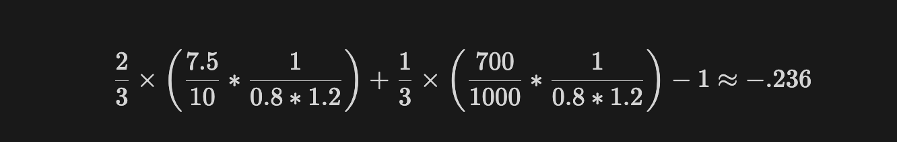

# [Ext]: Grant Program Forum Post Part 1 - Methodology

# TL;DR

-   As ecosystems mature and DeFi continues to cycle through various innovative changes, the Moonbeam Foundation sought to understand how to improve its grants program. Past grant tranches experienced challenges such as a lack of a unified impact measurement framework, fluctuating community alignment, and uncertainty in funding decisions. All DAOs experience these issues but the Moonbeam Foundation engaged with Gauntlet to approach these challenges quantitatively to strive for a sustainable future. This is detailed further in the  [recent forum post  5](https://forum.moonbeam.network/t/moonbeam-partners-with-gauntlet-for-grant-and-tokenomics-optimization/1570).
-   Gauntlet, a DeFi-native quantitative research firm, has partnered with the Foundation to dive deep into the past grant tranche and its performance to develop a robust grant impact measurement framework and provide data-driven recommendations for future grant allocations.

# Background

Gauntlet is a DeFi-native quantitative research firm specializing in risk management, incentive optimization, and mechanism design. We use battle-tested techniques from the algorithmic trading industry to help protocols manage risk, optimize revenue, and design better incentives. Our simulation models inform parameter decisions for protocols of all sizes, covering over 25% of aggregate DeFi TVL.

The Moonbeam Foundation has partnered with Gauntlet to ensure that grant programs bring lasting benefits to the Moonbeam ecosystem. To achieve this, we developed a comprehensive, retrospective grant impact measurement framework tailored to the Moonbeam ecosystem, evaluated the performance of past grants using this framework, and provided strategies for improving community alignment through the grant process. Additionally, we offer data-driven recommendations for future grant allocations to support the ecosystem’s growth and diversity.

# Overview of the Problem and Goals

## Problem Statement

The Moonbeam Foundation has been working to support the growth and development of the Moonbeam ecosystem through its grant programs. However, they identified areas for improvement to ensure that these programs have a lasting, positive impact on the community. By partnering with Gauntlet, the Foundation aims to address these challenges and enhance the effectiveness of its grant initiatives.

## Goals of the Report

The primary goals of this report are to:

1.  Develop a robust grant impact measurement framework tailored to the Moonbeam ecosystem.
2.  Provide strategies for improving community alignment through the grant process.

# Key Findings

## Executive Summary of Key Findings

-   Gauntlet developed a comprehensive grant impact measurement framework that considers key metrics such as TVL, DAU, trading volume, fees, and capital efficiency, adjusted for market trends and protocol growth expectations.
-   Community alignment can be enhanced by establishing consensus on the framework’s structure, default parameters for grant programs, and allows to evaluate how grant recipients performed on a consistent set of key metrics, in proportion to the grant amount received and overall market conditions

# Detailed Analysis

## Grant Impact Measurement Equation and Interpretation

Gauntlet developed a weighted average equation that considers the percentage change in key metrics, adjusted for market trends and protocol growth expectations. We chose this approach because it provides a comprehensive and objective assessment of grant performance, taking into account both the protocol’s individual growth and the broader DeFi market context. The resulting impact score can be interpreted as follows:

-   S(G) < 0: Grant did not meet expectations
-   S(G) = 0: Grant met expectations
-   S(G) > 0: Grant exceeded expectations

The grant impact measurement score S is given by the following weighted average (minus one):  

  
where:

-   _G_: the specific grant in question
-   ∆_xi_: the ratio of the value for a given metric after vs. before the grant
-   _wi_: the weight assigned to that metric
-   ∆_C(G)_: Adjusts score relative to the performance of DeFi itself
-   Θ(G): Adjusts scores relative to our expectations of this protocol’s growth

**Example calculation:**

For a hypothetical protocol, imagine our metrics look as follows:
| Category|Metric|Before|After|Weight|
|--|--|--|--|--|
|Metrics| | | | |
| | TVL | $10M | $7.5M | 2/3 |
| | DAU | 1000 | 700 | 1/3 |
| Corrections|
| | DeFi TVL    | $50B    |  $40B     |     |
| |  Growth Expectations   |      |  20%   |     |

We would then compute our final grant impact score via the following steps:

1.  Compute market correction term: (40B)/ (50B) = 0.8$.
2.  Compute growth expectation correction term: 1.2.
3.  Compute the weighted average change ∆Xi including market and growth corrections:  
    

    
    

In this example, this protocol did not meet grant expectations relative to market trends and growth expectations.

## Community Alignment Strategies

Community alignment is crucial for the success of the grant program, as it ensures that funding decisions are supported by the broader Moonbeam community and aligned with the ecosystem’s priorities. The proposed framework streamlines community alignment by:

1.  Establishing consensus on the framework’s overall structure and key metrics.
2.  Setting default growth expectations for each metric based on the protocol’s lifecycle stage.
3.  Evaluate grant recipients against a consistent set of key metrics and taking overall market conditions into account.

This approach fosters transparency, adaptability, and community involvement in the grant process, ensuring that funding decisions reflect the collective vision of the Moonbeam ecosystem.

## Operational Recommendations

Gauntlet suggests that the Moonbeam Foundation defines a “before” and “after” period of two months each for the grant program. In addition, we recommend that all grant funds be distributed on the same day and that the actual duration of the grant execution phase itself be fixed at a constant time period that is greater than or equal to two months, such as three months. This allows for a more comprehensive assessment of the grant’s impact over a sufficient timeframe and enables consistent comparison of statistics across the two periods when calculating the impact score.

For all grant recipients, Gauntlet recommends the following:

1.  Providing statistics for the “before” period as part of the grant. Ideally, these statistics should be calculated as the median value for each day over the two-month “before” period. If this is not feasible, recipients should strive to provide statistics that are as close to this format as reasonably possible.
2.  Grant recipients should specifiy to the community how they plan to expose the required statistics after the grant program concludes. This could involve the recipients providing the data themselves or, ideally, outlining a method for the community to independently access and verify the data. Clearly defining the data exposure process ensures transparency and allows for public verification of the grant’s impact.

By following these operational guidelines, all grant recipients can facilitate accurate and efficient impact assessments, promoting transparency and accountability in the grant process.

## Final Thoughts and Next Steps

The findings and recommendations presented in this report aim to significantly enhance the impact and effectiveness of Moonbeam’s grant programs. By adopting the proposed grant impact measurement framework and fostering community alignment, the Moonbeam Foundation can support the ecosystem’s growth, diversity, and long-term sustainability.

We encourage the Moonbeam community to provide feedback and engage in discussions on the forum to further refine and implement these recommendations.

# Acknowledgments

Gauntlet expresses its gratitude to the Moonbeam Foundation for their collaboration and valuable insights throughout this analysis. We also acknowledge the potential limitations of the study, such as the influence of external factors on the metrics evaluated and the accuracy of the data provided by the protocols. Despite these limitations, we believe that the findings and recommendations presented in this report provide a solid foundation for enhancing Moonbeam’s grant programs and supporting the ecosystem’s long-term success.